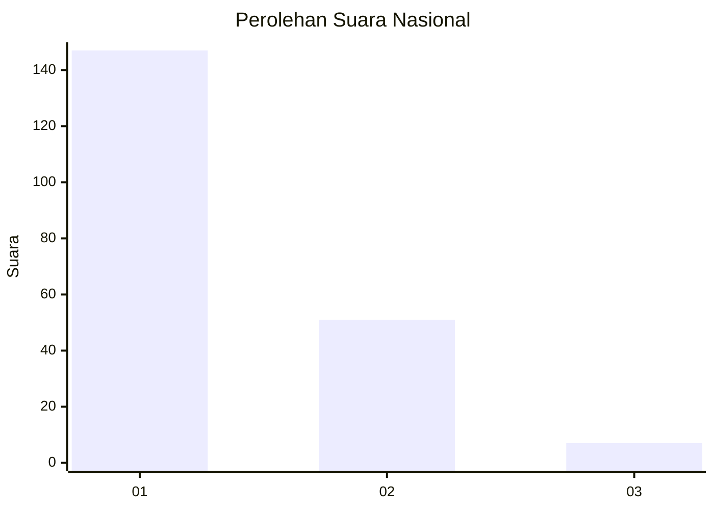
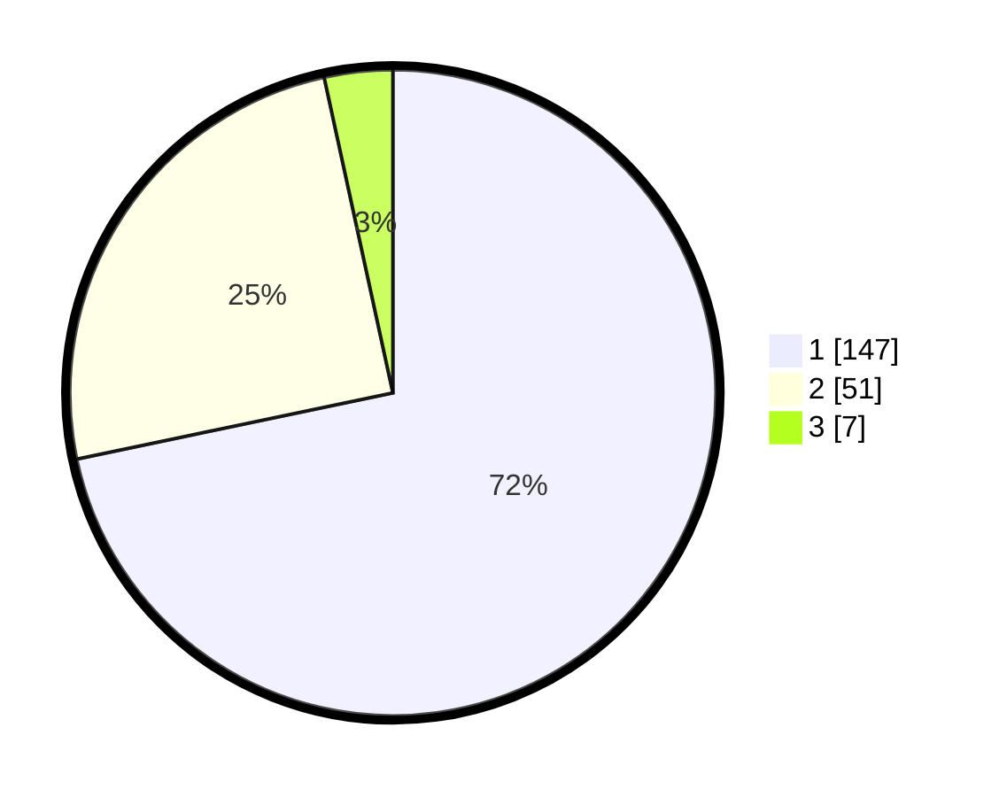

# Hasil

## Grafik

## Tabel

| No. | Nama Paslon    | Suara | Suara (raw) | Persentase |
|:--- |:-------------- | -----:| -----------:| ----------:|
| 1   | ANIES MUHAIMIN | 147   | [147][p-1]  | 71,71      |
| 2   | PRABOWO GIBRAN | 51    | [51][p-2]   | 24,88      |
| 3   | GANJAR MAHFUD  | 7     | [7][p-3]    | 3,41       |

[p-1]: https://github.com/gigit-pemilu/pemilu-2024/blob/main/pilpres/hitung-suara/sub/11-aceh/sub/15-nagan-raya/sub/05-darul-makmur/sub/2016-blang-baro/sub/003-tps/sub/paslon-1.txt
[p-2]: https://github.com/gigit-pemilu/pemilu-2024/blob/main/pilpres/hitung-suara/sub/11-aceh/sub/15-nagan-raya/sub/05-darul-makmur/sub/2016-blang-baro/sub/003-tps/sub/paslon-2.txt
[p-3]: https://github.com/gigit-pemilu/pemilu-2024/blob/main/pilpres/hitung-suara/sub/11-aceh/sub/15-nagan-raya/sub/05-darul-makmur/sub/2016-blang-baro/sub/003-tps/sub/paslon-3.txt

## Foto C Plano

https://sirekap-obj-formc.kpu.go.id/2232/pemilu/ppwp/11/15/05/20/16/1115052016003-20240221-221235--4f2ac5e9-dcc9-430b-8b5f-14543a3b6638.jpg

https://sirekap-obj-formc.kpu.go.id/2232/pemilu/ppwp/11/15/05/20/16/1115052016003-20240221-221322--8719aa70-bfe1-46ee-b9ea-4d232fe94bf8.jpg

https://sirekap-obj-formc.kpu.go.id/2232/pemilu/ppwp/11/15/05/20/16/1115052016003-20240221-221412--f4abf66f-64aa-4fe4-a969-e8a6eeca3b5b.jpg

## Metadata

| Key        | Value               |
| ---------- | ------------------- |
| Time Stamp | 2024-02-24 22:31:28 |

