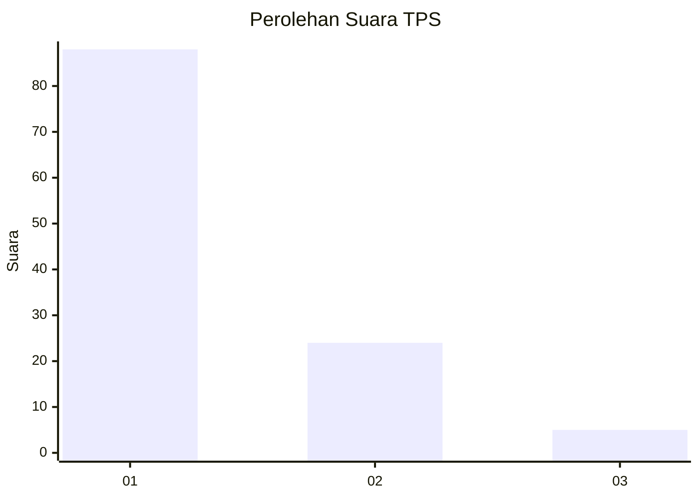
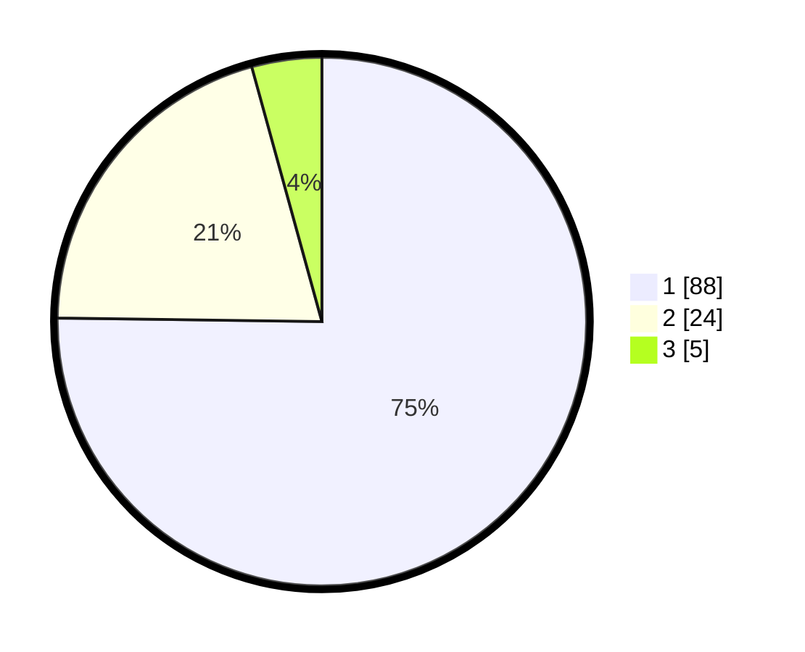

# Hasil

## Grafik

## Tabel

| No. | Nama Paslon    | Suara | Suara (raw) | Persentase |
|:--- |:-------------- | -----:| -----------:| ----------:|
| 1   | ANIES MUHAIMIN | 88    | [88][p-1]   | 75,21      |
| 2   | PRABOWO GIBRAN | 24    | [24][p-2]   | 20,51      |
| 3   | GANJAR MAHFUD  | 5     | [5][p-3]    | 4,27       |

[p-1]: https://github.com/gigit-pemilu/pemilu-2024-11-aceh/blob/main/pilpres/hitung-suara/sub/11-aceh/sub/15-nagan-raya/sub/05-darul-makmur/sub/2026-krueng-alem/sub/006-tps/sub/paslon-1.txt
[p-2]: https://github.com/gigit-pemilu/pemilu-2024-11-aceh/blob/main/pilpres/hitung-suara/sub/11-aceh/sub/15-nagan-raya/sub/05-darul-makmur/sub/2026-krueng-alem/sub/006-tps/sub/paslon-2.txt
[p-3]: https://github.com/gigit-pemilu/pemilu-2024-11-aceh/blob/main/pilpres/hitung-suara/sub/11-aceh/sub/15-nagan-raya/sub/05-darul-makmur/sub/2026-krueng-alem/sub/006-tps/sub/paslon-3.txt

## Foto C Plano

https://sirekap-obj-formc.kpu.go.id/c9d5/pemilu/ppwp/11/15/05/20/26/1115052026006-20240222-232953--74049f3b-02b9-49fa-be66-bc454439f7fa.jpg

https://sirekap-obj-formc.kpu.go.id/c9d5/pemilu/ppwp/11/15/05/20/26/1115052026006-20240222-212954--e317fe90-fea4-4e74-8be3-32b6375f20f6.jpg

https://sirekap-obj-formc.kpu.go.id/c9d5/pemilu/ppwp/11/15/05/20/26/1115052026006-20240222-213232--71121e32-d271-464e-9560-c2f46ffdd61c.jpg

## Metadata

| Key        | Value               |
| ---------- | ------------------- |
| Time Stamp | 2024-02-24 22:31:28 |

