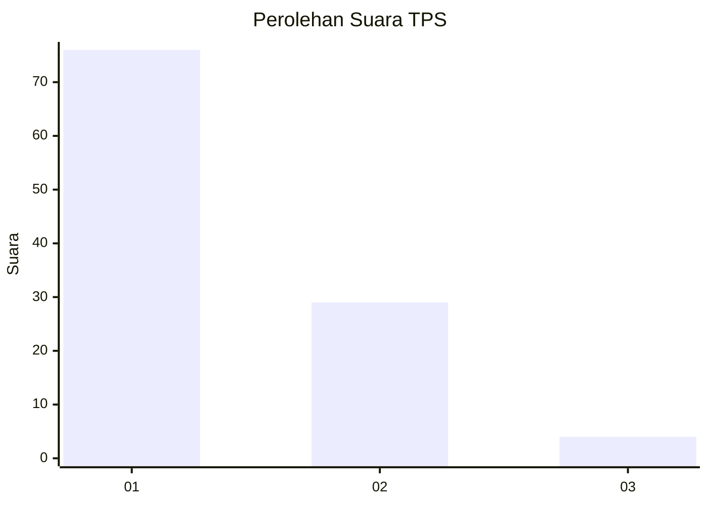
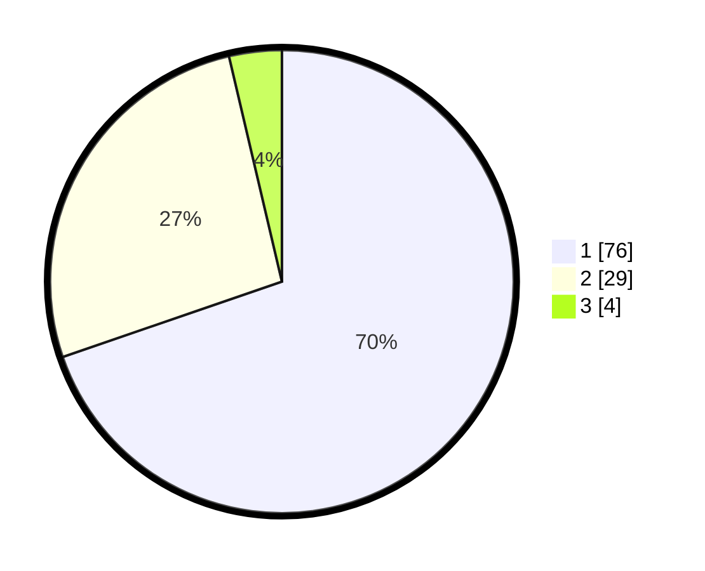

# Hasil

## Grafik

## Tabel

| No. | Nama Paslon    | Suara | Suara (raw) | Persentase |
|:--- |:-------------- | -----:| -----------:| ----------:|
| 1   | ANIES MUHAIMIN | 76    | [76][p-1]   | 69,72      |
| 2   | PRABOWO GIBRAN | 29    | [29][p-2]   | 26,61      |
| 3   | GANJAR MAHFUD  | 4     | [4][p-3]    | 3,67       |

[p-1]: https://github.com/gigit-pemilu/pemilu-2024-11-aceh/blob/main/pilpres/hitung-suara/sub/11-aceh/sub/15-nagan-raya/sub/05-darul-makmur/sub/2031-kuala-seumayam/sub/001-tps/sub/paslon-1.txt
[p-2]: https://github.com/gigit-pemilu/pemilu-2024-11-aceh/blob/main/pilpres/hitung-suara/sub/11-aceh/sub/15-nagan-raya/sub/05-darul-makmur/sub/2031-kuala-seumayam/sub/001-tps/sub/paslon-2.txt
[p-3]: https://github.com/gigit-pemilu/pemilu-2024-11-aceh/blob/main/pilpres/hitung-suara/sub/11-aceh/sub/15-nagan-raya/sub/05-darul-makmur/sub/2031-kuala-seumayam/sub/001-tps/sub/paslon-3.txt

## Foto C Plano

https://sirekap-obj-formc.kpu.go.id/ebe0/pemilu/ppwp/11/15/05/20/31/1115052031001-20240215-050723--307fc7cb-fd93-419c-bc18-177ea23e9e09.jpg

https://sirekap-obj-formc.kpu.go.id/ebe0/pemilu/ppwp/11/15/05/20/31/1115052031001-20240215-050803--22fdd3dd-42cd-464f-b267-d88e0f5bad8e.jpg

https://sirekap-obj-formc.kpu.go.id/ebe0/pemilu/ppwp/11/15/05/20/31/1115052031001-20240215-051247--d52c974a-91b4-4b49-aa34-cd575adb38ca.jpg

## Metadata

| Key        | Value               |
| ---------- | ------------------- |
| Time Stamp | 2024-02-16 10:30:29 |

## DATA PEMILIH TETAP

Jumlah pemilih dalam DPT: **139**.
 * L: **75**.
 * P: **64**.

## DATA PENGGUNA HAK PILIH

Jumlah pengguna hak pilih dalam DPT: **105**.
 * L: **56**.
 * P: **49**.

Jumlah pengguna hak pilih dalam DPTb: **3**.
 * L: **2**.
 * P: **1**.

Jumlah pengguna hak pilih dalam DPK: **3**.
 * L: **1**.
 * P: **2**.

Jumlah pengguna hak pilih: **111**.
 * L: **59**.
 * P: **52**.

## JUMLAH SUARA SAH DAN TIDAK SAH

JUMLAH SELURUH SUARA SAH: **109**.

JUMLAH SUARA TIDAK SAH: **2**.

JUMLAH SELURUH SUARA SAH DAN SUARA TIDAK SAH: **111**.

