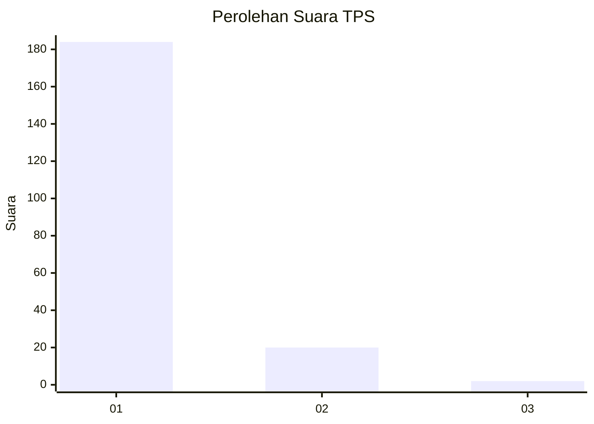
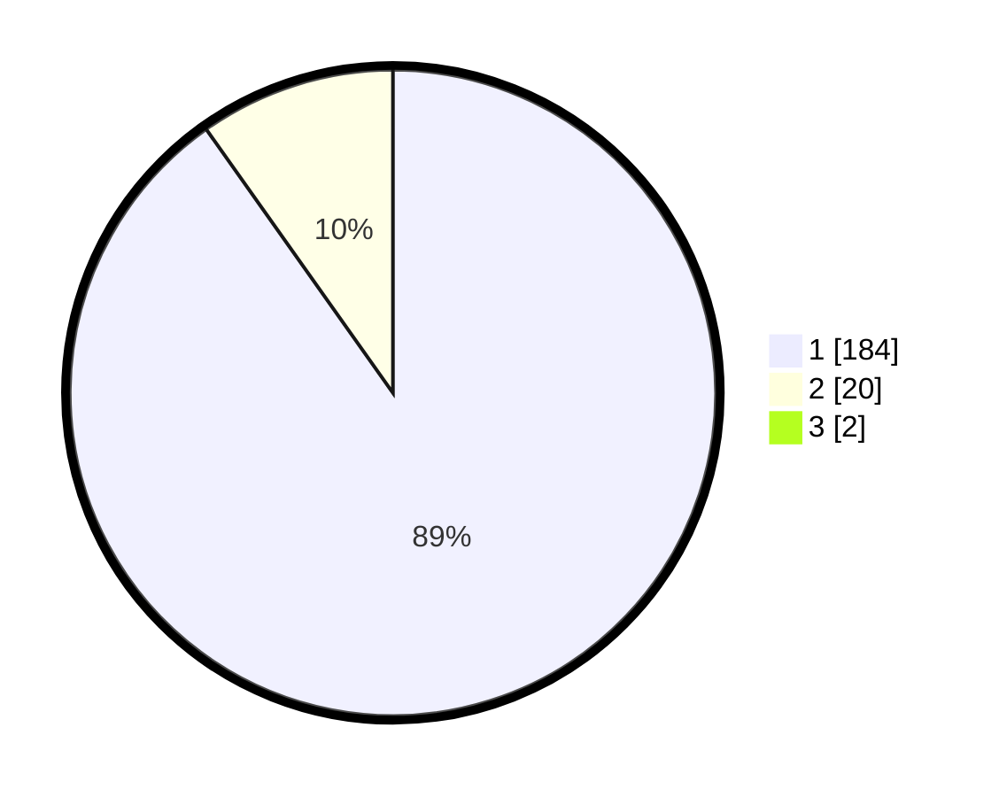

# Hasil

## Grafik

## Tabel

| No. | Nama Paslon    | Suara | Suara (raw) | Persentase |
|:--- |:-------------- | -----:| -----------:| ----------:|
| 1   | ANIES MUHAIMIN | 184   | [184][p-1]  | 89,32      |
| 2   | PRABOWO GIBRAN | 20    | [20][p-2]   | 9,71       |
| 3   | GANJAR MAHFUD  | 2     | [2][p-3]    | 0,97       |

[p-1]: https://github.com/gigit-pemilu/pemilu-2024-11-aceh/blob/main/pilpres/hitung-suara/sub/11-aceh/sub/15-nagan-raya/sub/05-darul-makmur/sub/2036-alue-jampak/sub/002-tps/sub/paslon-1.txt
[p-2]: https://github.com/gigit-pemilu/pemilu-2024-11-aceh/blob/main/pilpres/hitung-suara/sub/11-aceh/sub/15-nagan-raya/sub/05-darul-makmur/sub/2036-alue-jampak/sub/002-tps/sub/paslon-2.txt
[p-3]: https://github.com/gigit-pemilu/pemilu-2024-11-aceh/blob/main/pilpres/hitung-suara/sub/11-aceh/sub/15-nagan-raya/sub/05-darul-makmur/sub/2036-alue-jampak/sub/002-tps/sub/paslon-3.txt

## Foto C Plano

https://sirekap-obj-formc.kpu.go.id/31f3/pemilu/ppwp/11/15/05/20/36/1115052036002-20240214-214835--d2812ab7-c2f9-41c9-98fd-98e2f2161c99.jpg

https://sirekap-obj-formc.kpu.go.id/31f3/pemilu/ppwp/11/15/05/20/36/1115052036002-20240214-215144--92c8fa59-83b1-495e-9ced-4be12d1672e5.jpg

https://sirekap-obj-formc.kpu.go.id/31f3/pemilu/ppwp/11/15/05/20/36/1115052036002-20240215-231022--0d8911f2-70ee-43f1-965a-ea635b9f12a7.jpg

## Metadata

| Key        | Value               |
| ---------- | ------------------- |
| Time Stamp | 2024-02-16 00:30:27 |

