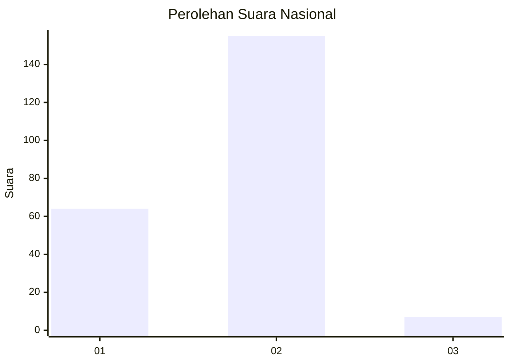
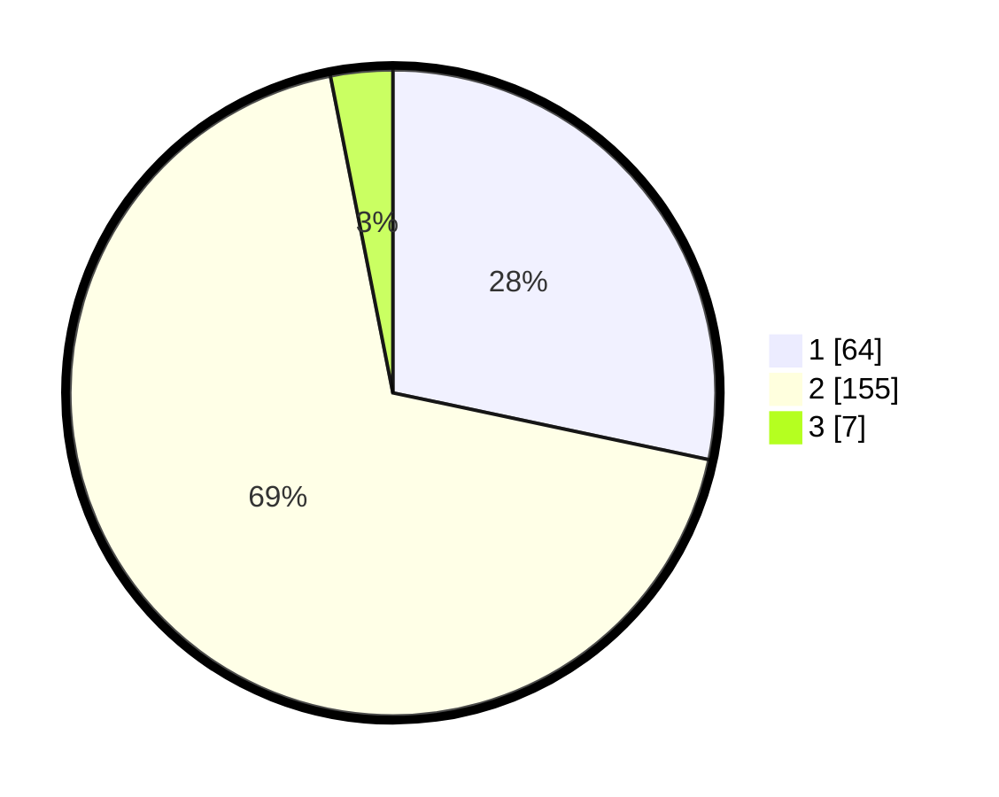

# Hasil

## Grafik

## Tabel

| No. | Nama Paslon    | Suara | Suara (raw) | Persentase |
|:--- |:-------------- | -----:| -----------:| ----------:|
| 1   | ANIES MUHAIMIN | 64    | [64][p-1]   | 28,32      |
| 2   | PRABOWO GIBRAN | 155   | [155][p-2]  | 68,58      |
| 3   | GANJAR MAHFUD  | 7     | [7][p-3]    | 3,10       |

[p-1]: https://github.com/gigit-pemilu/pemilu-2024/blob/main/pilpres/hitung-suara/sub/11-aceh/sub/15-nagan-raya/sub/05-darul-makmur/sub/2042-simpang-deli-kilang/sub/003-tps/sub/paslon-1.txt
[p-2]: https://github.com/gigit-pemilu/pemilu-2024/blob/main/pilpres/hitung-suara/sub/11-aceh/sub/15-nagan-raya/sub/05-darul-makmur/sub/2042-simpang-deli-kilang/sub/003-tps/sub/paslon-2.txt
[p-3]: https://github.com/gigit-pemilu/pemilu-2024/blob/main/pilpres/hitung-suara/sub/11-aceh/sub/15-nagan-raya/sub/05-darul-makmur/sub/2042-simpang-deli-kilang/sub/003-tps/sub/paslon-3.txt

## Foto C Plano

https://sirekap-obj-formc.kpu.go.id/7f99/pemilu/ppwp/11/15/05/20/42/1115052042003-20240215-092844--a2d361f2-8440-4c25-8f2b-ee6131305b1e.jpg

https://sirekap-obj-formc.kpu.go.id/7f99/pemilu/ppwp/11/15/05/20/42/1115052042003-20240215-195220--5940b8d8-47fe-4bca-a92f-702cd7ffe11d.jpg

https://sirekap-obj-formc.kpu.go.id/7f99/pemilu/ppwp/11/15/05/20/42/1115052042003-20240215-195629--a0063cb7-f005-4d82-8522-9d6de91ec1b9.jpg

## Metadata

| Key        | Value               |
| ---------- | ------------------- |
| Time Stamp | 2024-02-15 22:30:27 |

