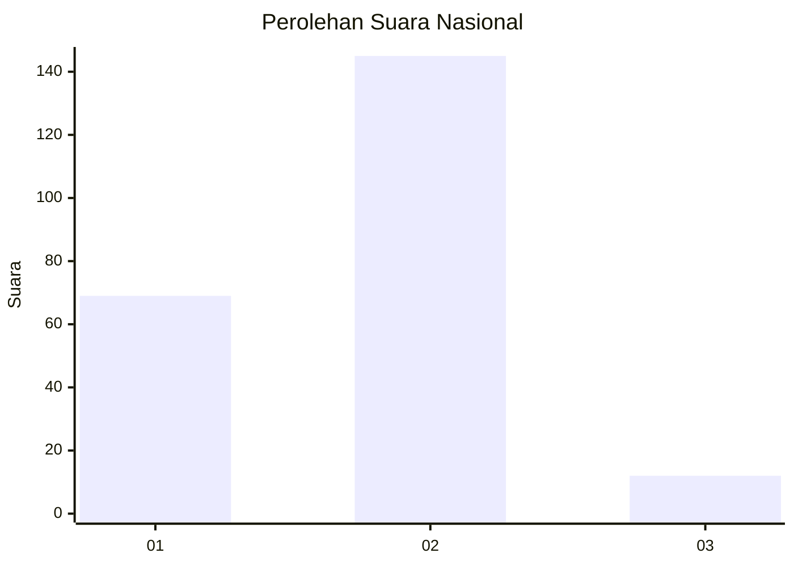
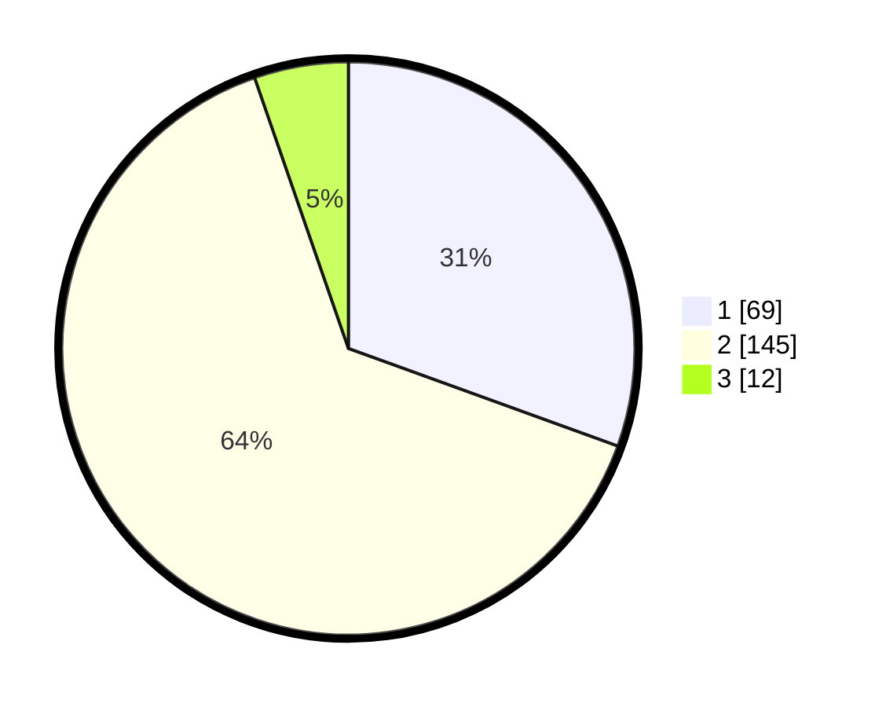

# Hasil

## Grafik

## Tabel

| No. | Nama Paslon    | Suara | Suara (raw) | Persentase |
|:--- |:-------------- | -----:| -----------:| ----------:|
| 1   | ANIES MUHAIMIN | 69    | [69][p-1]   | 30,53      |
| 2   | PRABOWO GIBRAN | 145   | [145][p-2]  | 64,16      |
| 3   | GANJAR MAHFUD  | 12    | [12][p-3]   | 5,31       |

[p-1]: https://github.com/gigit-pemilu/pemilu-2024/blob/main/pilpres/hitung-suara/sub/11-aceh/sub/15-nagan-raya/sub/05-darul-makmur/sub/2043-panton-bayu/sub/002-tps/sub/paslon-1.txt
[p-2]: https://github.com/gigit-pemilu/pemilu-2024/blob/main/pilpres/hitung-suara/sub/11-aceh/sub/15-nagan-raya/sub/05-darul-makmur/sub/2043-panton-bayu/sub/002-tps/sub/paslon-2.txt
[p-3]: https://github.com/gigit-pemilu/pemilu-2024/blob/main/pilpres/hitung-suara/sub/11-aceh/sub/15-nagan-raya/sub/05-darul-makmur/sub/2043-panton-bayu/sub/002-tps/sub/paslon-3.txt

## Foto C Plano

https://sirekap-obj-formc.kpu.go.id/04ec/pemilu/ppwp/11/15/05/20/43/1115052043002-20240222-111931--94250662-0865-4f7a-98cd-46d8708118f2.jpg

https://sirekap-obj-formc.kpu.go.id/04ec/pemilu/ppwp/11/15/05/20/43/1115052043002-20240222-112053--9a1ce1d0-9a5d-48a3-ab87-ee7b1e252d0b.jpg

https://sirekap-obj-formc.kpu.go.id/04ec/pemilu/ppwp/11/15/05/20/43/1115052043002-20240222-112149--95943bdc-45b5-4176-b191-b25473d6cb29.jpg

## Metadata

| Key        | Value               |
| ---------- | ------------------- |
| Time Stamp | 2024-02-25 13:00:00 |

