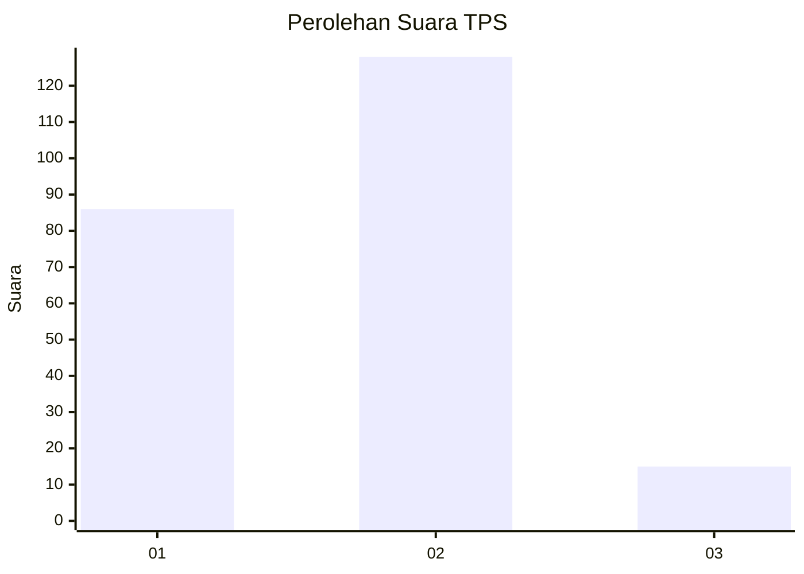
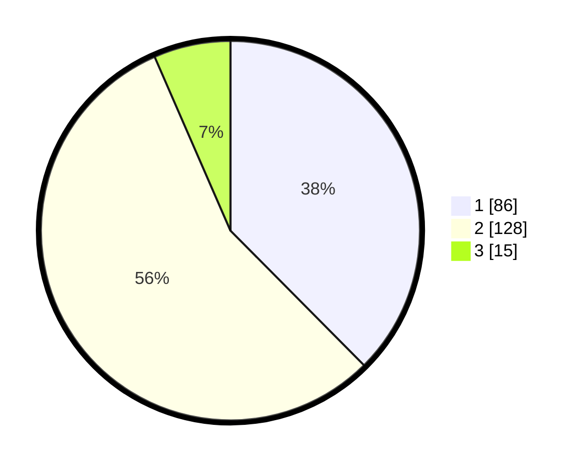

# Hasil

## Grafik

## Tabel

| No. | Nama Paslon    | Suara | Suara (raw) | Persentase |
|:--- |:-------------- | -----:| -----------:| ----------:|
| 1   | ANIES MUHAIMIN | 86    | [86][p-1]   | 37,55      |
| 2   | PRABOWO GIBRAN | 128   | [128][p-2]  | 55,90      |
| 3   | GANJAR MAHFUD  | 15    | [15][p-3]   | 6,55       |

[p-1]: https://github.com/gigit-pemilu/pemilu-2024-11-aceh/blob/main/pilpres/hitung-suara/sub/11-aceh/sub/15-nagan-raya/sub/05-darul-makmur/sub/2043-panton-bayu/sub/003-tps/sub/paslon-1.txt
[p-2]: https://github.com/gigit-pemilu/pemilu-2024-11-aceh/blob/main/pilpres/hitung-suara/sub/11-aceh/sub/15-nagan-raya/sub/05-darul-makmur/sub/2043-panton-bayu/sub/003-tps/sub/paslon-2.txt
[p-3]: https://github.com/gigit-pemilu/pemilu-2024-11-aceh/blob/main/pilpres/hitung-suara/sub/11-aceh/sub/15-nagan-raya/sub/05-darul-makmur/sub/2043-panton-bayu/sub/003-tps/sub/paslon-3.txt

## Foto C Plano

https://sirekap-obj-formc.kpu.go.id/8da7/pemilu/ppwp/11/15/05/20/43/1115052043003-20240217-184056--ae894baf-bba9-465e-8f7b-f0faa5452d6f.jpg

https://sirekap-obj-formc.kpu.go.id/8da7/pemilu/ppwp/11/15/05/20/43/1115052043003-20240217-184216--ce6fe1e3-0fd1-4122-8fdb-62b3d73f2232.jpg

https://sirekap-obj-formc.kpu.go.id/8da7/pemilu/ppwp/11/15/05/20/43/1115052043003-20240217-184333--67c1b4e2-3bd7-47f6-bf2d-998e56cc690d.jpg

## Metadata

| Key        | Value               |
| ---------- | ------------------- |
| Time Stamp | 2024-02-24 22:31:28 |

