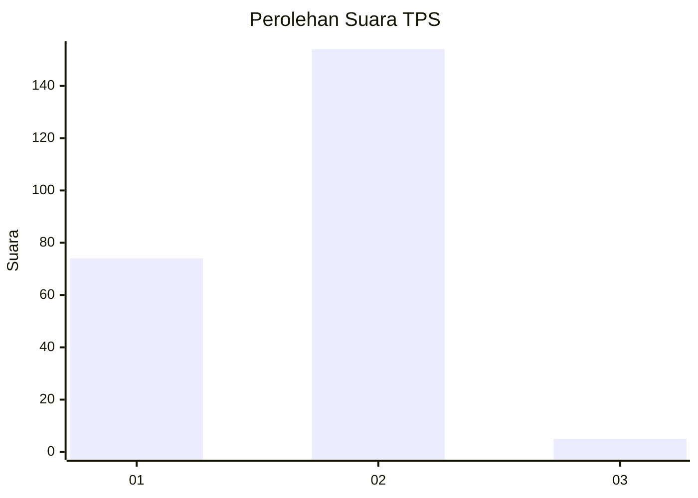
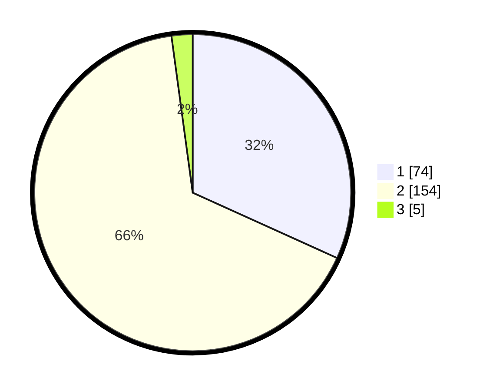

# Hasil

## Grafik

## Tabel

| No. | Nama Paslon    | Suara | Suara (raw) | Persentase |
|:--- |:-------------- | -----:| -----------:| ----------:|
| 1   | ANIES MUHAIMIN | 74    | [74][p-1]   | 31,76      |
| 2   | PRABOWO GIBRAN | 154   | [154][p-2]  | 66,09      |
| 3   | GANJAR MAHFUD  | 5     | [5][p-3]    | 2,15       |

[p-1]: https://github.com/gigit-pemilu/pemilu-2024-11-aceh/blob/main/pilpres/hitung-suara/sub/11-aceh/sub/15-nagan-raya/sub/05-darul-makmur/sub/2043-panton-bayu/sub/004-tps/sub/paslon-1.txt
[p-2]: https://github.com/gigit-pemilu/pemilu-2024-11-aceh/blob/main/pilpres/hitung-suara/sub/11-aceh/sub/15-nagan-raya/sub/05-darul-makmur/sub/2043-panton-bayu/sub/004-tps/sub/paslon-2.txt
[p-3]: https://github.com/gigit-pemilu/pemilu-2024-11-aceh/blob/main/pilpres/hitung-suara/sub/11-aceh/sub/15-nagan-raya/sub/05-darul-makmur/sub/2043-panton-bayu/sub/004-tps/sub/paslon-3.txt

## Foto C Plano

https://sirekap-obj-formc.kpu.go.id/c221/pemilu/ppwp/11/15/05/20/43/1115052043004-20240219-131735--ed9ed2fb-6888-4d7c-8e97-8dee39d1ea8f.jpg

https://sirekap-obj-formc.kpu.go.id/c221/pemilu/ppwp/11/15/05/20/43/1115052043004-20240219-124201--1a2fd7e0-39be-4271-8e32-2ef4375264ee.jpg

https://sirekap-obj-formc.kpu.go.id/c221/pemilu/ppwp/11/15/05/20/43/1115052043004-20240219-124929--b1087891-9e17-4aa9-bce6-b2a1ba3d4fe1.jpg

## Metadata

| Key        | Value               |
| ---------- | ------------------- |
| Time Stamp | 2024-02-19 14:00:00 |

