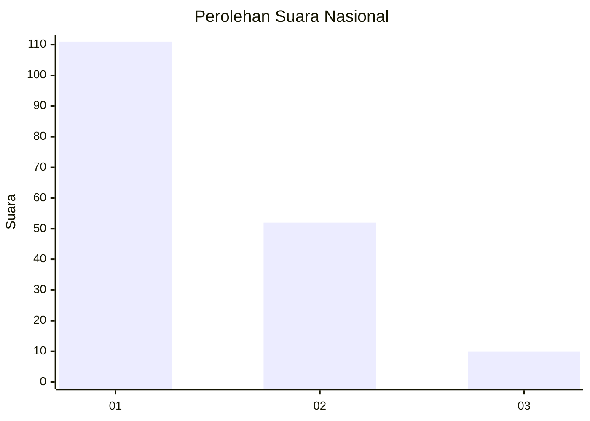
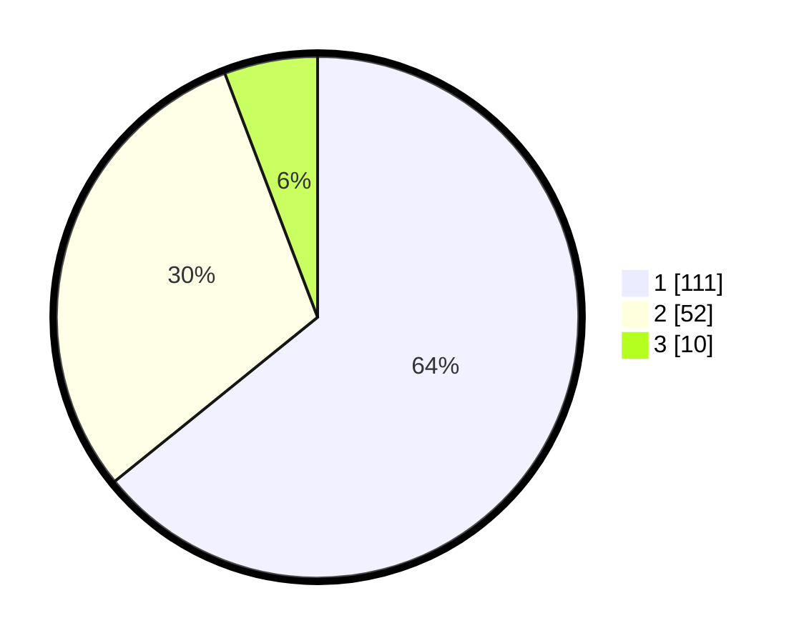

# Hasil

## Grafik

## Tabel

| No. | Nama Paslon    | Suara | Suara (raw) | Persentase |
|:--- |:-------------- | -----:| -----------:| ----------:|
| 1   | ANIES MUHAIMIN | 111   | [111][p-1]  | 64,16      |
| 2   | PRABOWO GIBRAN | 52    | [52][p-2]   | 30,06      |
| 3   | GANJAR MAHFUD  | 10    | [10][p-3]   | 5,78       |

[p-1]: https://github.com/gigit-pemilu/pemilu-2024/blob/main/pilpres/hitung-suara/sub/11-aceh/sub/15-nagan-raya/sub/05-darul-makmur/sub/2044-ujong-tanjong/sub/002-tps/sub/paslon-1.txt
[p-2]: https://github.com/gigit-pemilu/pemilu-2024/blob/main/pilpres/hitung-suara/sub/11-aceh/sub/15-nagan-raya/sub/05-darul-makmur/sub/2044-ujong-tanjong/sub/002-tps/sub/paslon-2.txt
[p-3]: https://github.com/gigit-pemilu/pemilu-2024/blob/main/pilpres/hitung-suara/sub/11-aceh/sub/15-nagan-raya/sub/05-darul-makmur/sub/2044-ujong-tanjong/sub/002-tps/sub/paslon-3.txt

## Foto C Plano

https://sirekap-obj-formc.kpu.go.id/2ed9/pemilu/ppwp/11/15/05/20/44/1115052044002-20240215-061839--e2bf451d-981d-41ff-832d-b5f4dc738aab.jpg

https://sirekap-obj-formc.kpu.go.id/2ed9/pemilu/ppwp/11/15/05/20/44/1115052044002-20240215-062046--103e4a13-7d51-4252-a782-91f0eaaa395d.jpg

https://sirekap-obj-formc.kpu.go.id/2ed9/pemilu/ppwp/11/15/05/20/44/1115052044002-20240215-062230--acf7dda2-805b-4659-8c21-72223d6acb79.jpg

## Metadata

| Key        | Value               |
| ---------- | ------------------- |
| Time Stamp | 2024-02-15 19:00:26 |

## DATA PEMILIH TETAP

Jumlah pemilih dalam DPT: **198**.
 * L: **103**.
 * P: **95**.

## DATA PENGGUNA HAK PILIH

Jumlah pengguna hak pilih dalam DPT: **164**.
 * L: **84**.
 * P: **80**.

Jumlah pengguna hak pilih dalam DPTb: **0**.
 * L: **0**.
 * P: **0**.

Jumlah pengguna hak pilih dalam DPK: **16**.
 * L: **11**.
 * P: **5**.

Jumlah pengguna hak pilih: **180**.
 * L: **95**.
 * P: **85**.

## JUMLAH SUARA SAH DAN TIDAK SAH

JUMLAH SELURUH SUARA SAH: **173**.

JUMLAH SUARA TIDAK SAH: **7**.

JUMLAH SELURUH SUARA SAH DAN SUARA TIDAK SAH: **180**.

