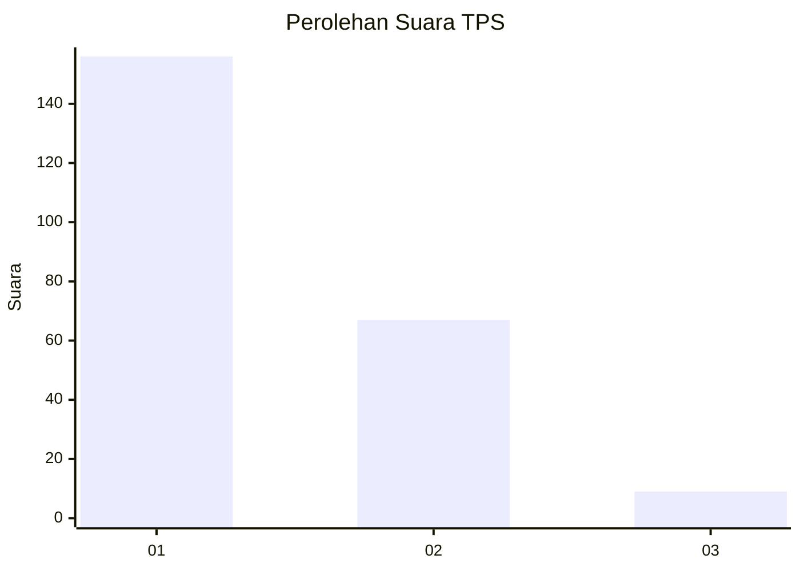
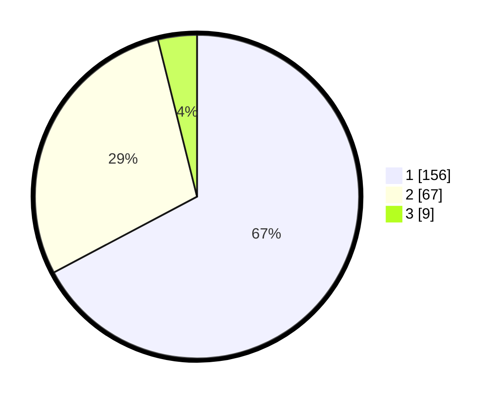

# Hasil

## Grafik

## Tabel

| No. | Nama Paslon    | Suara | Suara (raw) | Persentase |
|:--- |:-------------- | -----:| -----------:| ----------:|
| 1   | ANIES MUHAIMIN | 156   | [156][p-1]  | 67,24      |
| 2   | PRABOWO GIBRAN | 67    | [67][p-2]   | 28,88      |
| 3   | GANJAR MAHFUD  | 9     | [9][p-3]    | 3,88       |

[p-1]: https://github.com/gigit-pemilu/pemilu-2024-11-aceh/blob/main/pilpres/hitung-suara/sub/11-aceh/sub/15-nagan-raya/sub/05-darul-makmur/sub/2046-ladang-baro/sub/001-tps/sub/paslon-1.txt
[p-2]: https://github.com/gigit-pemilu/pemilu-2024-11-aceh/blob/main/pilpres/hitung-suara/sub/11-aceh/sub/15-nagan-raya/sub/05-darul-makmur/sub/2046-ladang-baro/sub/001-tps/sub/paslon-2.txt
[p-3]: https://github.com/gigit-pemilu/pemilu-2024-11-aceh/blob/main/pilpres/hitung-suara/sub/11-aceh/sub/15-nagan-raya/sub/05-darul-makmur/sub/2046-ladang-baro/sub/001-tps/sub/paslon-3.txt

## Foto C Plano

https://sirekap-obj-formc.kpu.go.id/10cf/pemilu/ppwp/11/15/05/20/46/1115052046001-20240215-065215--ca0b9988-74f3-4a38-8bde-6bb6b628c469.jpg

https://sirekap-obj-formc.kpu.go.id/10cf/pemilu/ppwp/11/15/05/20/46/1115052046001-20240215-065443--7f966ef0-e3cf-4da3-afd9-6dc9c3946caf.jpg

https://sirekap-obj-formc.kpu.go.id/10cf/pemilu/ppwp/11/15/05/20/46/1115052046001-20240215-062719--2c654716-0c1a-43e3-b864-9e2664a4625d.jpg

## Metadata

| Key        | Value               |
| ---------- | ------------------- |
| Time Stamp | 2024-02-15 19:00:26 |

