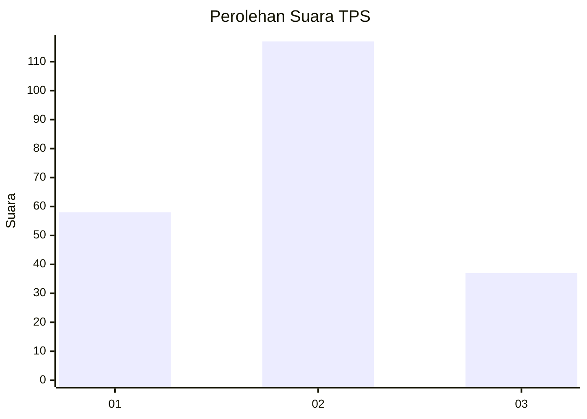
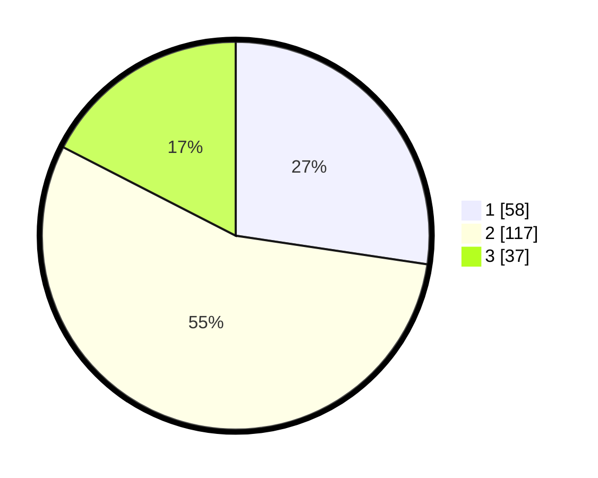

# Hasil

## Grafik

## Tabel

| No. | Nama Paslon    | Suara | Suara (raw) | Persentase |
|:--- |:-------------- | -----:| -----------:| ----------:|
| 1   | ANIES MUHAIMIN | 58    | [58][p-1]   | 27,36      |
| 2   | PRABOWO GIBRAN | 117   | [117][p-2]  | 55,19      |
| 3   | GANJAR MAHFUD  | 37    | [37][p-3]   | 17,45      |

[p-1]: https://github.com/gigit-pemilu/pemilu-2024-11-aceh/blob/main/pilpres/hitung-suara/sub/11-aceh/sub/15-nagan-raya/sub/05-darul-makmur/sub/2051-makarti-jaya/sub/004-tps/sub/paslon-1.txt
[p-2]: https://github.com/gigit-pemilu/pemilu-2024-11-aceh/blob/main/pilpres/hitung-suara/sub/11-aceh/sub/15-nagan-raya/sub/05-darul-makmur/sub/2051-makarti-jaya/sub/004-tps/sub/paslon-2.txt
[p-3]: https://github.com/gigit-pemilu/pemilu-2024-11-aceh/blob/main/pilpres/hitung-suara/sub/11-aceh/sub/15-nagan-raya/sub/05-darul-makmur/sub/2051-makarti-jaya/sub/004-tps/sub/paslon-3.txt

## Foto C Plano

https://sirekap-obj-formc.kpu.go.id/ea18/pemilu/ppwp/11/15/05/20/51/1115052051004-20240215-055334--fcc47aa9-d9db-427f-8e72-f34b0da84e7b.jpg

https://sirekap-obj-formc.kpu.go.id/ea18/pemilu/ppwp/11/15/05/20/51/1115052051004-20240215-055611--769d61f3-9c69-45d2-93f8-2582ba93cf3f.jpg

## Metadata

| Key        | Value               |
| ---------- | ------------------- |
| Time Stamp | 2024-02-16 10:30:29 |

