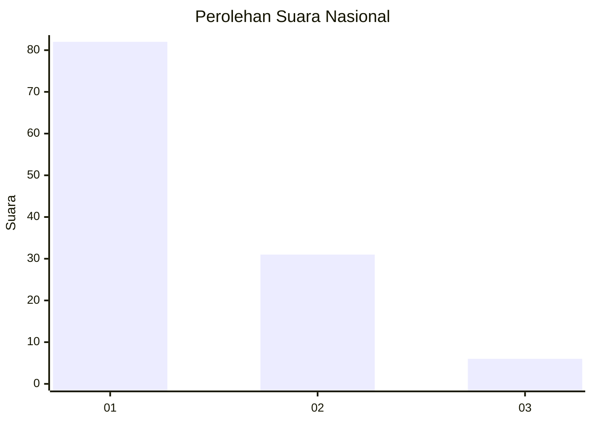
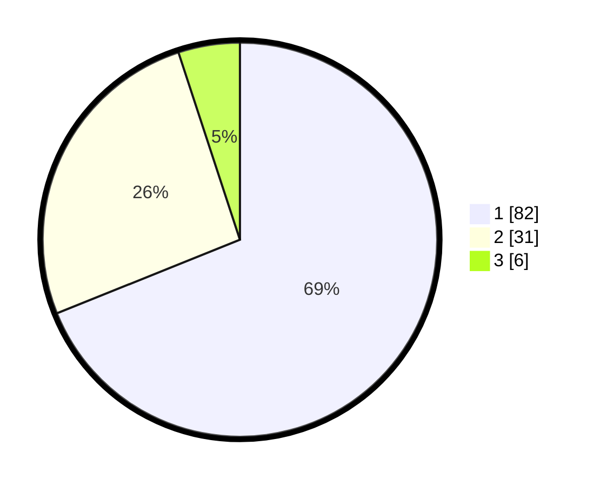

# Hasil

## Grafik

## Tabel

| No. | Nama Paslon    | Suara | Suara (raw) | Persentase |
|:--- |:-------------- | -----:| -----------:| ----------:|
| 1   | ANIES MUHAIMIN | 82    | [82][p-1]   | 68,91      |
| 2   | PRABOWO GIBRAN | 31    | [31][p-2]   | 26,05      |
| 3   | GANJAR MAHFUD  | 6     | [6][p-3]    | 5,04       |

[p-1]: https://github.com/gigit-pemilu/pemilu-2024/blob/main/pilpres/hitung-suara/sub/11-aceh/sub/15-nagan-raya/sub/06-suka-makmue/sub/2006-seumambek/sub/001-tps/sub/paslon-1.txt
[p-2]: https://github.com/gigit-pemilu/pemilu-2024/blob/main/pilpres/hitung-suara/sub/11-aceh/sub/15-nagan-raya/sub/06-suka-makmue/sub/2006-seumambek/sub/001-tps/sub/paslon-2.txt
[p-3]: https://github.com/gigit-pemilu/pemilu-2024/blob/main/pilpres/hitung-suara/sub/11-aceh/sub/15-nagan-raya/sub/06-suka-makmue/sub/2006-seumambek/sub/001-tps/sub/paslon-3.txt

## Foto C Plano

https://sirekap-obj-formc.kpu.go.id/dbc4/pemilu/ppwp/11/15/06/20/06/1115062006001-20240214-221708--703f30c9-1360-42b8-a533-67c01d0d4eb0.jpg

https://sirekap-obj-formc.kpu.go.id/dbc4/pemilu/ppwp/11/15/06/20/06/1115062006001-20240215-093206--ad1cf593-471c-48f7-b282-94e1c4e263fc.jpg

https://sirekap-obj-formc.kpu.go.id/dbc4/pemilu/ppwp/11/15/06/20/06/1115062006001-20240215-051503--59f0e7ed-9e36-4d12-be9f-46273116a51f.jpg

## Metadata

| Key        | Value               |
| ---------- | ------------------- |
| Time Stamp | 2024-02-16 10:00:28 |

## DATA PEMILIH TETAP

Jumlah pemilih dalam DPT: **127**.
 * L: **65**.
 * P: **62**.

## DATA PENGGUNA HAK PILIH

Jumlah pengguna hak pilih dalam DPT: **115**.
 * L: **59**.
 * P: **56**.

Jumlah pengguna hak pilih dalam DPTb: **1**.
 * L: **1**.
 * P: **0**.

Jumlah pengguna hak pilih dalam DPK: **3**.
 * L: **1**.
 * P: **2**.

Jumlah pengguna hak pilih: **119**.
 * L: **61**.
 * P: **58**.

## JUMLAH SUARA SAH DAN TIDAK SAH

JUMLAH SELURUH SUARA SAH: **119**.

JUMLAH SUARA TIDAK SAH: **0**.

JUMLAH SELURUH SUARA SAH DAN SUARA TIDAK SAH: **119**.

