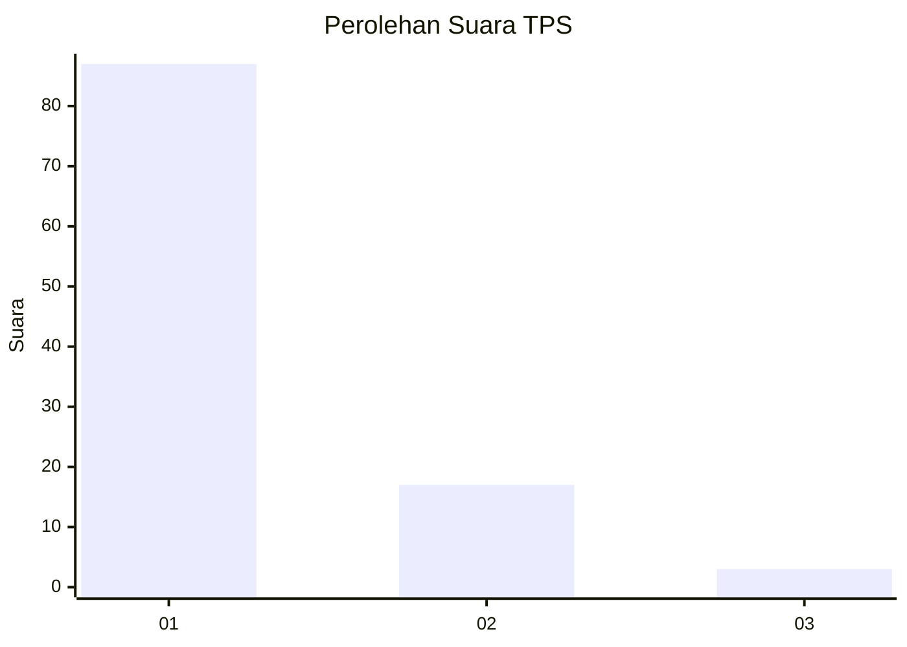
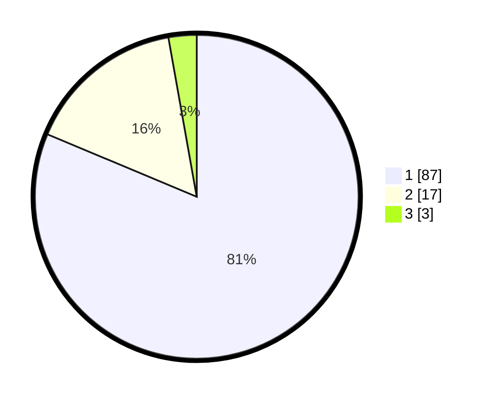

# Hasil

## Grafik

## Tabel

| No. | Nama Paslon    | Suara | Suara (raw) | Persentase |
|:--- |:-------------- | -----:| -----------:| ----------:|
| 1   | ANIES MUHAIMIN | 87    | [87][p-1]   | 81,31      |
| 2   | PRABOWO GIBRAN | 17    | [17][p-2]   | 15,89      |
| 3   | GANJAR MAHFUD  | 3     | [3][p-3]    | 2,80       |

[p-1]: https://github.com/gigit-pemilu/pemilu-2024-11-aceh/blob/main/pilpres/hitung-suara/sub/11-aceh/sub/15-nagan-raya/sub/06-suka-makmue/sub/2010-blang-sapek/sub/003-tps/sub/paslon-1.txt
[p-2]: https://github.com/gigit-pemilu/pemilu-2024-11-aceh/blob/main/pilpres/hitung-suara/sub/11-aceh/sub/15-nagan-raya/sub/06-suka-makmue/sub/2010-blang-sapek/sub/003-tps/sub/paslon-2.txt
[p-3]: https://github.com/gigit-pemilu/pemilu-2024-11-aceh/blob/main/pilpres/hitung-suara/sub/11-aceh/sub/15-nagan-raya/sub/06-suka-makmue/sub/2010-blang-sapek/sub/003-tps/sub/paslon-3.txt

## Foto C Plano

https://sirekap-obj-formc.kpu.go.id/2de6/pemilu/ppwp/11/15/06/20/10/1115062010003-20240216-180653--e2d50d2e-ba59-4c82-81d3-af19bac958bf.jpg

https://sirekap-obj-formc.kpu.go.id/2de6/pemilu/ppwp/11/15/06/20/10/1115062010003-20240216-180655--3c1fe08d-f63d-4da3-a77a-dcbaa3d71ded.jpg

https://sirekap-obj-formc.kpu.go.id/2de6/pemilu/ppwp/11/15/06/20/10/1115062010003-20240216-180654--e9f65f24-3122-4473-a5bc-411cf9e54951.jpg

## Metadata

| Key        | Value               |
| ---------- | ------------------- |
| Time Stamp | 2024-02-16 21:01:00 |

## DATA PEMILIH TETAP

Jumlah pemilih dalam DPT: **107**.
 * L: **46**.
 * P: **61**.

## DATA PENGGUNA HAK PILIH

Jumlah pengguna hak pilih dalam DPT: **97**.
 * L: **40**.
 * P: **57**.

Jumlah pengguna hak pilih dalam DPTb: **7**.
 * L: **2**.
 * P: **5**.

Jumlah pengguna hak pilih dalam DPK: **4**.
 * L: **2**.
 * P: **2**.

Jumlah pengguna hak pilih: **108**.
 * L: **44**.
 * P: **64**.

## JUMLAH SUARA SAH DAN TIDAK SAH

JUMLAH SELURUH SUARA SAH: **107**.

JUMLAH SUARA TIDAK SAH: **1**.

JUMLAH SELURUH SUARA SAH DAN SUARA TIDAK SAH: **108**.

