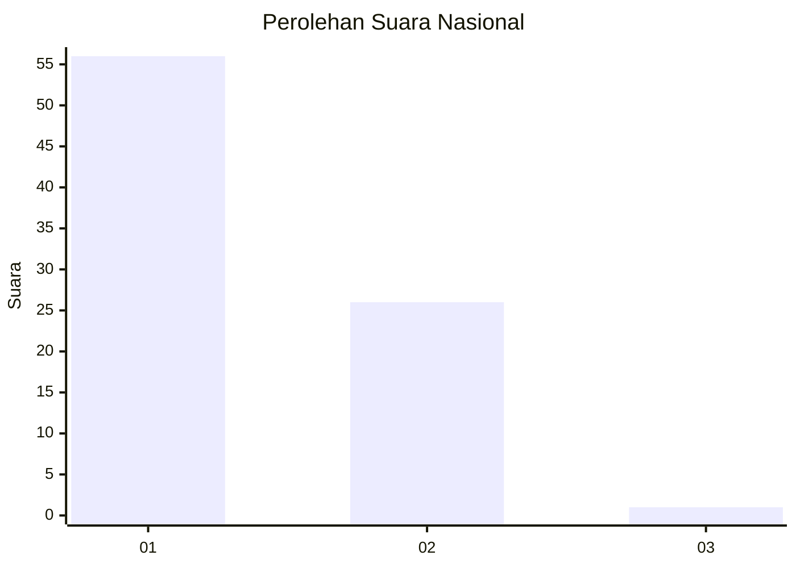
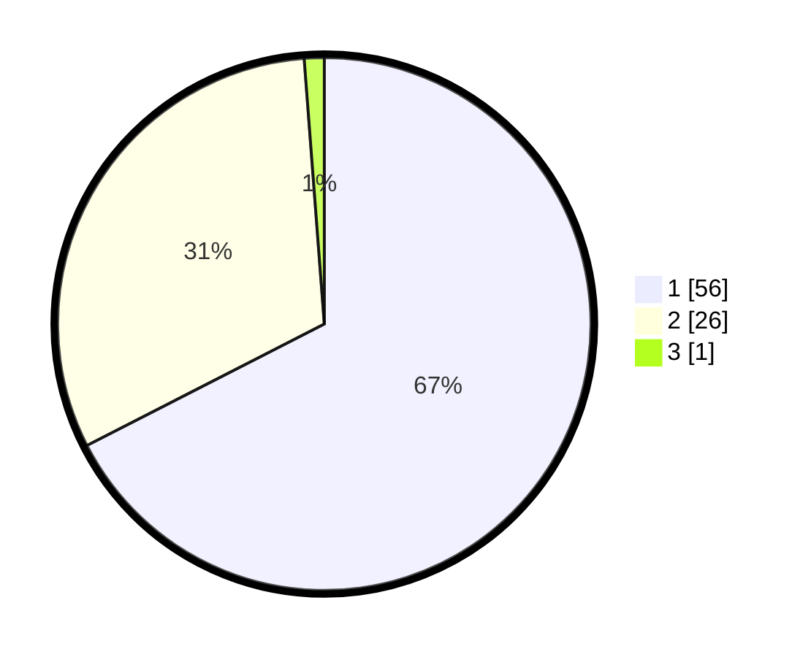

# Hasil

## Grafik

## Tabel

| No. | Nama Paslon    | Suara | Suara (raw) | Persentase |
|:--- |:-------------- | -----:| -----------:| ----------:|
| 1   | ANIES MUHAIMIN | 56    | [56][p-1]   | 67,47      |
| 2   | PRABOWO GIBRAN | 26    | [26][p-2]   | 31,33      |
| 3   | GANJAR MAHFUD  | 1     | [1][p-3]    | 1,20       |

[p-1]: https://github.com/gigit-pemilu/pemilu-2024/blob/main/pilpres/hitung-suara/sub/11-aceh/sub/15-nagan-raya/sub/06-suka-makmue/sub/2011-lhok-beutong/sub/001-tps/sub/paslon-1.txt
[p-2]: https://github.com/gigit-pemilu/pemilu-2024/blob/main/pilpres/hitung-suara/sub/11-aceh/sub/15-nagan-raya/sub/06-suka-makmue/sub/2011-lhok-beutong/sub/001-tps/sub/paslon-2.txt
[p-3]: https://github.com/gigit-pemilu/pemilu-2024/blob/main/pilpres/hitung-suara/sub/11-aceh/sub/15-nagan-raya/sub/06-suka-makmue/sub/2011-lhok-beutong/sub/001-tps/sub/paslon-3.txt

## Foto C Plano

https://sirekap-obj-formc.kpu.go.id/a790/pemilu/ppwp/11/15/06/20/11/1115062011001-20240214-155034--8955e752-05a6-40d1-b2e5-24041f5dce53.jpg

https://sirekap-obj-formc.kpu.go.id/a790/pemilu/ppwp/11/15/06/20/11/1115062011001-20240214-155404--680dbbd7-94cc-4aea-b2ea-da4c6dcc75d6.jpg

https://sirekap-obj-formc.kpu.go.id/a790/pemilu/ppwp/11/15/06/20/11/1115062011001-20240214-155308--a6530145-6746-4ec5-8c86-7a7fd7577410.jpg

## Metadata

| Key        | Value               |
| ---------- | ------------------- |
| Time Stamp | 2024-02-14 21:46:01 |

## DATA PEMILIH TETAP

Jumlah pemilih dalam DPT: **86**.
 * L: **44**.
 * P: **42**.

## DATA PENGGUNA HAK PILIH

Jumlah pengguna hak pilih dalam DPT: **82**.
 * L: **44**.
 * P: **38**.

Jumlah pengguna hak pilih dalam DPTb: **1**.
 * L: **1**.
 * P: **0**.

Jumlah pengguna hak pilih dalam DPK: **0**.
 * L: **0**.
 * P: **0**.

Jumlah pengguna hak pilih: **83**.
 * L: **45**.
 * P: **38**.

## JUMLAH SUARA SAH DAN TIDAK SAH

JUMLAH SELURUH SUARA SAH: **83**.

JUMLAH SUARA TIDAK SAH: **0**.

JUMLAH SELURUH SUARA SAH DAN SUARA TIDAK SAH: **83**.

