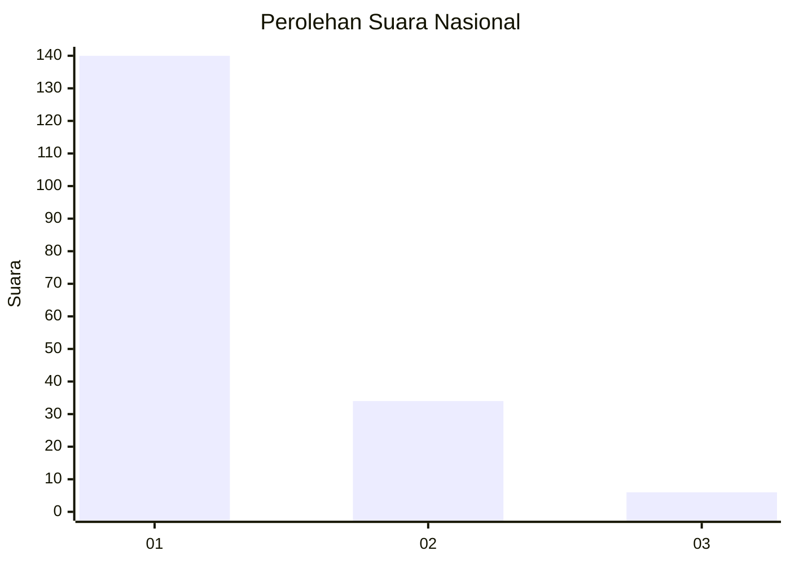
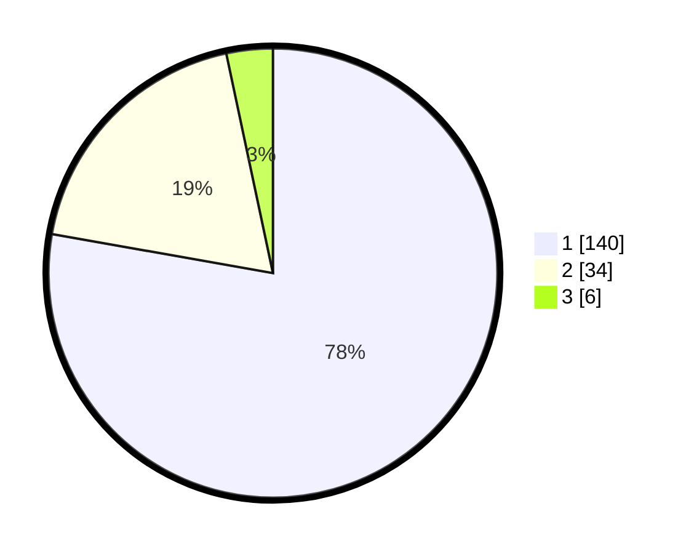

# Hasil

## Grafik

## Tabel

| No. | Nama Paslon    | Suara | Suara (raw) | Persentase |
|:--- |:-------------- | -----:| -----------:| ----------:|
| 1   | ANIES MUHAIMIN | 140   | [140][p-1]  | 77,78      |
| 2   | PRABOWO GIBRAN | 34    | [34][p-2]   | 18,89      |
| 3   | GANJAR MAHFUD  | 6     | [6][p-3]    | 3,33       |

[p-1]: https://github.com/gigit-pemilu/pemilu-2024/blob/main/pilpres/hitung-suara/sub/11-aceh/sub/15-nagan-raya/sub/07-kuala-pesisir/sub/2002-gampong-lhok/sub/001-tps/sub/paslon-1.txt
[p-2]: https://github.com/gigit-pemilu/pemilu-2024/blob/main/pilpres/hitung-suara/sub/11-aceh/sub/15-nagan-raya/sub/07-kuala-pesisir/sub/2002-gampong-lhok/sub/001-tps/sub/paslon-2.txt
[p-3]: https://github.com/gigit-pemilu/pemilu-2024/blob/main/pilpres/hitung-suara/sub/11-aceh/sub/15-nagan-raya/sub/07-kuala-pesisir/sub/2002-gampong-lhok/sub/001-tps/sub/paslon-3.txt

## Foto C Plano

https://sirekap-obj-formc.kpu.go.id/8fdd/pemilu/ppwp/11/15/07/20/02/1115072002001-20240215-035217--26c5b095-a8fd-4ebd-94df-3c58862711e8.jpg

https://sirekap-obj-formc.kpu.go.id/8fdd/pemilu/ppwp/11/15/07/20/02/1115072002001-20240215-035240--d20119f8-3e55-4a40-be51-d4b5fd902a1e.jpg

https://sirekap-obj-formc.kpu.go.id/8fdd/pemilu/ppwp/11/15/07/20/02/1115072002001-20240215-035229--2c655c72-1d0a-4850-84ab-83daab0a4e70.jpg

## Metadata

| Key        | Value               |
| ---------- | ------------------- |
| Time Stamp | 2024-02-15 15:30:25 |

## DATA PEMILIH TETAP

Jumlah pemilih dalam DPT: **184**.
 * L: **98**.
 * P: **86**.

## DATA PENGGUNA HAK PILIH

Jumlah pengguna hak pilih dalam DPT: **175**.
 * L: **91**.
 * P: **84**.

Jumlah pengguna hak pilih dalam DPTb: **0**.
 * L: **0**.
 * P: **0**.

Jumlah pengguna hak pilih dalam DPK: **5**.
 * L: **3**.
 * P: **2**.

Jumlah pengguna hak pilih: **180**.
 * L: **94**.
 * P: **86**.

## JUMLAH SUARA SAH DAN TIDAK SAH

JUMLAH SELURUH SUARA SAH: **180**.

JUMLAH SUARA TIDAK SAH: **0**.

JUMLAH SELURUH SUARA SAH DAN SUARA TIDAK SAH: **180**.

