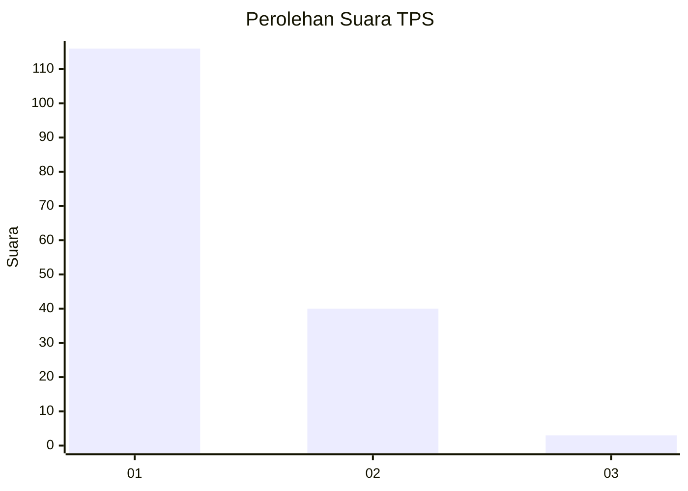
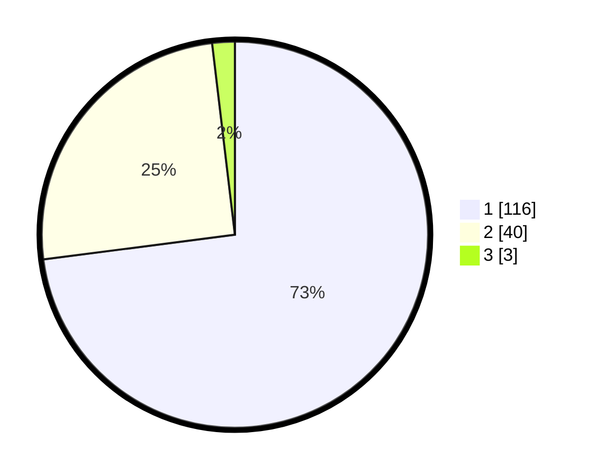

# Hasil

## Grafik

## Tabel

| No. | Nama Paslon    | Suara | Suara (raw) | Persentase |
|:--- |:-------------- | -----:| -----------:| ----------:|
| 1   | ANIES MUHAIMIN | 116   | [116][p-1]  | 72,96      |
| 2   | PRABOWO GIBRAN | 40    | [40][p-2]   | 25,16      |
| 3   | GANJAR MAHFUD  | 3     | [3][p-3]    | 1,89       |

[p-1]: https://github.com/gigit-pemilu/pemilu-2024-11-aceh/blob/main/pilpres/hitung-suara/sub/11-aceh/sub/15-nagan-raya/sub/07-kuala-pesisir/sub/2002-gampong-lhok/sub/002-tps/sub/paslon-1.txt
[p-2]: https://github.com/gigit-pemilu/pemilu-2024-11-aceh/blob/main/pilpres/hitung-suara/sub/11-aceh/sub/15-nagan-raya/sub/07-kuala-pesisir/sub/2002-gampong-lhok/sub/002-tps/sub/paslon-2.txt
[p-3]: https://github.com/gigit-pemilu/pemilu-2024-11-aceh/blob/main/pilpres/hitung-suara/sub/11-aceh/sub/15-nagan-raya/sub/07-kuala-pesisir/sub/2002-gampong-lhok/sub/002-tps/sub/paslon-3.txt

## Foto C Plano

https://sirekap-obj-formc.kpu.go.id/5a05/pemilu/ppwp/11/15/07/20/02/1115072002002-20240214-190042--6582b148-feaf-4ee2-a337-0f5842512358.jpg

https://sirekap-obj-formc.kpu.go.id/5a05/pemilu/ppwp/11/15/07/20/02/1115072002002-20240214-190103--67d0a27a-5e64-4084-baf2-39aead1dd99d.jpg

https://sirekap-obj-formc.kpu.go.id/5a05/pemilu/ppwp/11/15/07/20/02/1115072002002-20240214-190052--e121e848-e5a9-4ec0-8544-38e373cfed58.jpg

## Metadata

| Key        | Value               |
| ---------- | ------------------- |
| Time Stamp | 2024-02-15 00:41:44 |

## DATA PEMILIH TETAP

Jumlah pemilih dalam DPT: **164**.
 * L: **79**.
 * P: **85**.

## DATA PENGGUNA HAK PILIH

Jumlah pengguna hak pilih dalam DPT: **150**.
 * L: **70**.
 * P: **80**.

Jumlah pengguna hak pilih dalam DPTb: **3**.
 * L: **2**.
 * P: **1**.

Jumlah pengguna hak pilih dalam DPK: **9**.
 * L: **7**.
 * P: **2**.

Jumlah pengguna hak pilih: **162**.
 * L: **79**.
 * P: **83**.

## JUMLAH SUARA SAH DAN TIDAK SAH

JUMLAH SELURUH SUARA SAH: **159**.

JUMLAH SUARA TIDAK SAH: **3**.

JUMLAH SELURUH SUARA SAH DAN SUARA TIDAK SAH: **162**.

