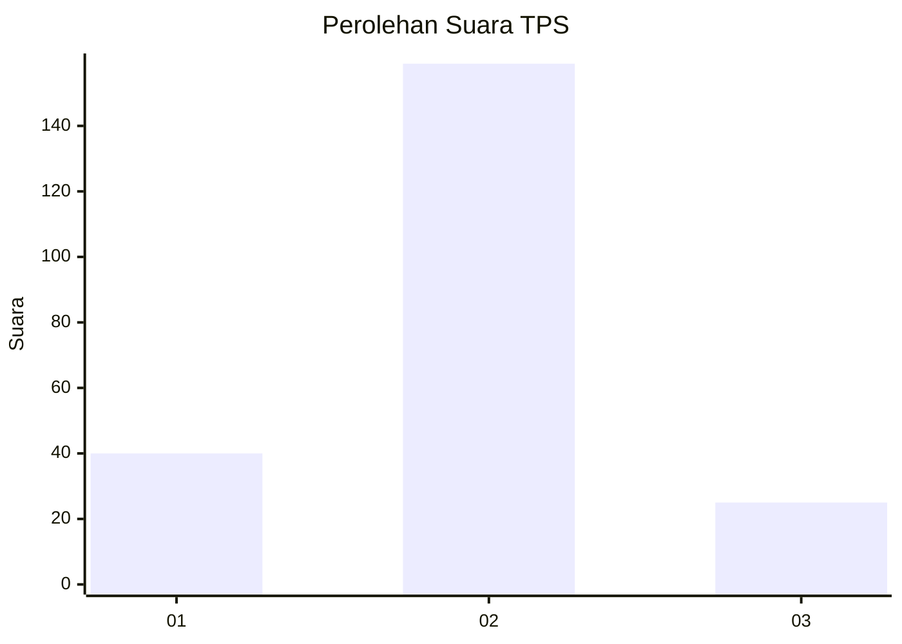
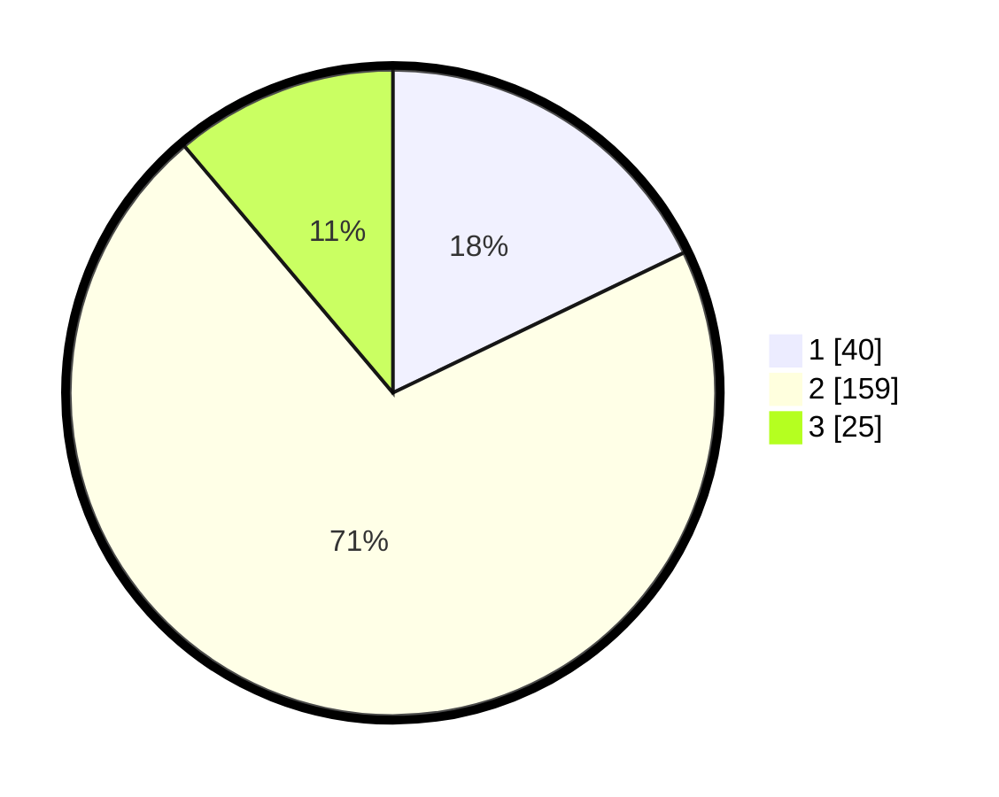

# Hasil

## Grafik

## Tabel

| No. | Nama Paslon    | Suara | Suara (raw) | Persentase |
|:--- |:-------------- | -----:| -----------:| ----------:|
| 1   | ANIES MUHAIMIN | 40    | [40][p-1]   | 17,86      |
| 2   | PRABOWO GIBRAN | 159   | [159][p-2]  | 70,98      |
| 3   | GANJAR MAHFUD  | 25    | [25][p-3]   | 11,16      |

[p-1]: https://github.com/gigit-pemilu/pemilu-2024-11-aceh/blob/main/pilpres/hitung-suara/sub/11-aceh/sub/15-nagan-raya/sub/08-tadu-raya/sub/2014-sumber-daya/sub/003-tps/sub/paslon-1.txt
[p-2]: https://github.com/gigit-pemilu/pemilu-2024-11-aceh/blob/main/pilpres/hitung-suara/sub/11-aceh/sub/15-nagan-raya/sub/08-tadu-raya/sub/2014-sumber-daya/sub/003-tps/sub/paslon-2.txt
[p-3]: https://github.com/gigit-pemilu/pemilu-2024-11-aceh/blob/main/pilpres/hitung-suara/sub/11-aceh/sub/15-nagan-raya/sub/08-tadu-raya/sub/2014-sumber-daya/sub/003-tps/sub/paslon-3.txt

## Foto C Plano

https://sirekap-obj-formc.kpu.go.id/9106/pemilu/ppwp/11/15/08/20/14/1115082014003-20240214-193327--3d5b4ed8-10ec-4548-b90a-b6527c2ceb4a.jpg

https://sirekap-obj-formc.kpu.go.id/9106/pemilu/ppwp/11/15/08/20/14/1115082014003-20240215-093718--d9f263dc-581a-4943-acb1-5bce358a0e24.jpg

## Metadata

| Key        | Value               |
| ---------- | ------------------- |
| Time Stamp | 2024-02-15 12:00:28 |

