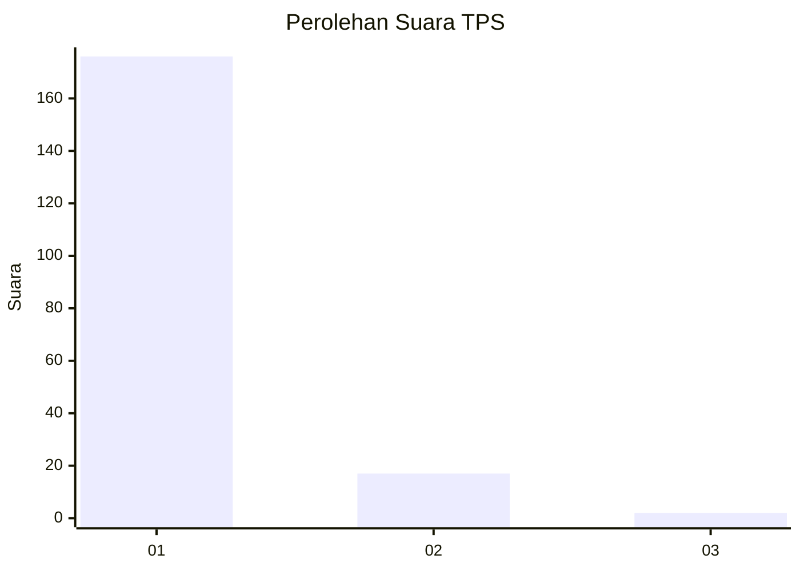
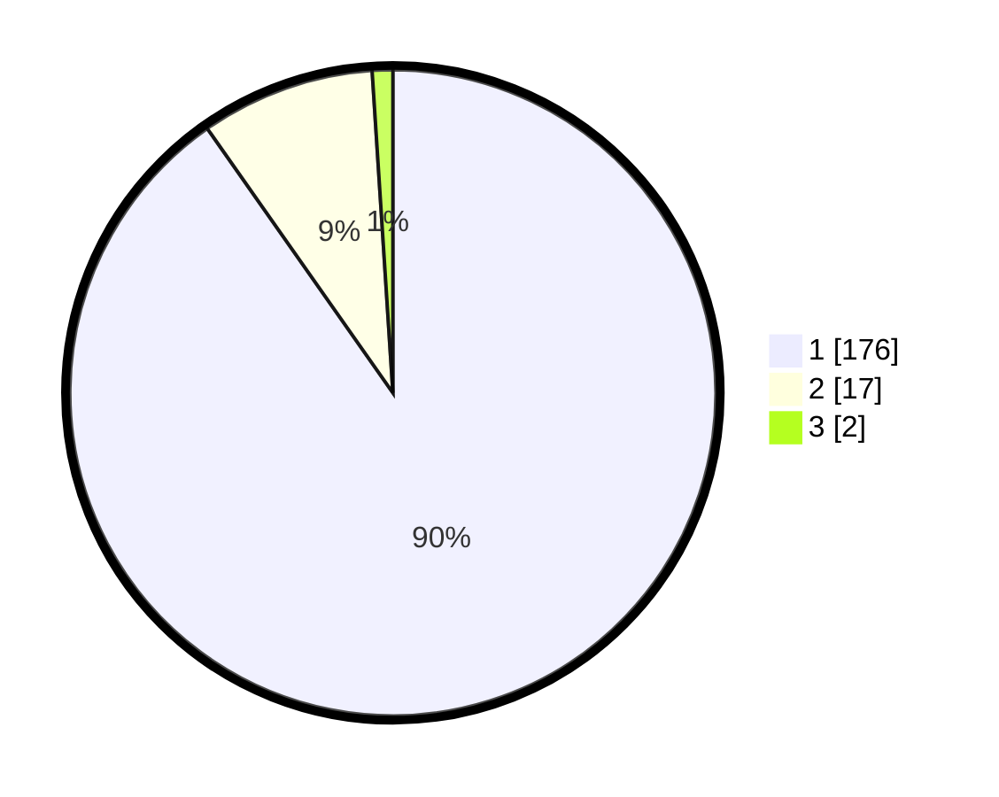

# Hasil

## Grafik

## Tabel

| No. | Nama Paslon    | Suara | Suara (raw) | Persentase |
|:--- |:-------------- | -----:| -----------:| ----------:|
| 1   | ANIES MUHAIMIN | 176   | [176][p-1]  | 90,26      |
| 2   | PRABOWO GIBRAN | 17    | [17][p-2]   | 8,72       |
| 3   | GANJAR MAHFUD  | 2     | [2][p-3]    | 1,03       |

[p-1]: https://github.com/gigit-pemilu/pemilu-2024-11-aceh/blob/main/pilpres/hitung-suara/sub/11-aceh/sub/15-nagan-raya/sub/09-tripa-makmur/sub/2001-kuala-tripa/sub/001-tps/sub/paslon-1.txt
[p-2]: https://github.com/gigit-pemilu/pemilu-2024-11-aceh/blob/main/pilpres/hitung-suara/sub/11-aceh/sub/15-nagan-raya/sub/09-tripa-makmur/sub/2001-kuala-tripa/sub/001-tps/sub/paslon-2.txt
[p-3]: https://github.com/gigit-pemilu/pemilu-2024-11-aceh/blob/main/pilpres/hitung-suara/sub/11-aceh/sub/15-nagan-raya/sub/09-tripa-makmur/sub/2001-kuala-tripa/sub/001-tps/sub/paslon-3.txt

## Foto C Plano

https://sirekap-obj-formc.kpu.go.id/0faf/pemilu/ppwp/11/15/09/20/01/1115092001001-20240214-185447--715f27ae-fa63-41c5-a07f-83a2add30972.jpg

https://sirekap-obj-formc.kpu.go.id/0faf/pemilu/ppwp/11/15/09/20/01/1115092001001-20240214-202140--5d313ee7-6ef7-4b1a-aba6-ffbc1593e460.jpg

https://sirekap-obj-formc.kpu.go.id/0faf/pemilu/ppwp/11/15/09/20/01/1115092001001-20240217-175251--96942278-f3f8-44e0-a400-ec4c87320dcf.jpg

## Metadata

| Key        | Value               |
| ---------- | ------------------- |
| Time Stamp | 2024-02-17 18:00:00 |

