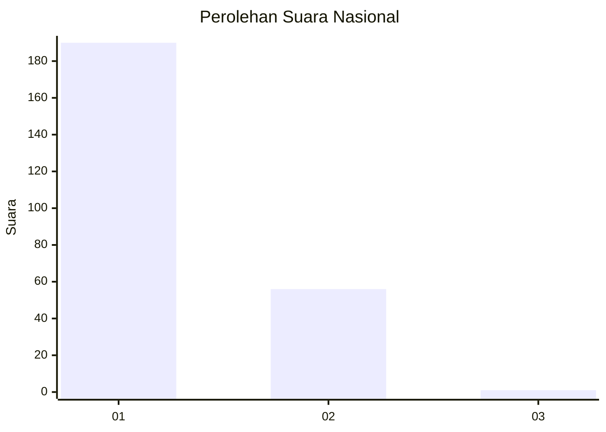
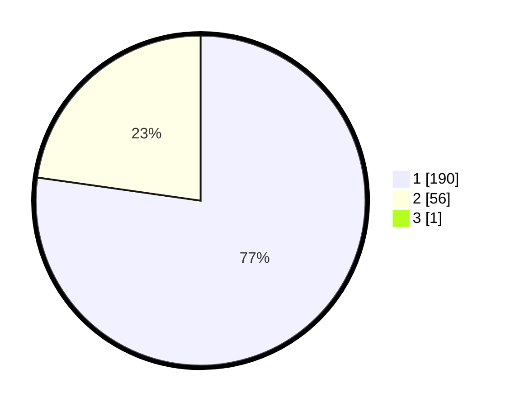

# Hasil

## Grafik

## Tabel

| No. | Nama Paslon    | Suara | Suara (raw) | Persentase |
|:--- |:-------------- | -----:| -----------:| ----------:|
| 1   | ANIES MUHAIMIN | 190   | [190][p-1]  | 76,92      |
| 2   | PRABOWO GIBRAN | 56    | [56][p-2]   | 22,67      |
| 3   | GANJAR MAHFUD  | 1     | [1][p-3]    | 0,40       |

[p-1]: https://github.com/gigit-pemilu/pemilu-2024/blob/main/pilpres/hitung-suara/sub/11-aceh/sub/15-nagan-raya/sub/09-tripa-makmur/sub/2004-lueng-keubeu-jagat/sub/001-tps/sub/paslon-1.txt
[p-2]: https://github.com/gigit-pemilu/pemilu-2024/blob/main/pilpres/hitung-suara/sub/11-aceh/sub/15-nagan-raya/sub/09-tripa-makmur/sub/2004-lueng-keubeu-jagat/sub/001-tps/sub/paslon-2.txt
[p-3]: https://github.com/gigit-pemilu/pemilu-2024/blob/main/pilpres/hitung-suara/sub/11-aceh/sub/15-nagan-raya/sub/09-tripa-makmur/sub/2004-lueng-keubeu-jagat/sub/001-tps/sub/paslon-3.txt

## Foto C Plano

https://sirekap-obj-formc.kpu.go.id/1654/pemilu/ppwp/11/15/09/20/04/1115092004001-20240217-162536--eee3aa6e-54bc-4a40-803d-72ba593be715.jpg

https://sirekap-obj-formc.kpu.go.id/1654/pemilu/ppwp/11/15/09/20/04/1115092004001-20240217-163625--6a7add9a-c3f2-4054-959b-90c2621f4b02.jpg

https://sirekap-obj-formc.kpu.go.id/1654/pemilu/ppwp/11/15/09/20/04/1115092004001-20240217-164134--1585aede-bffb-4e9c-bb33-0f5a9ea7b226.jpg

## Metadata

| Key        | Value               |
| ---------- | ------------------- |
| Time Stamp | 2024-02-19 06:16:00 |

