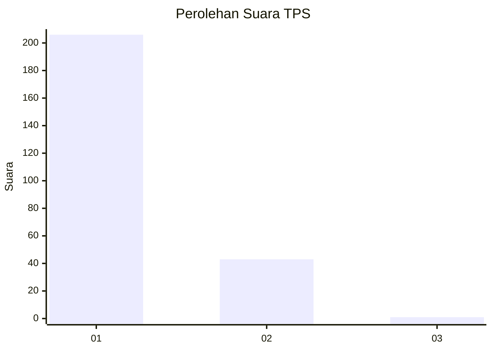
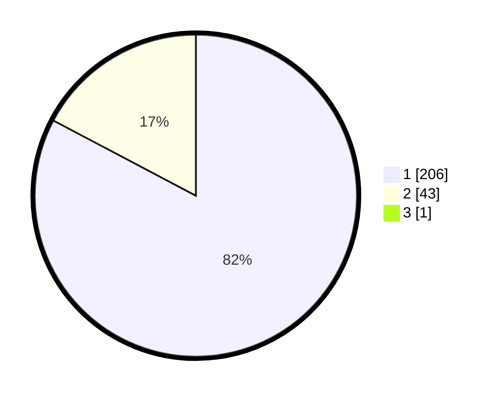

# Hasil

## Grafik

## Tabel

| No. | Nama Paslon    | Suara | Suara (raw) | Persentase |
|:--- |:-------------- | -----:| -----------:| ----------:|
| 1   | ANIES MUHAIMIN | 206   | [206][p-1]  | 82,40      |
| 2   | PRABOWO GIBRAN | 43    | [43][p-2]   | 17,20      |
| 3   | GANJAR MAHFUD  | 1     | [1][p-3]    | 0,40       |

[p-1]: https://github.com/gigit-pemilu/pemilu-2024-11-aceh/blob/main/pilpres/hitung-suara/sub/11-aceh/sub/15-nagan-raya/sub/09-tripa-makmur/sub/2004-lueng-keubeu-jagat/sub/002-tps/sub/paslon-1.txt
[p-2]: https://github.com/gigit-pemilu/pemilu-2024-11-aceh/blob/main/pilpres/hitung-suara/sub/11-aceh/sub/15-nagan-raya/sub/09-tripa-makmur/sub/2004-lueng-keubeu-jagat/sub/002-tps/sub/paslon-2.txt
[p-3]: https://github.com/gigit-pemilu/pemilu-2024-11-aceh/blob/main/pilpres/hitung-suara/sub/11-aceh/sub/15-nagan-raya/sub/09-tripa-makmur/sub/2004-lueng-keubeu-jagat/sub/002-tps/sub/paslon-3.txt

## Foto C Plano

https://sirekap-obj-formc.kpu.go.id/0db2/pemilu/ppwp/11/15/09/20/04/1115092004002-20240218-204455--e7184786-2013-4b18-b864-4c064ce83f31.jpg

https://sirekap-obj-formc.kpu.go.id/0db2/pemilu/ppwp/11/15/09/20/04/1115092004002-20240215-111109--25ca5839-475f-4d7a-b516-7b6a710c891b.jpg

https://sirekap-obj-formc.kpu.go.id/0db2/pemilu/ppwp/11/15/09/20/04/1115092004002-20240215-111420--006d3e37-1e12-48ca-b340-1eed083c0c32.jpg

## Metadata

| Key        | Value               |
| ---------- | ------------------- |
| Time Stamp | 2024-02-19 06:16:00 |

