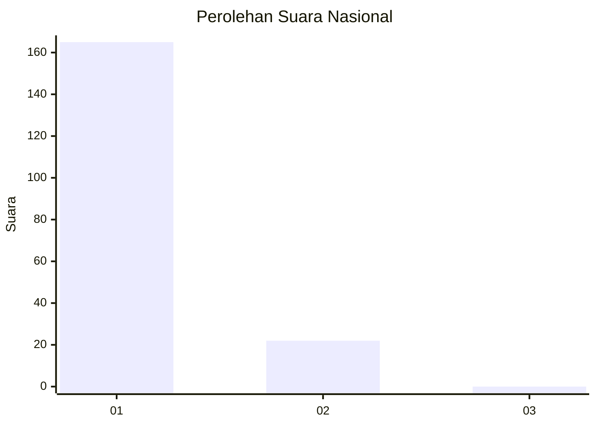
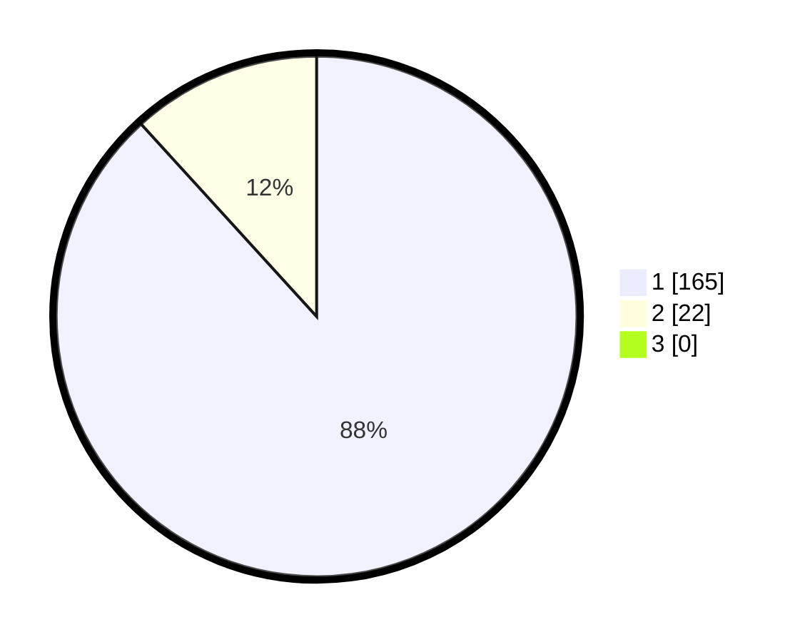

# Hasil

## Grafik

## Tabel

| No. | Nama Paslon    | Suara | Suara (raw) | Persentase |
|:--- |:-------------- | -----:| -----------:| ----------:|
| 1   | ANIES MUHAIMIN | 165   | [165][p-1]  | 88,24      |
| 2   | PRABOWO GIBRAN | 22    | [22][p-2]   | 11,76      |
| 3   | GANJAR MAHFUD  | 0     | [0][p-3]    | 0,00       |

[p-1]: https://github.com/gigit-pemilu/pemilu-2024/blob/main/pilpres/hitung-suara/sub/11-aceh/sub/15-nagan-raya/sub/09-tripa-makmur/sub/2005-kabu/sub/003-tps/sub/paslon-1.txt
[p-2]: https://github.com/gigit-pemilu/pemilu-2024/blob/main/pilpres/hitung-suara/sub/11-aceh/sub/15-nagan-raya/sub/09-tripa-makmur/sub/2005-kabu/sub/003-tps/sub/paslon-2.txt
[p-3]: https://github.com/gigit-pemilu/pemilu-2024/blob/main/pilpres/hitung-suara/sub/11-aceh/sub/15-nagan-raya/sub/09-tripa-makmur/sub/2005-kabu/sub/003-tps/sub/paslon-3.txt

## Foto C Plano

https://sirekap-obj-formc.kpu.go.id/9844/pemilu/ppwp/11/15/09/20/05/1115092005003-20240215-143723--5c9431e2-49b8-4ce5-b288-774877f0fc20.jpg

https://sirekap-obj-formc.kpu.go.id/9844/pemilu/ppwp/11/15/09/20/05/1115092005003-20240215-143809--0061e554-99ad-47d8-ac18-3d5826528f1b.jpg

https://sirekap-obj-formc.kpu.go.id/9844/pemilu/ppwp/11/15/09/20/05/1115092005003-20240215-143853--642b77de-e6b1-4652-8019-4278e520ea07.jpg

## Metadata

| Key        | Value               |
| ---------- | ------------------- |
| Time Stamp | 2024-02-15 17:30:25 |

