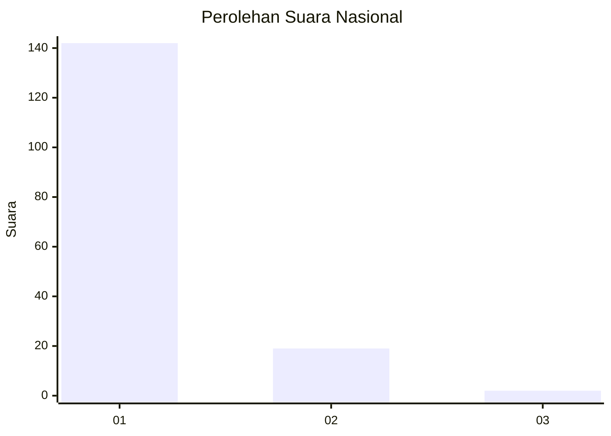
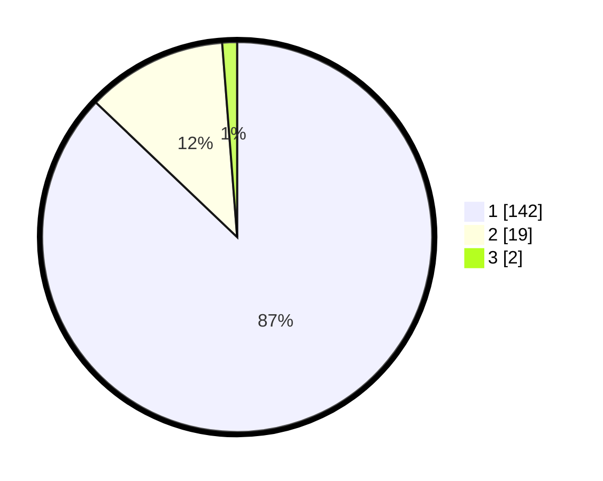

# Hasil

## Grafik

## Tabel

| No. | Nama Paslon    | Suara | Suara (raw) | Persentase |
|:--- |:-------------- | -----:| -----------:| ----------:|
| 1   | ANIES MUHAIMIN | 142   | [142][p-1]  | 87,12      |
| 2   | PRABOWO GIBRAN | 19    | [19][p-2]   | 11,66      |
| 3   | GANJAR MAHFUD  | 2     | [2][p-3]    | 1,23       |

[p-1]: https://github.com/gigit-pemilu/pemilu-2024/blob/main/pilpres/hitung-suara/sub/11-aceh/sub/15-nagan-raya/sub/10-beutong-ateuh-banggalang/sub/2002-babah-suak/sub/001-tps/sub/paslon-1.txt
[p-2]: https://github.com/gigit-pemilu/pemilu-2024/blob/main/pilpres/hitung-suara/sub/11-aceh/sub/15-nagan-raya/sub/10-beutong-ateuh-banggalang/sub/2002-babah-suak/sub/001-tps/sub/paslon-2.txt
[p-3]: https://github.com/gigit-pemilu/pemilu-2024/blob/main/pilpres/hitung-suara/sub/11-aceh/sub/15-nagan-raya/sub/10-beutong-ateuh-banggalang/sub/2002-babah-suak/sub/001-tps/sub/paslon-3.txt

## Foto C Plano

https://sirekap-obj-formc.kpu.go.id/3d5e/pemilu/ppwp/11/15/10/20/02/1115102002001-20240216-133123--2d9a455b-e6ec-4c8d-9305-7c139aedc4e8.jpg

https://sirekap-obj-formc.kpu.go.id/3d5e/pemilu/ppwp/11/15/10/20/02/1115102002001-20240216-133124--61bc7989-89fc-47f3-8ac7-4f20734f8ea1.jpg

https://sirekap-obj-formc.kpu.go.id/3d5e/pemilu/ppwp/11/15/10/20/02/1115102002001-20240216-133123--6779607e-4889-480f-a0a7-e9097642b2da.jpg

## Metadata

| Key        | Value               |
| ---------- | ------------------- |
| Time Stamp | 2024-02-16 21:01:00 |

## DATA PEMILIH TETAP

Jumlah pemilih dalam DPT: **167**.
 * L: **84**.
 * P: **83**.

## DATA PENGGUNA HAK PILIH

Jumlah pengguna hak pilih dalam DPT: **161**.
 * L: **81**.
 * P: **80**.

Jumlah pengguna hak pilih dalam DPTb: **3**.
 * L: **2**.
 * P: **1**.

Jumlah pengguna hak pilih dalam DPK: **2**.
 * L: **2**.
 * P: **0**.

Jumlah pengguna hak pilih: **166**.
 * L: **85**.
 * P: **81**.

## JUMLAH SUARA SAH DAN TIDAK SAH

JUMLAH SELURUH SUARA SAH: **163**.

JUMLAH SUARA TIDAK SAH: **3**.

JUMLAH SELURUH SUARA SAH DAN SUARA TIDAK SAH: **166**.

