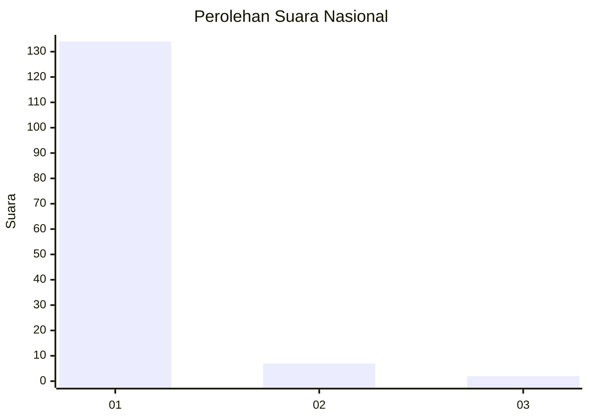
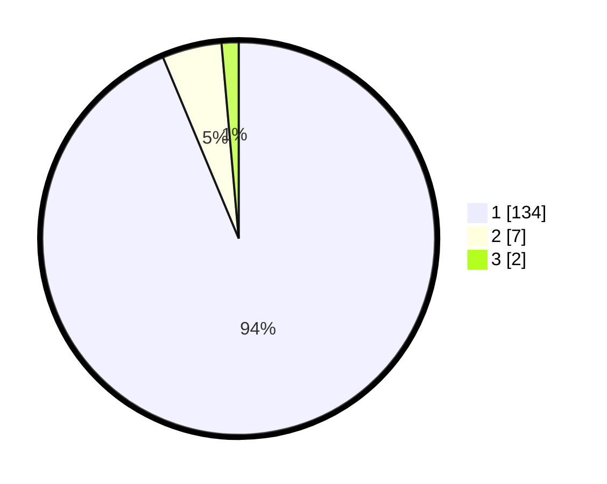

# Hasil

## Grafik

## Tabel

| No. | Nama Paslon    | Suara | Suara (raw) | Persentase |
|:--- |:-------------- | -----:| -----------:| ----------:|
| 1   | ANIES MUHAIMIN | 134   | [134][p-1]  | 93,71      |
| 2   | PRABOWO GIBRAN | 7     | [7][p-2]    | 4,90       |
| 3   | GANJAR MAHFUD  | 2     | [2][p-3]    | 1,40       |

[p-1]: https://github.com/gigit-pemilu/pemilu-2024/blob/main/pilpres/hitung-suara/sub/11-aceh/sub/15-nagan-raya/sub/10-beutong-ateuh-banggalang/sub/2002-babah-suak/sub/002-tps/sub/paslon-1.txt
[p-2]: https://github.com/gigit-pemilu/pemilu-2024/blob/main/pilpres/hitung-suara/sub/11-aceh/sub/15-nagan-raya/sub/10-beutong-ateuh-banggalang/sub/2002-babah-suak/sub/002-tps/sub/paslon-2.txt
[p-3]: https://github.com/gigit-pemilu/pemilu-2024/blob/main/pilpres/hitung-suara/sub/11-aceh/sub/15-nagan-raya/sub/10-beutong-ateuh-banggalang/sub/2002-babah-suak/sub/002-tps/sub/paslon-3.txt

## Foto C Plano

https://sirekap-obj-formc.kpu.go.id/03d4/pemilu/ppwp/11/15/10/20/02/1115102002002-20240216-133511--47c7d83d-fc46-4233-931b-6e1b4d8729da.jpg

https://sirekap-obj-formc.kpu.go.id/03d4/pemilu/ppwp/11/15/10/20/02/1115102002002-20240216-133513--20ca6272-5cf3-4589-b9e1-9cbca739ec07.jpg

https://sirekap-obj-formc.kpu.go.id/03d4/pemilu/ppwp/11/15/10/20/02/1115102002002-20240216-133512--7c5c625c-4147-4c52-b895-ecdb0b068576.jpg

## Metadata

| Key        | Value               |
| ---------- | ------------------- |
| Time Stamp | 2024-02-16 21:01:00 |

## DATA PEMILIH TETAP

Jumlah pemilih dalam DPT: **159**.
 * L: **80**.
 * P: **79**.

## DATA PENGGUNA HAK PILIH

Jumlah pengguna hak pilih dalam DPT: **147**.
 * L: **73**.
 * P: **74**.

Jumlah pengguna hak pilih dalam DPTb: **0**.
 * L: **0**.
 * P: **0**.

Jumlah pengguna hak pilih dalam DPK: **0**.
 * L: **0**.
 * P: **0**.

Jumlah pengguna hak pilih: **147**.
 * L: **73**.
 * P: **74**.

## JUMLAH SUARA SAH DAN TIDAK SAH

JUMLAH SELURUH SUARA SAH: **143**.

JUMLAH SUARA TIDAK SAH: **4**.

JUMLAH SELURUH SUARA SAH DAN SUARA TIDAK SAH: **147**.

