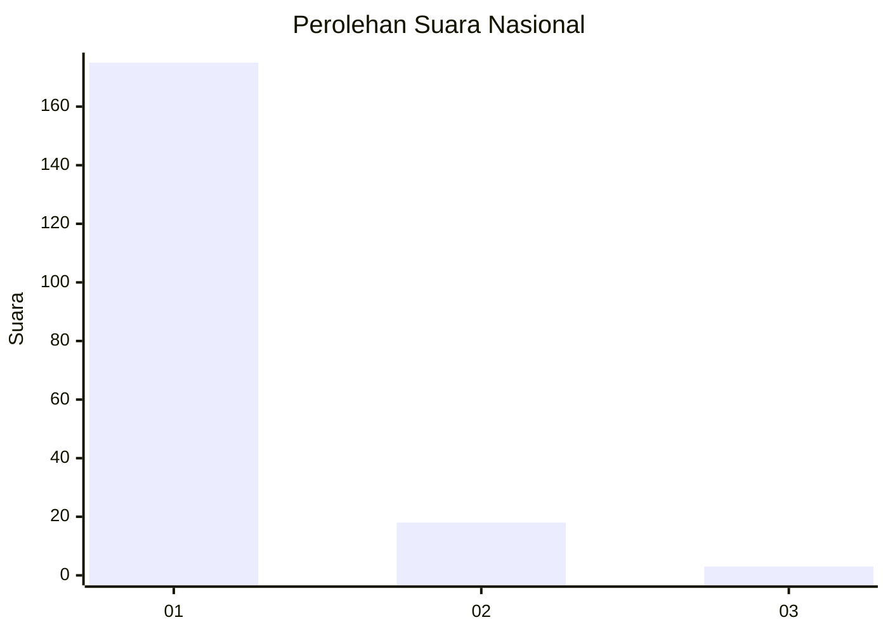
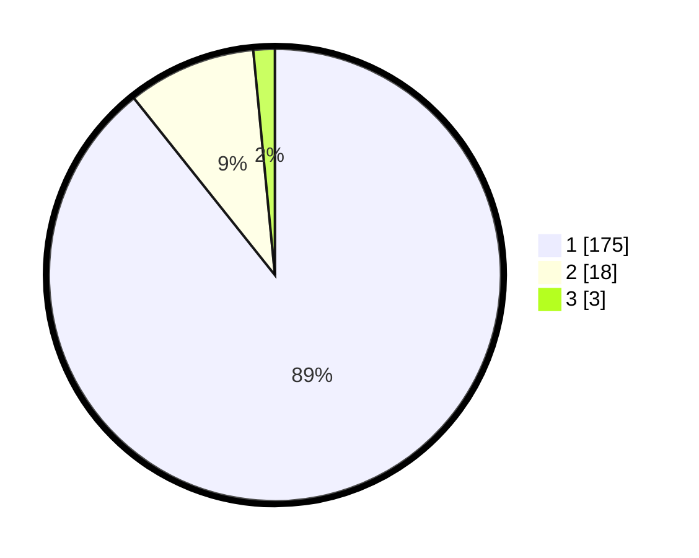

# Hasil

## Grafik

## Tabel

| No. | Nama Paslon    | Suara | Suara (raw) | Persentase |
|:--- |:-------------- | -----:| -----------:| ----------:|
| 1   | ANIES MUHAIMIN | 175   | [175][p-1]  | 89,29      |
| 2   | PRABOWO GIBRAN | 18    | [18][p-2]   | 9,18       |
| 3   | GANJAR MAHFUD  | 3     | [3][p-3]    | 1,53       |

[p-1]: https://github.com/gigit-pemilu/pemilu-2024/blob/main/pilpres/hitung-suara/sub/11-aceh/sub/16-aceh-tamiang/sub/01-manyak-payed/sub/2001-simpang-lhee/sub/002-tps/sub/paslon-1.txt
[p-2]: https://github.com/gigit-pemilu/pemilu-2024/blob/main/pilpres/hitung-suara/sub/11-aceh/sub/16-aceh-tamiang/sub/01-manyak-payed/sub/2001-simpang-lhee/sub/002-tps/sub/paslon-2.txt
[p-3]: https://github.com/gigit-pemilu/pemilu-2024/blob/main/pilpres/hitung-suara/sub/11-aceh/sub/16-aceh-tamiang/sub/01-manyak-payed/sub/2001-simpang-lhee/sub/002-tps/sub/paslon-3.txt

## Foto C Plano

https://sirekap-obj-formc.kpu.go.id/f207/pemilu/ppwp/11/16/01/20/01/1116012001002-20240220-174330--1a0edc90-dc9b-4615-9542-bfdb97bd6566.jpg

https://sirekap-obj-formc.kpu.go.id/f207/pemilu/ppwp/11/16/01/20/01/1116012001002-20240220-174331--37284e1b-f477-46cf-bcfb-3149ae634678.jpg

https://sirekap-obj-formc.kpu.go.id/f207/pemilu/ppwp/11/16/01/20/01/1116012001002-20240220-174331--72d04861-104a-42cd-b0be-847fc11e1020.jpg

## Metadata

| Key        | Value               |
| ---------- | ------------------- |
| Time Stamp | 2024-02-20 23:00:00 |

## DATA PEMILIH TETAP

Jumlah pemilih dalam DPT: **240**.
 * L: **118**.
 * P: **122**.

## DATA PENGGUNA HAK PILIH

Jumlah pengguna hak pilih dalam DPT: **199**.
 * L: **90**.
 * P: **109**.

Jumlah pengguna hak pilih dalam DPTb: **1**.
 * L: **0**.
 * P: **1**.

Jumlah pengguna hak pilih dalam DPK: **0**.
 * L: **0**.
 * P: **0**.

Jumlah pengguna hak pilih: **200**.
 * L: **90**.
 * P: **110**.

## JUMLAH SUARA SAH DAN TIDAK SAH

JUMLAH SELURUH SUARA SAH: **196**.

JUMLAH SUARA TIDAK SAH: **4**.

JUMLAH SELURUH SUARA SAH DAN SUARA TIDAK SAH: **200**.

