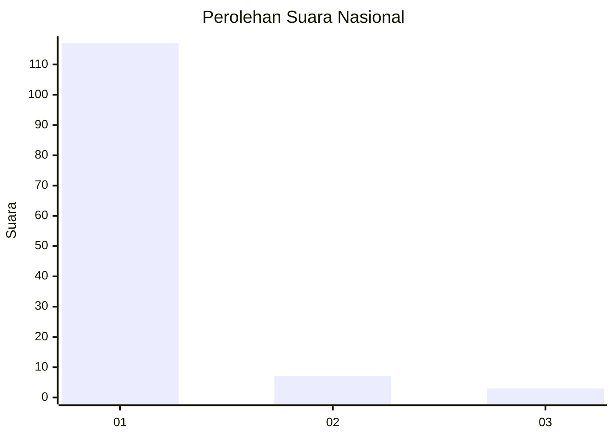
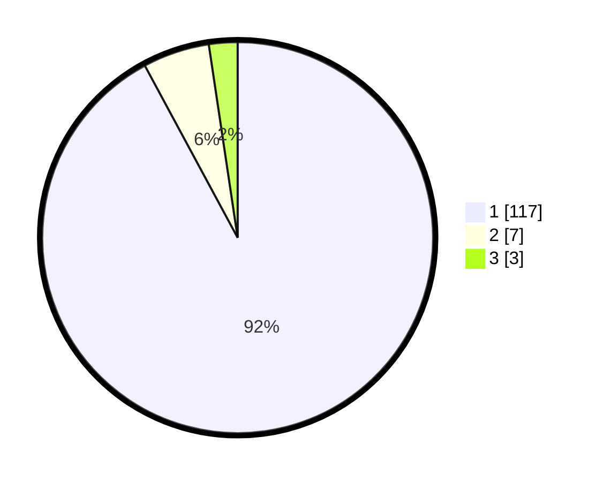

# Hasil

## Grafik

## Tabel

| No. | Nama Paslon    | Suara | Suara (raw) | Persentase |
|:--- |:-------------- | -----:| -----------:| ----------:|
| 1   | ANIES MUHAIMIN | 117   | [117][p-1]  | 92,13      |
| 2   | PRABOWO GIBRAN | 7     | [7][p-2]    | 5,51       |
| 3   | GANJAR MAHFUD  | 3     | [3][p-3]    | 2,36       |

[p-1]: https://github.com/gigit-pemilu/pemilu-2024/blob/main/pilpres/hitung-suara/sub/11-aceh/sub/16-aceh-tamiang/sub/01-manyak-payed/sub/2001-simpang-lhee/sub/003-tps/sub/paslon-1.txt
[p-2]: https://github.com/gigit-pemilu/pemilu-2024/blob/main/pilpres/hitung-suara/sub/11-aceh/sub/16-aceh-tamiang/sub/01-manyak-payed/sub/2001-simpang-lhee/sub/003-tps/sub/paslon-2.txt
[p-3]: https://github.com/gigit-pemilu/pemilu-2024/blob/main/pilpres/hitung-suara/sub/11-aceh/sub/16-aceh-tamiang/sub/01-manyak-payed/sub/2001-simpang-lhee/sub/003-tps/sub/paslon-3.txt

## Foto C Plano

https://sirekap-obj-formc.kpu.go.id/8b67/pemilu/ppwp/11/16/01/20/01/1116012001003-20240220-152939--0c378b7a-cb16-4c2d-91e9-a2e582936972.jpg

https://sirekap-obj-formc.kpu.go.id/8b67/pemilu/ppwp/11/16/01/20/01/1116012001003-20240220-153045--690ae8d6-e194-44f5-a0d5-bc323564f343.jpg

https://sirekap-obj-formc.kpu.go.id/8b67/pemilu/ppwp/11/16/01/20/01/1116012001003-20240220-153136--871567b8-6903-420f-8473-03d7e6ec8519.jpg

## Metadata

| Key        | Value               |
| ---------- | ------------------- |
| Time Stamp | 2024-02-20 16:00:00 |

## DATA PEMILIH TETAP

Jumlah pemilih dalam DPT: **170**.
 * L: **77**.
 * P: **93**.

## DATA PENGGUNA HAK PILIH

Jumlah pengguna hak pilih dalam DPT: **128**.
 * L: **57**.
 * P: **71**.

Jumlah pengguna hak pilih dalam DPTb: **0**.
 * L: **0**.
 * P: **0**.

Jumlah pengguna hak pilih dalam DPK: **2**.
 * L: **0**.
 * P: **2**.

Jumlah pengguna hak pilih: **130**.
 * L: **57**.
 * P: **73**.

## JUMLAH SUARA SAH DAN TIDAK SAH

JUMLAH SELURUH SUARA SAH: **127**.

JUMLAH SUARA TIDAK SAH: **3**.

JUMLAH SELURUH SUARA SAH DAN SUARA TIDAK SAH: **130**.

