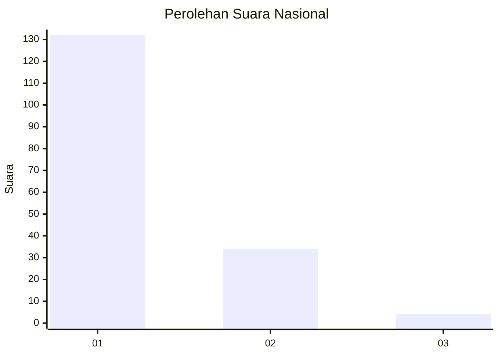
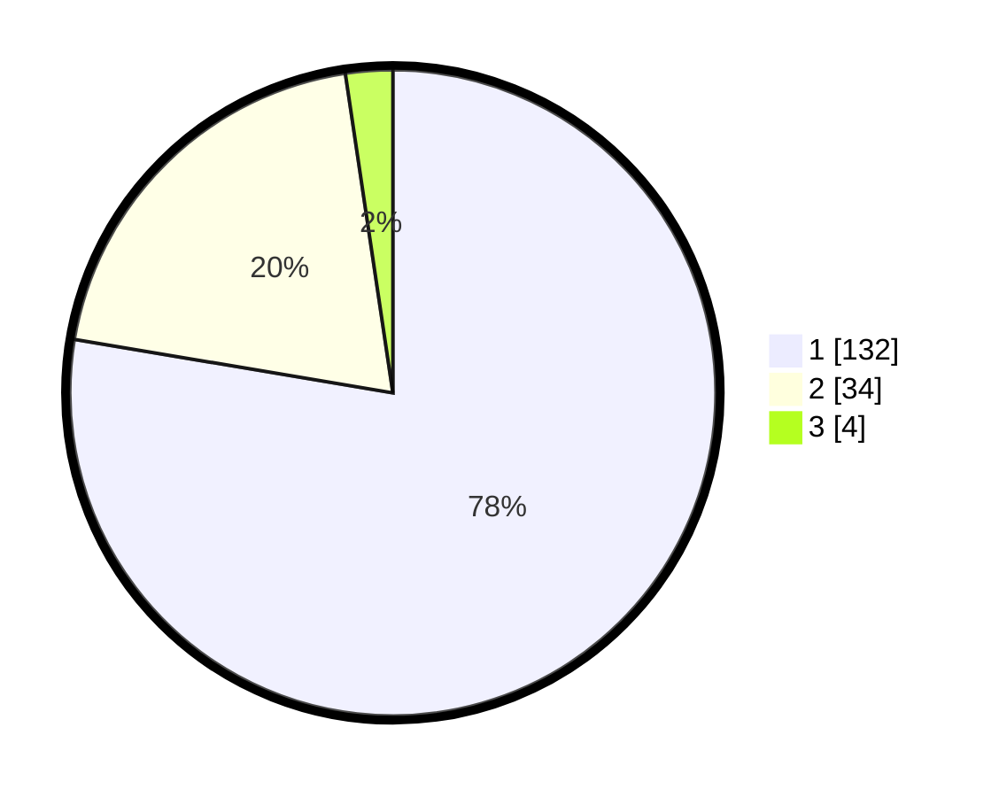

# Hasil

## Grafik

## Tabel

| No. | Nama Paslon    | Suara | Suara (raw) | Persentase |
|:--- |:-------------- | -----:| -----------:| ----------:|
| 1   | ANIES MUHAIMIN | 132   | [132][p-1]  | 77,65      |
| 2   | PRABOWO GIBRAN | 34    | [34][p-2]   | 20,00      |
| 3   | GANJAR MAHFUD  | 4     | [4][p-3]    | 2,35       |

[p-1]: https://github.com/gigit-pemilu/pemilu-2024/blob/main/pilpres/hitung-suara/sub/11-aceh/sub/16-aceh-tamiang/sub/01-manyak-payed/sub/2001-simpang-lhee/sub/004-tps/sub/paslon-1.txt
[p-2]: https://github.com/gigit-pemilu/pemilu-2024/blob/main/pilpres/hitung-suara/sub/11-aceh/sub/16-aceh-tamiang/sub/01-manyak-payed/sub/2001-simpang-lhee/sub/004-tps/sub/paslon-2.txt
[p-3]: https://github.com/gigit-pemilu/pemilu-2024/blob/main/pilpres/hitung-suara/sub/11-aceh/sub/16-aceh-tamiang/sub/01-manyak-payed/sub/2001-simpang-lhee/sub/004-tps/sub/paslon-3.txt

## Foto C Plano

https://sirekap-obj-formc.kpu.go.id/7f1e/pemilu/ppwp/11/16/01/20/01/1116012001004-20240214-155517--30046c4e-36bf-4ad3-83ce-d2e9f08f1ee7.jpg

https://sirekap-obj-formc.kpu.go.id/7f1e/pemilu/ppwp/11/16/01/20/01/1116012001004-20240220-092859--e15bade4-21bc-4beb-bdf2-ae171e64b69d.jpg

https://sirekap-obj-formc.kpu.go.id/7f1e/pemilu/ppwp/11/16/01/20/01/1116012001004-20240220-092931--277ff96e-133f-40f1-be6d-9ca90e021fa0.jpg

## Metadata

| Key        | Value               |
| ---------- | ------------------- |
| Time Stamp | 2024-02-21 11:00:00 |

## DATA PEMILIH TETAP

Jumlah pemilih dalam DPT: **215**.
 * L: **109**.
 * P: **106**.

## DATA PENGGUNA HAK PILIH

Jumlah pengguna hak pilih dalam DPT: **172**.
 * L: **83**.
 * P: **89**.

Jumlah pengguna hak pilih dalam DPTb: **1**.
 * L: **0**.
 * P: **1**.

Jumlah pengguna hak pilih dalam DPK: **0**.
 * L: **0**.
 * P: **0**.

Jumlah pengguna hak pilih: **173**.
 * L: **83**.
 * P: **90**.

## JUMLAH SUARA SAH DAN TIDAK SAH

JUMLAH SELURUH SUARA SAH: **170**.

JUMLAH SUARA TIDAK SAH: **3**.

JUMLAH SELURUH SUARA SAH DAN SUARA TIDAK SAH: **173**.

