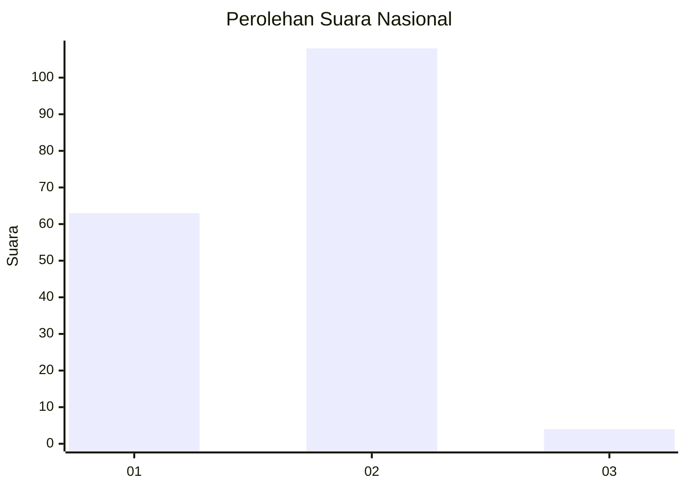
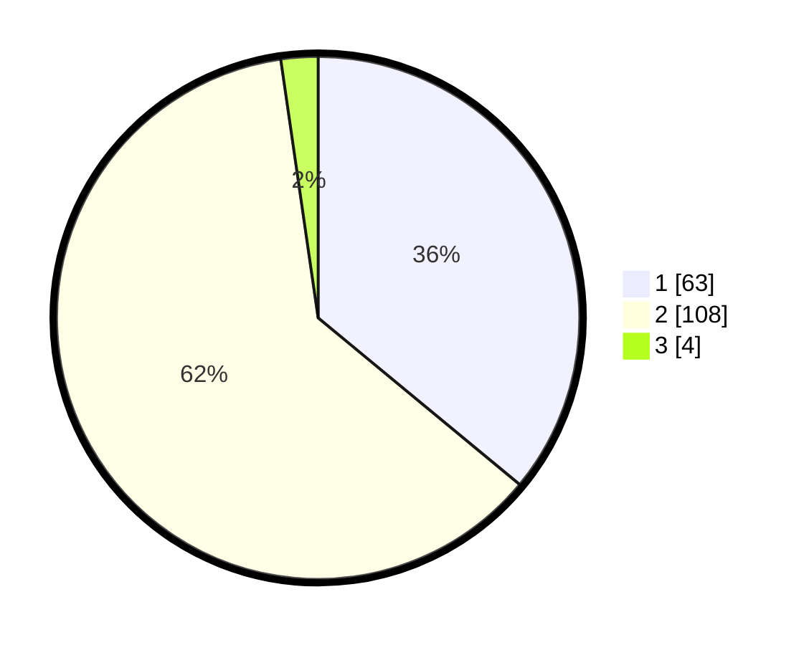

# Hasil

## Grafik

## Tabel

| No. | Nama Paslon    | Suara | Suara (raw) | Persentase |
|:--- |:-------------- | -----:| -----------:| ----------:|
| 1   | ANIES MUHAIMIN | 63    | [63][p-1]   | 36,00      |
| 2   | PRABOWO GIBRAN | 108   | [108][p-2]  | 61,71      |
| 3   | GANJAR MAHFUD  | 4     | [4][p-3]    | 2,29       |

[p-1]: https://github.com/gigit-pemilu/pemilu-2024/blob/main/pilpres/hitung-suara/sub/11-aceh/sub/16-aceh-tamiang/sub/01-manyak-payed/sub/2002-buket-panyang-sa/sub/001-tps/sub/paslon-1.txt
[p-2]: https://github.com/gigit-pemilu/pemilu-2024/blob/main/pilpres/hitung-suara/sub/11-aceh/sub/16-aceh-tamiang/sub/01-manyak-payed/sub/2002-buket-panyang-sa/sub/001-tps/sub/paslon-2.txt
[p-3]: https://github.com/gigit-pemilu/pemilu-2024/blob/main/pilpres/hitung-suara/sub/11-aceh/sub/16-aceh-tamiang/sub/01-manyak-payed/sub/2002-buket-panyang-sa/sub/001-tps/sub/paslon-3.txt

## Foto C Plano

https://sirekap-obj-formc.kpu.go.id/1936/pemilu/ppwp/11/16/01/20/02/1116012002001-20240222-142232--6e34b517-ec1f-44e6-885c-47a639dcfdf5.jpg

https://sirekap-obj-formc.kpu.go.id/1936/pemilu/ppwp/11/16/01/20/02/1116012002001-20240214-155202--9085558a-8e44-462b-83c2-1d1d5639616e.jpg

https://sirekap-obj-formc.kpu.go.id/1936/pemilu/ppwp/11/16/01/20/02/1116012002001-20240214-155256--d1f220d4-9bd4-487c-8309-baa37a9090c6.jpg

## Metadata

| Key        | Value               |
| ---------- | ------------------- |
| Time Stamp | 2024-02-22 15:00:00 |

## DATA PEMILIH TETAP

Jumlah pemilih dalam DPT: **194**.
 * L: **96**.
 * P: **98**.

## DATA PENGGUNA HAK PILIH

Jumlah pengguna hak pilih dalam DPT: **169**.
 * L: **84**.
 * P: **85**.

Jumlah pengguna hak pilih dalam DPTb: **1**.
 * L: **0**.
 * P: **1**.

Jumlah pengguna hak pilih dalam DPK: **6**.
 * L: **4**.
 * P: **2**.

Jumlah pengguna hak pilih: **176**.
 * L: **88**.
 * P: **88**.

## JUMLAH SUARA SAH DAN TIDAK SAH

JUMLAH SELURUH SUARA SAH: **175**.

JUMLAH SUARA TIDAK SAH: **1**.

JUMLAH SELURUH SUARA SAH DAN SUARA TIDAK SAH: **176**.

