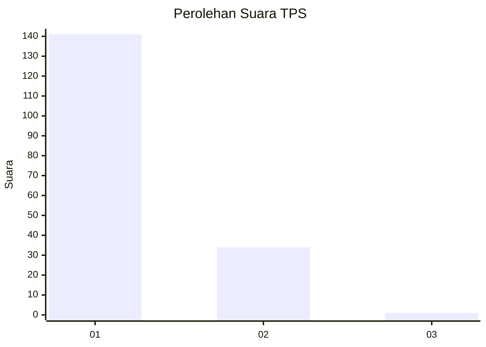
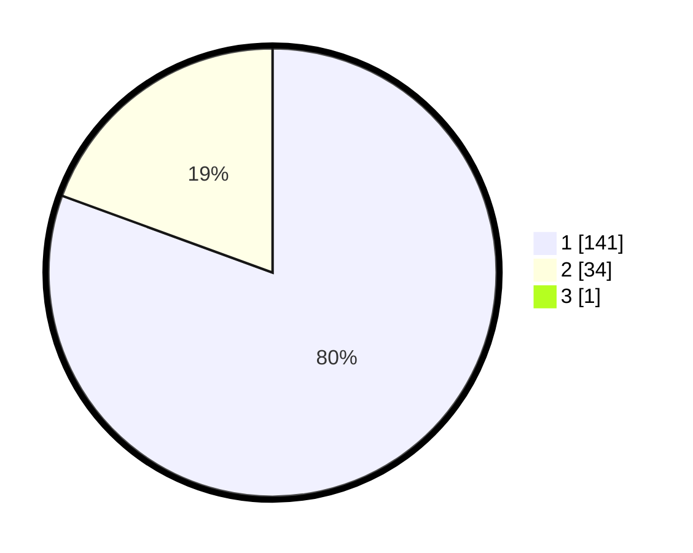

# Hasil

## Grafik

## Tabel

| No. | Nama Paslon    | Suara | Suara (raw) | Persentase |
|:--- |:-------------- | -----:| -----------:| ----------:|
| 1   | ANIES MUHAIMIN | 141   | [141][p-1]  | 80,11      |
| 2   | PRABOWO GIBRAN | 34    | [34][p-2]   | 19,32      |
| 3   | GANJAR MAHFUD  | 1     | [1][p-3]    | 0,57       |

[p-1]: https://github.com/gigit-pemilu/pemilu-2024-11-aceh/blob/main/pilpres/hitung-suara/sub/11-aceh/sub/16-aceh-tamiang/sub/01-manyak-payed/sub/2008-mesjid/sub/005-tps/sub/paslon-1.txt
[p-2]: https://github.com/gigit-pemilu/pemilu-2024-11-aceh/blob/main/pilpres/hitung-suara/sub/11-aceh/sub/16-aceh-tamiang/sub/01-manyak-payed/sub/2008-mesjid/sub/005-tps/sub/paslon-2.txt
[p-3]: https://github.com/gigit-pemilu/pemilu-2024-11-aceh/blob/main/pilpres/hitung-suara/sub/11-aceh/sub/16-aceh-tamiang/sub/01-manyak-payed/sub/2008-mesjid/sub/005-tps/sub/paslon-3.txt

## Foto C Plano

https://sirekap-obj-formc.kpu.go.id/eab4/pemilu/ppwp/11/16/01/20/08/1116012008005-20240214-195733--3d44d179-f611-46c7-bdb3-93cabe823b9c.jpg

https://sirekap-obj-formc.kpu.go.id/eab4/pemilu/ppwp/11/16/01/20/08/1116012008005-20240214-200216--e50dce54-a546-41a4-8540-7a9c347bd142.jpg

https://sirekap-obj-formc.kpu.go.id/eab4/pemilu/ppwp/11/16/01/20/08/1116012008005-20240214-200300--498f9fd9-0018-45e5-a8bb-766484ca4dbe.jpg

## Metadata

| Key        | Value               |
| ---------- | ------------------- |
| Time Stamp | 2024-02-15 12:00:28 |

