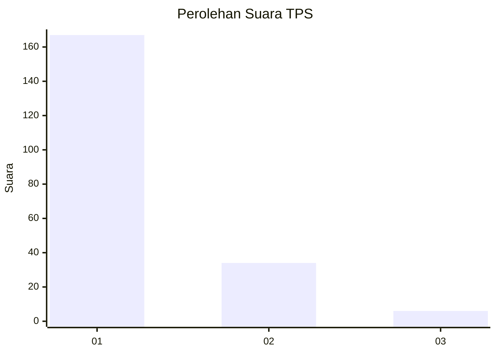
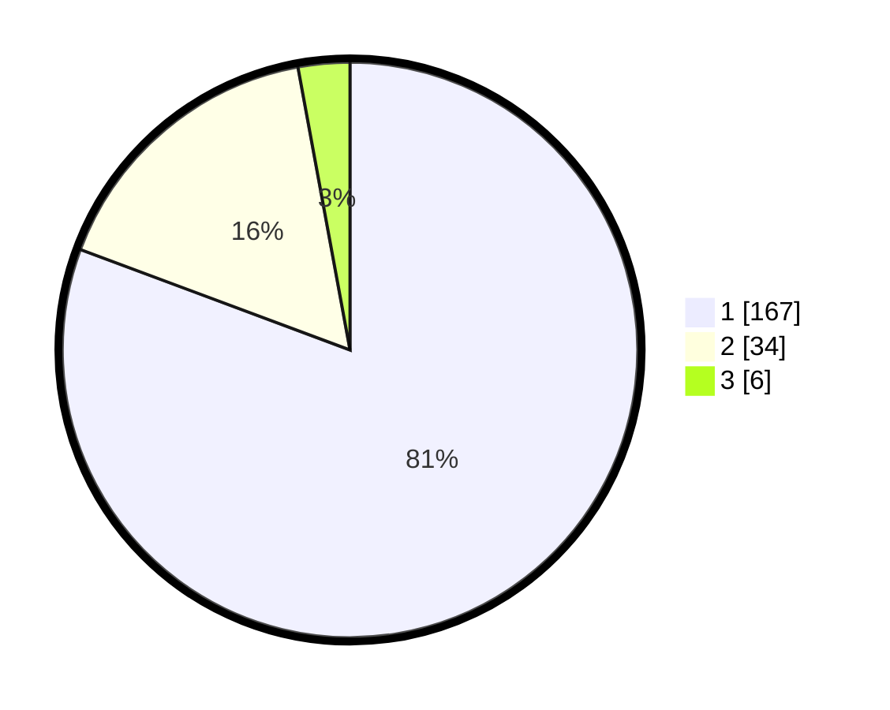

# Hasil

## Grafik

## Tabel

| No. | Nama Paslon    | Suara | Suara (raw) | Persentase |
|:--- |:-------------- | -----:| -----------:| ----------:|
| 1   | ANIES MUHAIMIN | 167   | [167][p-1]  | 80,68      |
| 2   | PRABOWO GIBRAN | 34    | [34][p-2]   | 16,43      |
| 3   | GANJAR MAHFUD  | 6     | [6][p-3]    | 2,90       |

[p-1]: https://github.com/gigit-pemilu/pemilu-2024-11-aceh/blob/main/pilpres/hitung-suara/sub/11-aceh/sub/16-aceh-tamiang/sub/01-manyak-payed/sub/2021-tualang-baro/sub/002-tps/sub/paslon-1.txt
[p-2]: https://github.com/gigit-pemilu/pemilu-2024-11-aceh/blob/main/pilpres/hitung-suara/sub/11-aceh/sub/16-aceh-tamiang/sub/01-manyak-payed/sub/2021-tualang-baro/sub/002-tps/sub/paslon-2.txt
[p-3]: https://github.com/gigit-pemilu/pemilu-2024-11-aceh/blob/main/pilpres/hitung-suara/sub/11-aceh/sub/16-aceh-tamiang/sub/01-manyak-payed/sub/2021-tualang-baro/sub/002-tps/sub/paslon-3.txt

## Foto C Plano

https://sirekap-obj-formc.kpu.go.id/178c/pemilu/ppwp/11/16/01/20/21/1116012021002-20240214-220743--e626c6ef-7dfb-4366-b3b3-068c55bbf1dc.jpg

https://sirekap-obj-formc.kpu.go.id/178c/pemilu/ppwp/11/16/01/20/21/1116012021002-20240214-195358--e9dedd92-d6f6-4cdc-a993-284203f6334b.jpg

## Metadata

| Key        | Value               |
| ---------- | ------------------- |
| Time Stamp | 2024-02-15 20:30:46 |

