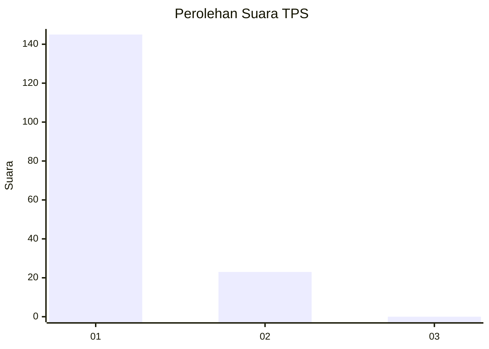
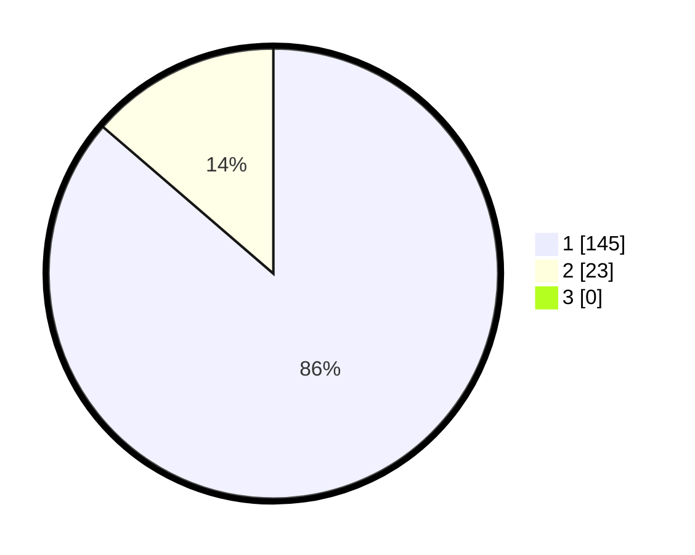

# Hasil

## Grafik

## Tabel

| No. | Nama Paslon    | Suara | Suara (raw) | Persentase |
|:--- |:-------------- | -----:| -----------:| ----------:|
| 1   | ANIES MUHAIMIN | 145   | [145][p-1]  | 86,31      |
| 2   | PRABOWO GIBRAN | 23    | [23][p-2]   | 13,69      |
| 3   | GANJAR MAHFUD  | 0     | [0][p-3]    | 0,00       |

[p-1]: https://github.com/gigit-pemilu/pemilu-2024-11-aceh/blob/main/pilpres/hitung-suara/sub/11-aceh/sub/16-aceh-tamiang/sub/01-manyak-payed/sub/2027-meurandeh/sub/004-tps/sub/paslon-1.txt
[p-2]: https://github.com/gigit-pemilu/pemilu-2024-11-aceh/blob/main/pilpres/hitung-suara/sub/11-aceh/sub/16-aceh-tamiang/sub/01-manyak-payed/sub/2027-meurandeh/sub/004-tps/sub/paslon-2.txt
[p-3]: https://github.com/gigit-pemilu/pemilu-2024-11-aceh/blob/main/pilpres/hitung-suara/sub/11-aceh/sub/16-aceh-tamiang/sub/01-manyak-payed/sub/2027-meurandeh/sub/004-tps/sub/paslon-3.txt

## Foto C Plano

https://sirekap-obj-formc.kpu.go.id/e5ce/pemilu/ppwp/11/16/01/20/27/1116012027004-20240224-010837--5bef38cb-03f3-46d1-9b49-e40ea80532b4.jpg

https://sirekap-obj-formc.kpu.go.id/e5ce/pemilu/ppwp/11/16/01/20/27/1116012027004-20240223-231739--336b63a0-3913-4b9d-a9fa-8e8bae15fc22.jpg

https://sirekap-obj-formc.kpu.go.id/e5ce/pemilu/ppwp/11/16/01/20/27/1116012027004-20240223-232012--4d71ad30-9c58-49e8-80f2-4cae12b31d31.jpg

## Metadata

| Key        | Value               |
| ---------- | ------------------- |
| Time Stamp | 2024-02-24 22:31:28 |

