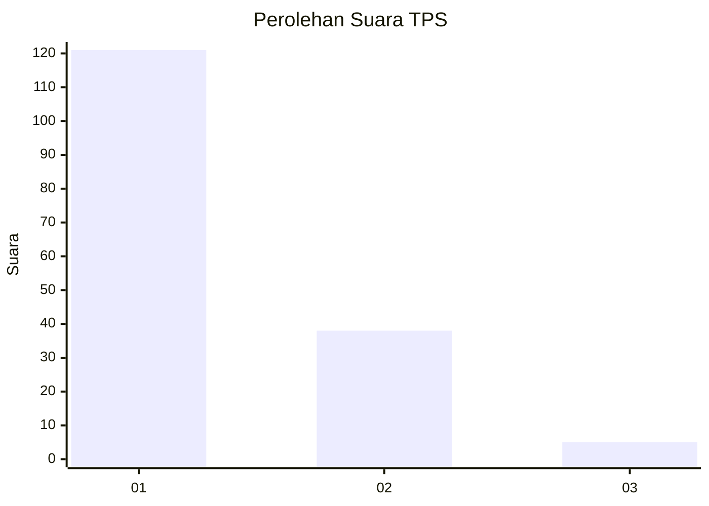
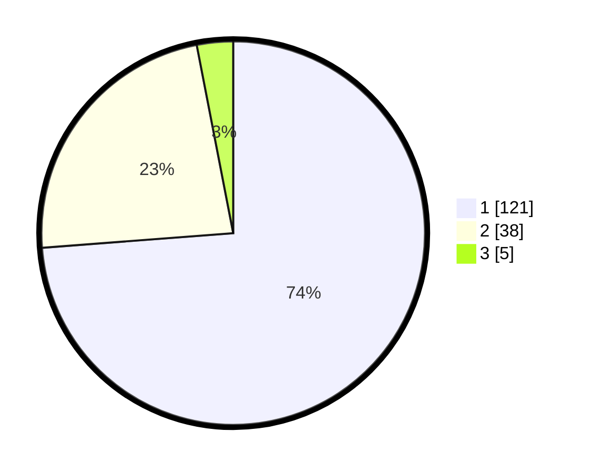

# Hasil

## Grafik

## Tabel

| No. | Nama Paslon    | Suara | Suara (raw) | Persentase |
|:--- |:-------------- | -----:| -----------:| ----------:|
| 1   | ANIES MUHAIMIN | 121   | [121][p-1]  | 73,78      |
| 2   | PRABOWO GIBRAN | 38    | [38][p-2]   | 23,17      |
| 3   | GANJAR MAHFUD  | 5     | [5][p-3]    | 3,05       |

[p-1]: https://github.com/gigit-pemilu/pemilu-2024-11-aceh/blob/main/pilpres/hitung-suara/sub/11-aceh/sub/16-aceh-tamiang/sub/02-bendahara/sub/2001-mesjid-sungai-iyu/sub/002-tps/sub/paslon-1.txt
[p-2]: https://github.com/gigit-pemilu/pemilu-2024-11-aceh/blob/main/pilpres/hitung-suara/sub/11-aceh/sub/16-aceh-tamiang/sub/02-bendahara/sub/2001-mesjid-sungai-iyu/sub/002-tps/sub/paslon-2.txt
[p-3]: https://github.com/gigit-pemilu/pemilu-2024-11-aceh/blob/main/pilpres/hitung-suara/sub/11-aceh/sub/16-aceh-tamiang/sub/02-bendahara/sub/2001-mesjid-sungai-iyu/sub/002-tps/sub/paslon-3.txt

## Foto C Plano

https://sirekap-obj-formc.kpu.go.id/73ae/pemilu/ppwp/11/16/02/20/01/1116022001002-20240216-140331--c7fcb56a-937e-4388-89a4-30692b9b4461.jpg

https://sirekap-obj-formc.kpu.go.id/73ae/pemilu/ppwp/11/16/02/20/01/1116022001002-20240216-140332--bed49c12-f18e-4ac8-a380-8bd363d65ea9.jpg

https://sirekap-obj-formc.kpu.go.id/73ae/pemilu/ppwp/11/16/02/20/01/1116022001002-20240216-140332--66c8356e-fbb0-4064-b2b4-9c990978c328.jpg

## Metadata

| Key        | Value               |
| ---------- | ------------------- |
| Time Stamp | 2024-02-16 21:01:00 |

## DATA PEMILIH TETAP

Jumlah pemilih dalam DPT: **198**.
 * L: **93**.
 * P: **105**.

## DATA PENGGUNA HAK PILIH

Jumlah pengguna hak pilih dalam DPT: **164**.
 * L: **75**.
 * P: **89**.

Jumlah pengguna hak pilih dalam DPTb: **0**.
 * L: **0**.
 * P: **0**.

Jumlah pengguna hak pilih dalam DPK: **0**.
 * L: **0**.
 * P: **0**.

Jumlah pengguna hak pilih: **164**.
 * L: **75**.
 * P: **89**.

## JUMLAH SUARA SAH DAN TIDAK SAH

JUMLAH SELURUH SUARA SAH: **164**.

JUMLAH SUARA TIDAK SAH: **0**.

JUMLAH SELURUH SUARA SAH DAN SUARA TIDAK SAH: **164**.

