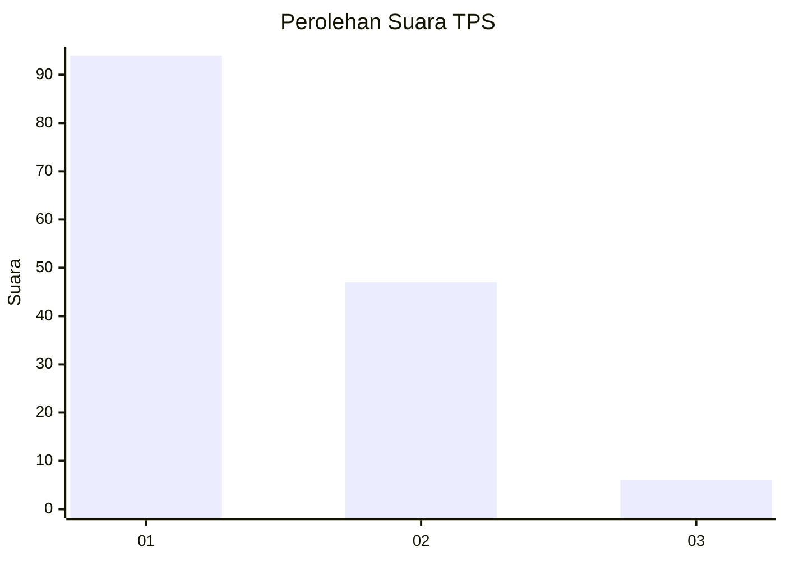
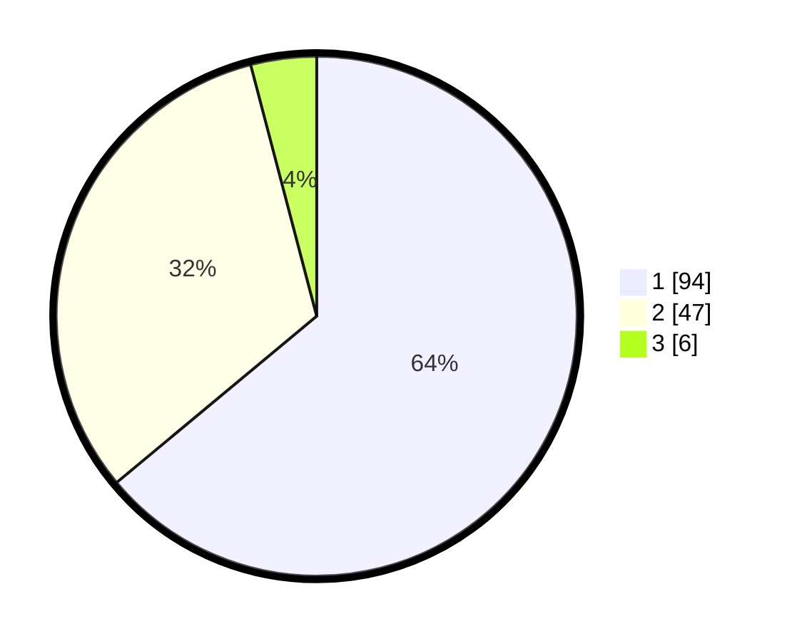

# Hasil

## Grafik

## Tabel

| No. | Nama Paslon    | Suara | Suara (raw) | Persentase |
|:--- |:-------------- | -----:| -----------:| ----------:|
| 1   | ANIES MUHAIMIN | 94    | [94][p-1]   | 63,95      |
| 2   | PRABOWO GIBRAN | 47    | [47][p-2]   | 31,97      |
| 3   | GANJAR MAHFUD  | 6     | [6][p-3]    | 4,08       |

[p-1]: https://github.com/gigit-pemilu/pemilu-2024-11-aceh/blob/main/pilpres/hitung-suara/sub/11-aceh/sub/16-aceh-tamiang/sub/02-bendahara/sub/2001-mesjid-sungai-iyu/sub/003-tps/sub/paslon-1.txt
[p-2]: https://github.com/gigit-pemilu/pemilu-2024-11-aceh/blob/main/pilpres/hitung-suara/sub/11-aceh/sub/16-aceh-tamiang/sub/02-bendahara/sub/2001-mesjid-sungai-iyu/sub/003-tps/sub/paslon-2.txt
[p-3]: https://github.com/gigit-pemilu/pemilu-2024-11-aceh/blob/main/pilpres/hitung-suara/sub/11-aceh/sub/16-aceh-tamiang/sub/02-bendahara/sub/2001-mesjid-sungai-iyu/sub/003-tps/sub/paslon-3.txt

## Foto C Plano

https://sirekap-obj-formc.kpu.go.id/4a62/pemilu/ppwp/11/16/02/20/01/1116022001003-20240216-142523--7ba2e8cc-516d-451e-bea3-c3adcb3f9c29.jpg

https://sirekap-obj-formc.kpu.go.id/4a62/pemilu/ppwp/11/16/02/20/01/1116022001003-20240216-142524--03d76f82-5119-4466-9b0f-c4db32c51a39.jpg

https://sirekap-obj-formc.kpu.go.id/4a62/pemilu/ppwp/11/16/02/20/01/1116022001003-20240216-142523--dba53a1e-536b-49e7-a6e5-0b4c8cf903c3.jpg

## Metadata

| Key        | Value               |
| ---------- | ------------------- |
| Time Stamp | 2024-02-16 21:01:00 |

## DATA PEMILIH TETAP

Jumlah pemilih dalam DPT: **189**.
 * L: **97**.
 * P: **92**.

## DATA PENGGUNA HAK PILIH

Jumlah pengguna hak pilih dalam DPT: **147**.
 * L: **71**.
 * P: **76**.

Jumlah pengguna hak pilih dalam DPTb: **2**.
 * L: **1**.
 * P: **1**.

Jumlah pengguna hak pilih dalam DPK: **0**.
 * L: **0**.
 * P: **0**.

Jumlah pengguna hak pilih: **149**.
 * L: **72**.
 * P: **77**.

## JUMLAH SUARA SAH DAN TIDAK SAH

JUMLAH SELURUH SUARA SAH: **147**.

JUMLAH SUARA TIDAK SAH: **2**.

JUMLAH SELURUH SUARA SAH DAN SUARA TIDAK SAH: **149**.

