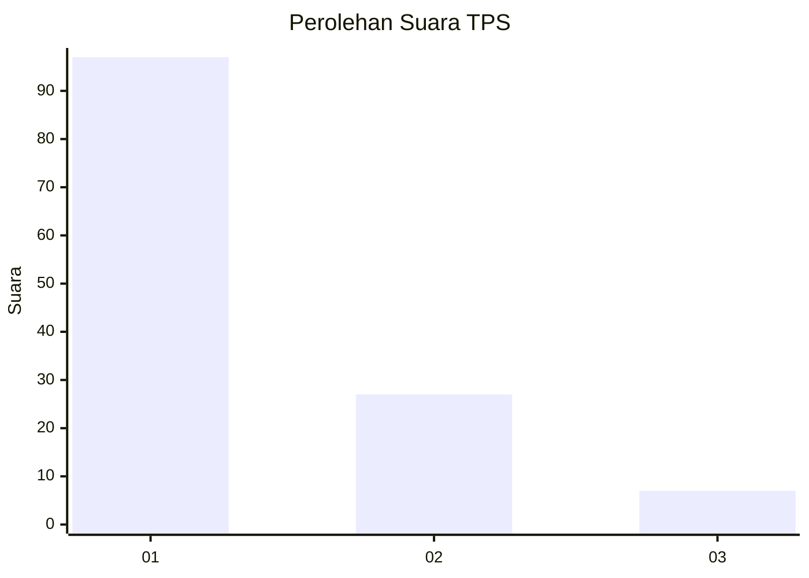
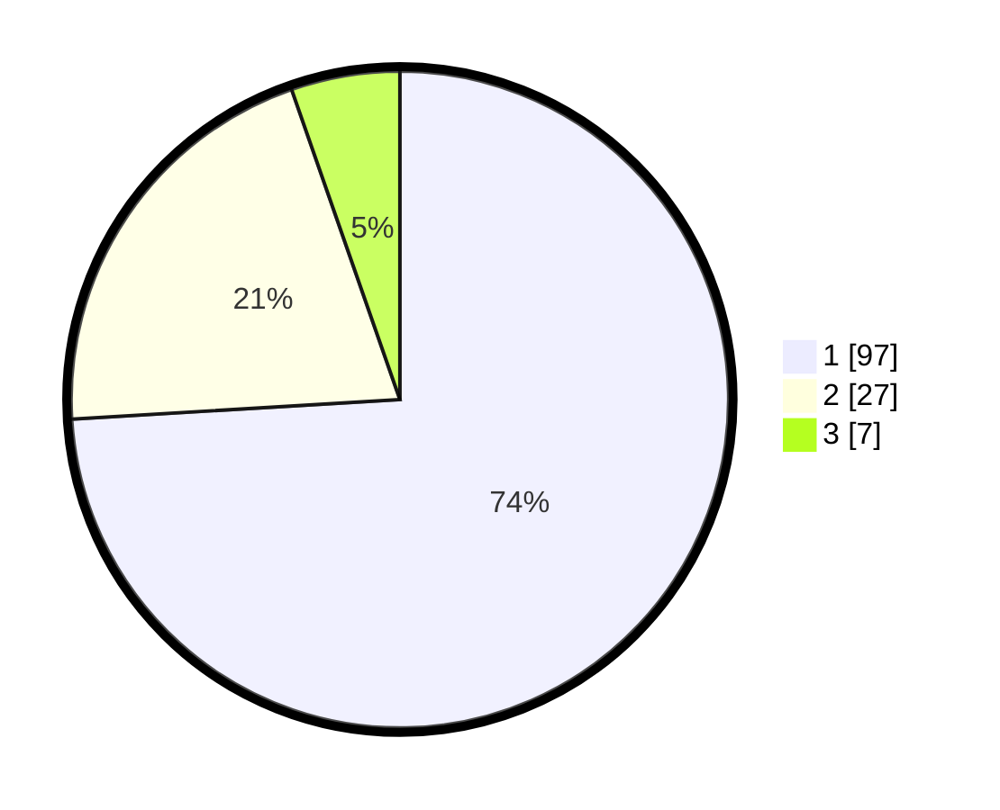

# Hasil

## Grafik

## Tabel

| No. | Nama Paslon    | Suara | Suara (raw) | Persentase |
|:--- |:-------------- | -----:| -----------:| ----------:|
| 1   | ANIES MUHAIMIN | 97    | [97][p-1]   | 74,05      |
| 2   | PRABOWO GIBRAN | 27    | [27][p-2]   | 20,61      |
| 3   | GANJAR MAHFUD  | 7     | [7][p-3]    | 5,34       |

[p-1]: https://github.com/gigit-pemilu/pemilu-2024-11-aceh/blob/main/pilpres/hitung-suara/sub/11-aceh/sub/16-aceh-tamiang/sub/02-bendahara/sub/2001-mesjid-sungai-iyu/sub/004-tps/sub/paslon-1.txt
[p-2]: https://github.com/gigit-pemilu/pemilu-2024-11-aceh/blob/main/pilpres/hitung-suara/sub/11-aceh/sub/16-aceh-tamiang/sub/02-bendahara/sub/2001-mesjid-sungai-iyu/sub/004-tps/sub/paslon-2.txt
[p-3]: https://github.com/gigit-pemilu/pemilu-2024-11-aceh/blob/main/pilpres/hitung-suara/sub/11-aceh/sub/16-aceh-tamiang/sub/02-bendahara/sub/2001-mesjid-sungai-iyu/sub/004-tps/sub/paslon-3.txt

## Foto C Plano

https://sirekap-obj-formc.kpu.go.id/0a3f/pemilu/ppwp/11/16/02/20/01/1116022001004-20240216-091336--6fa4b44a-3a7e-4ad8-83f8-a411ad730875.jpg

https://sirekap-obj-formc.kpu.go.id/0a3f/pemilu/ppwp/11/16/02/20/01/1116022001004-20240216-092431--b809e392-e862-4f6e-b8ba-926475756a09.jpg

https://sirekap-obj-formc.kpu.go.id/0a3f/pemilu/ppwp/11/16/02/20/01/1116022001004-20240216-091341--63b4d0d5-aa51-43c9-89e4-e8b006177682.jpg

## Metadata

| Key        | Value               |
| ---------- | ------------------- |
| Time Stamp | 2024-02-16 09:30:28 |

## DATA PEMILIH TETAP

Jumlah pemilih dalam DPT: **180**.
 * L: **95**.
 * P: **85**.

## DATA PENGGUNA HAK PILIH

Jumlah pengguna hak pilih dalam DPT: **132**.
 * L: **70**.
 * P: **62**.

Jumlah pengguna hak pilih dalam DPTb: **2**.
 * L: **1**.
 * P: **1**.

Jumlah pengguna hak pilih dalam DPK: **0**.
 * L: **0**.
 * P: **0**.

Jumlah pengguna hak pilih: **134**.
 * L: **71**.
 * P: **63**.

## JUMLAH SUARA SAH DAN TIDAK SAH

JUMLAH SELURUH SUARA SAH: **131**.

JUMLAH SUARA TIDAK SAH: **3**.

JUMLAH SELURUH SUARA SAH DAN SUARA TIDAK SAH: **134**.

