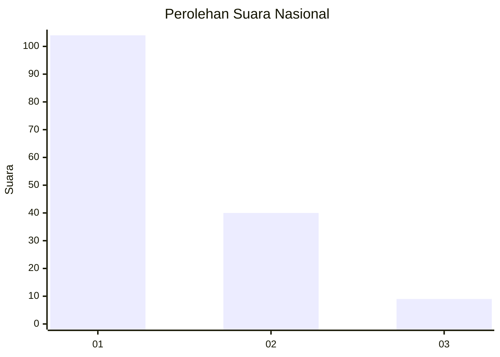
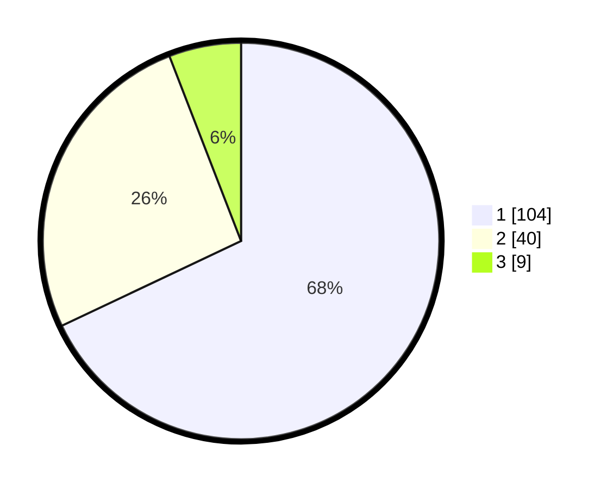

# Hasil

## Grafik

## Tabel

| No. | Nama Paslon    | Suara | Suara (raw) | Persentase |
|:--- |:-------------- | -----:| -----------:| ----------:|
| 1   | ANIES MUHAIMIN | 104   | [104][p-1]  | 67,97      |
| 2   | PRABOWO GIBRAN | 40    | [40][p-2]   | 26,14      |
| 3   | GANJAR MAHFUD  | 9     | [9][p-3]    | 5,88       |

[p-1]: https://github.com/gigit-pemilu/pemilu-2024/blob/main/pilpres/hitung-suara/sub/11-aceh/sub/16-aceh-tamiang/sub/02-bendahara/sub/2001-mesjid-sungai-iyu/sub/005-tps/sub/paslon-1.txt
[p-2]: https://github.com/gigit-pemilu/pemilu-2024/blob/main/pilpres/hitung-suara/sub/11-aceh/sub/16-aceh-tamiang/sub/02-bendahara/sub/2001-mesjid-sungai-iyu/sub/005-tps/sub/paslon-2.txt
[p-3]: https://github.com/gigit-pemilu/pemilu-2024/blob/main/pilpres/hitung-suara/sub/11-aceh/sub/16-aceh-tamiang/sub/02-bendahara/sub/2001-mesjid-sungai-iyu/sub/005-tps/sub/paslon-3.txt

## Foto C Plano

https://sirekap-obj-formc.kpu.go.id/b847/pemilu/ppwp/11/16/02/20/01/1116022001005-20240216-121657--aef037e7-819b-48cf-9b19-8455656840dc.jpg

https://sirekap-obj-formc.kpu.go.id/b847/pemilu/ppwp/11/16/02/20/01/1116022001005-20240216-121704--780f93b0-b71b-4039-964e-3994ee9a867c.jpg

https://sirekap-obj-formc.kpu.go.id/b847/pemilu/ppwp/11/16/02/20/01/1116022001005-20240216-121700--f5fb2a95-3b38-4cf5-8ce8-e7e2998e1323.jpg

## Metadata

| Key        | Value               |
| ---------- | ------------------- |
| Time Stamp | 2024-02-19 06:16:00 |

## DATA PEMILIH TETAP

Jumlah pemilih dalam DPT: **197**.
 * L: **101**.
 * P: **96**.

## DATA PENGGUNA HAK PILIH

Jumlah pengguna hak pilih dalam DPT: **147**.
 * L: **66**.
 * P: **81**.

Jumlah pengguna hak pilih dalam DPTb: **0**.
 * L: **0**.
 * P: **0**.

Jumlah pengguna hak pilih dalam DPK: **7**.
 * L: **6**.
 * P: **1**.

Jumlah pengguna hak pilih: **154**.
 * L: **72**.
 * P: **82**.

## JUMLAH SUARA SAH DAN TIDAK SAH

JUMLAH SELURUH SUARA SAH: **153**.

JUMLAH SUARA TIDAK SAH: **1**.

JUMLAH SELURUH SUARA SAH DAN SUARA TIDAK SAH: **154**.

