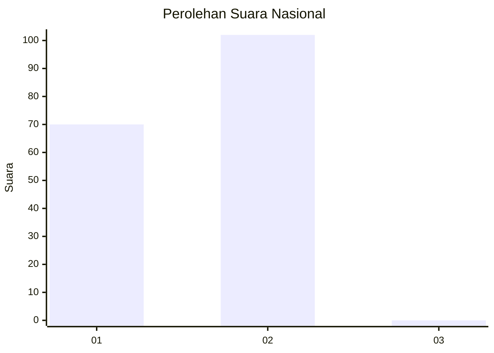
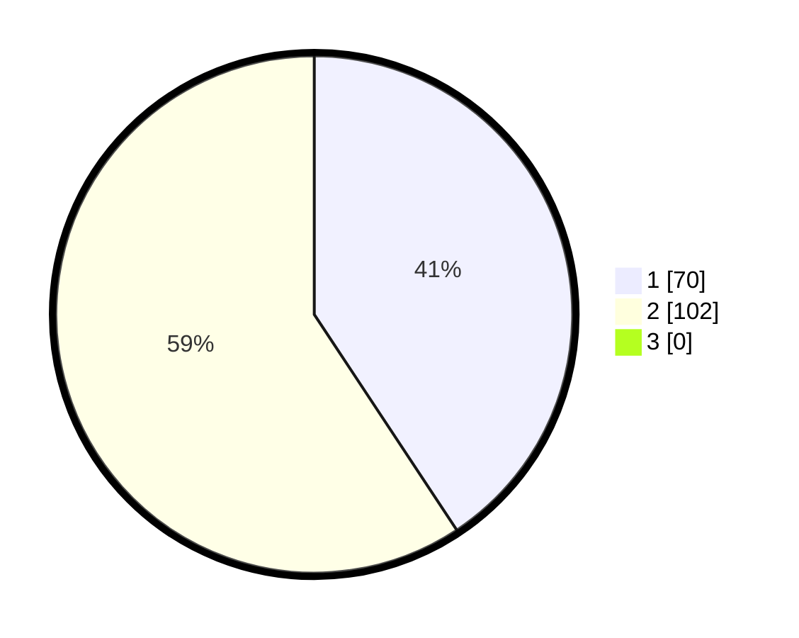

# Hasil

## Grafik

## Tabel

| No. | Nama Paslon    | Suara | Suara (raw) | Persentase |
|:--- |:-------------- | -----:| -----------:| ----------:|
| 1   | ANIES MUHAIMIN | 70    | [70][p-1]   | 40,70      |
| 2   | PRABOWO GIBRAN | 102   | [102][p-2]  | 59,30      |
| 3   | GANJAR MAHFUD  | 0     | [0][p-3]    | 0,00       |

[p-1]: https://github.com/gigit-pemilu/pemilu-2024/blob/main/pilpres/hitung-suara/sub/11-aceh/sub/16-aceh-tamiang/sub/02-bendahara/sub/2031-matang-tepah/sub/002-tps/sub/paslon-1.txt
[p-2]: https://github.com/gigit-pemilu/pemilu-2024/blob/main/pilpres/hitung-suara/sub/11-aceh/sub/16-aceh-tamiang/sub/02-bendahara/sub/2031-matang-tepah/sub/002-tps/sub/paslon-2.txt
[p-3]: https://github.com/gigit-pemilu/pemilu-2024/blob/main/pilpres/hitung-suara/sub/11-aceh/sub/16-aceh-tamiang/sub/02-bendahara/sub/2031-matang-tepah/sub/002-tps/sub/paslon-3.txt

## Foto C Plano

https://sirekap-obj-formc.kpu.go.id/9329/pemilu/ppwp/11/16/02/20/31/1116022031002-20240223-140502--2a29c44f-b019-4159-a393-b2c67df03aac.jpg

https://sirekap-obj-formc.kpu.go.id/9329/pemilu/ppwp/11/16/02/20/31/1116022031002-20240223-141458--c9111933-5685-4fb6-a212-959569591784.jpg

https://sirekap-obj-formc.kpu.go.id/9329/pemilu/ppwp/11/16/02/20/31/1116022031002-20240223-141931--495dc1ab-8b3d-4a2f-8647-132b07e706e3.jpg

## Metadata

| Key        | Value               |
| ---------- | ------------------- |
| Time Stamp | 2024-02-24 22:31:28 |

