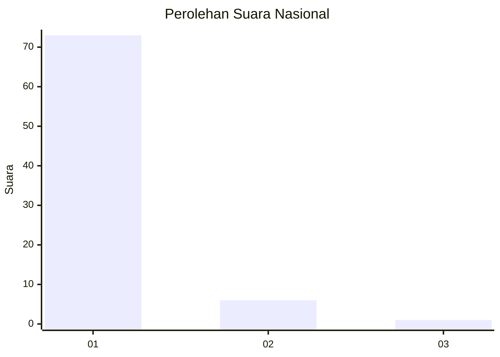
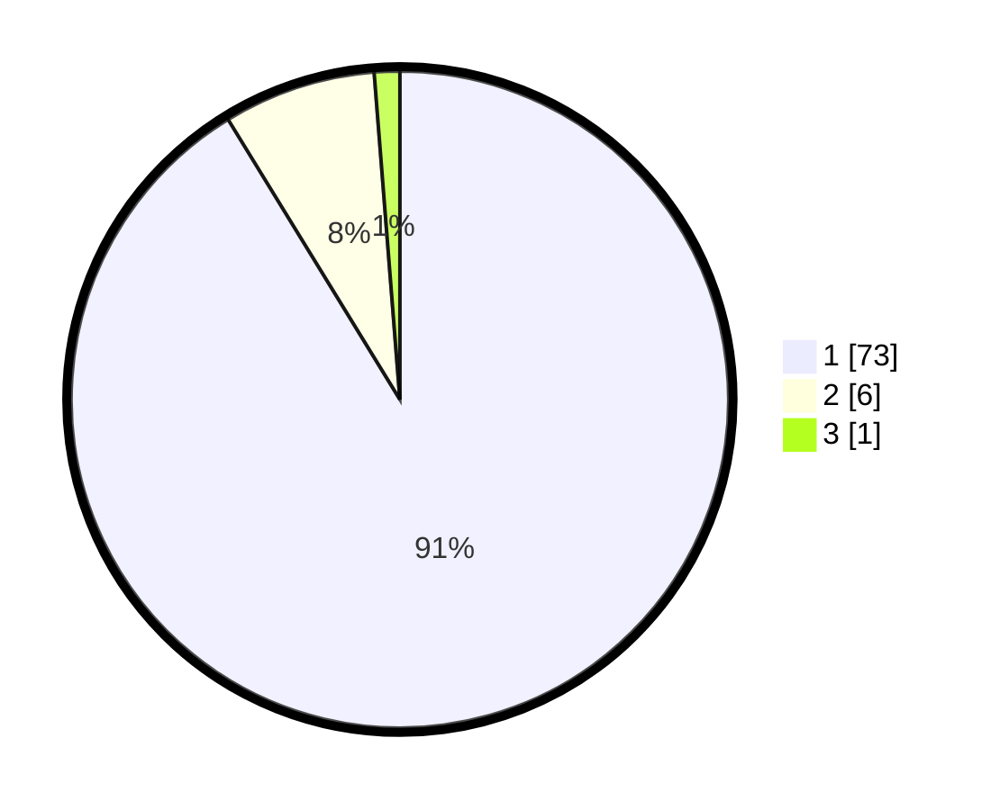

# Hasil

## Grafik

## Tabel

| No. | Nama Paslon    | Suara | Suara (raw) | Persentase |
|:--- |:-------------- | -----:| -----------:| ----------:|
| 1   | ANIES MUHAIMIN | 73    | [73][p-1]   | 91,25      |
| 2   | PRABOWO GIBRAN | 6     | [6][p-2]    | 7,50       |
| 3   | GANJAR MAHFUD  | 1     | [1][p-3]    | 1,25       |

[p-1]: https://github.com/gigit-pemilu/pemilu-2024/blob/main/pilpres/hitung-suara/sub/11-aceh/sub/16-aceh-tamiang/sub/02-bendahara/sub/2035-seuneubok-dalam-upah/sub/003-tps/sub/paslon-1.txt
[p-2]: https://github.com/gigit-pemilu/pemilu-2024/blob/main/pilpres/hitung-suara/sub/11-aceh/sub/16-aceh-tamiang/sub/02-bendahara/sub/2035-seuneubok-dalam-upah/sub/003-tps/sub/paslon-2.txt
[p-3]: https://github.com/gigit-pemilu/pemilu-2024/blob/main/pilpres/hitung-suara/sub/11-aceh/sub/16-aceh-tamiang/sub/02-bendahara/sub/2035-seuneubok-dalam-upah/sub/003-tps/sub/paslon-3.txt

## Foto C Plano

https://sirekap-obj-formc.kpu.go.id/7f44/pemilu/ppwp/11/16/02/20/35/1116022035003-20240223-105427--27a86ce0-f0e0-4ea5-ab67-f73e8a6b16ed.jpg

https://sirekap-obj-formc.kpu.go.id/7f44/pemilu/ppwp/11/16/02/20/35/1116022035003-20240215-022150--5fad41f8-e933-4277-ae6a-4607ea24e926.jpg

https://sirekap-obj-formc.kpu.go.id/7f44/pemilu/ppwp/11/16/02/20/35/1116022035003-20240215-022429--7d23ae54-8a0b-4787-9b35-36afdde2b096.jpg

## Metadata

| Key        | Value               |
| ---------- | ------------------- |
| Time Stamp | 2024-02-24 22:31:28 |

## DATA PEMILIH TETAP

Jumlah pemilih dalam DPT: **103**.
 * L: **51**.
 * P: **52**.

## DATA PENGGUNA HAK PILIH

Jumlah pengguna hak pilih dalam DPT: **63**.
 * L: **26**.
 * P: **37**.

Jumlah pengguna hak pilih dalam DPTb: **8**.
 * L: **8**.
 * P: **0**.

Jumlah pengguna hak pilih dalam DPK: **9**.
 * L: **3**.
 * P: **6**.

Jumlah pengguna hak pilih: **80**.
 * L: **37**.
 * P: **43**.

## JUMLAH SUARA SAH DAN TIDAK SAH

JUMLAH SELURUH SUARA SAH: **80**.

JUMLAH SUARA TIDAK SAH: **0**.

JUMLAH SELURUH SUARA SAH DAN SUARA TIDAK SAH: **80**.

