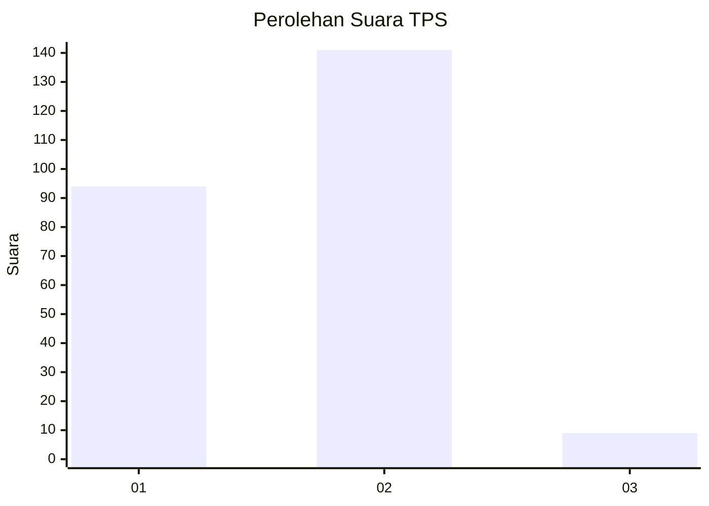
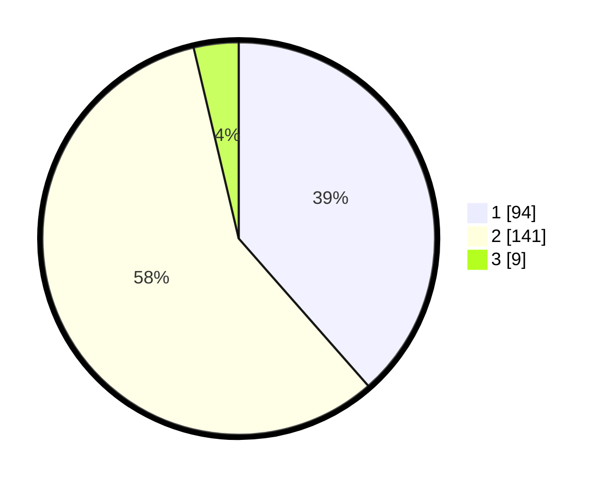

# Hasil

## Grafik

## Tabel

| No. | Nama Paslon    | Suara | Suara (raw) | Persentase |
|:--- |:-------------- | -----:| -----------:| ----------:|
| 1   | ANIES MUHAIMIN | 94    | [94][p-1]   | 38,52      |
| 2   | PRABOWO GIBRAN | 141   | [141][p-2]  | 57,79      |
| 3   | GANJAR MAHFUD  | 9     | [9][p-3]    | 3,69       |

[p-1]: https://github.com/gigit-pemilu/pemilu-2024-11-aceh/blob/main/pilpres/hitung-suara/sub/11-aceh/sub/16-aceh-tamiang/sub/03-karang-baru/sub/2011-dalam/sub/901-tps/sub/paslon-1.txt
[p-2]: https://github.com/gigit-pemilu/pemilu-2024-11-aceh/blob/main/pilpres/hitung-suara/sub/11-aceh/sub/16-aceh-tamiang/sub/03-karang-baru/sub/2011-dalam/sub/901-tps/sub/paslon-2.txt
[p-3]: https://github.com/gigit-pemilu/pemilu-2024-11-aceh/blob/main/pilpres/hitung-suara/sub/11-aceh/sub/16-aceh-tamiang/sub/03-karang-baru/sub/2011-dalam/sub/901-tps/sub/paslon-3.txt

## Foto C Plano

https://sirekap-obj-formc.kpu.go.id/19db/pemilu/ppwp/11/16/03/20/11/1116032011901-20240214-201154--38862338-715f-4c39-9f88-28434e57ad53.jpg

https://sirekap-obj-formc.kpu.go.id/19db/pemilu/ppwp/11/16/03/20/11/1116032011901-20240214-201355--f2239b1f-1c6a-4f10-bbad-b319faed72af.jpg

https://sirekap-obj-formc.kpu.go.id/19db/pemilu/ppwp/11/16/03/20/11/1116032011901-20240214-201502--916aebc9-4bb4-42d1-b4d1-cf14357a90a0.jpg

## Metadata

| Key        | Value               |
| ---------- | ------------------- |
| Time Stamp | 2024-02-15 00:41:44 |

## DATA PEMILIH TETAP

Jumlah pemilih dalam DPT: **246**.
 * L: **245**.
 * P: **1**.

## DATA PENGGUNA HAK PILIH

Jumlah pengguna hak pilih dalam DPT: **101**.
 * L: **101**.
 * P: **0**.

Jumlah pengguna hak pilih dalam DPTb: **150**.
 * L: **148**.
 * P: **2**.

Jumlah pengguna hak pilih dalam DPK: **0**.
 * L: **0**.
 * P: **0**.

Jumlah pengguna hak pilih: **251**.
 * L: **249**.
 * P: **2**.

## JUMLAH SUARA SAH DAN TIDAK SAH

JUMLAH SELURUH SUARA SAH: **244**.

JUMLAH SUARA TIDAK SAH: **7**.

JUMLAH SELURUH SUARA SAH DAN SUARA TIDAK SAH: **251**.

