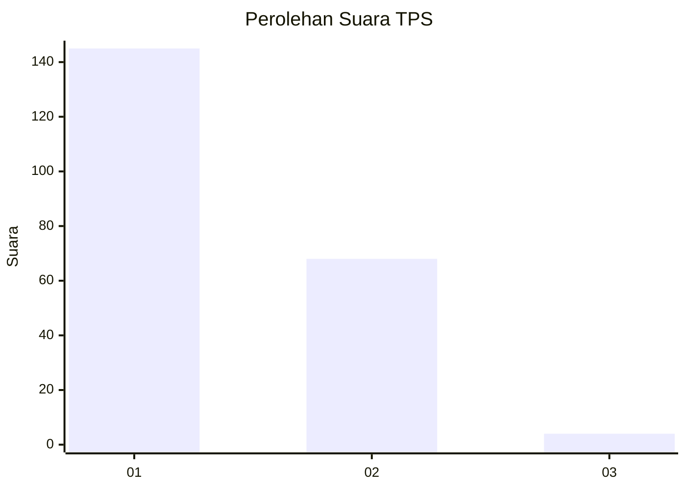
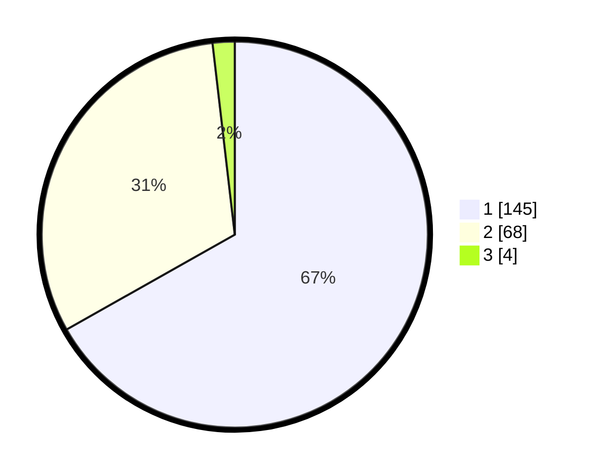

# Hasil

## Grafik

## Tabel

| No. | Nama Paslon    | Suara | Suara (raw) | Persentase |
|:--- |:-------------- | -----:| -----------:| ----------:|
| 1   | ANIES MUHAIMIN | 145   | [145][p-1]  | 66,82      |
| 2   | PRABOWO GIBRAN | 68    | [68][p-2]   | 31,34      |
| 3   | GANJAR MAHFUD  | 4     | [4][p-3]    | 1,84       |

[p-1]: https://github.com/gigit-pemilu/pemilu-2024-11-aceh/blob/main/pilpres/hitung-suara/sub/11-aceh/sub/16-aceh-tamiang/sub/03-karang-baru/sub/2019-pahlawan/sub/001-tps/sub/paslon-1.txt
[p-2]: https://github.com/gigit-pemilu/pemilu-2024-11-aceh/blob/main/pilpres/hitung-suara/sub/11-aceh/sub/16-aceh-tamiang/sub/03-karang-baru/sub/2019-pahlawan/sub/001-tps/sub/paslon-2.txt
[p-3]: https://github.com/gigit-pemilu/pemilu-2024-11-aceh/blob/main/pilpres/hitung-suara/sub/11-aceh/sub/16-aceh-tamiang/sub/03-karang-baru/sub/2019-pahlawan/sub/001-tps/sub/paslon-3.txt

## Foto C Plano

https://sirekap-obj-formc.kpu.go.id/16fc/pemilu/ppwp/11/16/03/20/19/1116032019001-20240220-172913--214aa409-84d7-4d20-a67b-09d4cfb27598.jpg

https://sirekap-obj-formc.kpu.go.id/16fc/pemilu/ppwp/11/16/03/20/19/1116032019001-20240214-192343--f6d40b40-8474-4f44-828e-2cc5ab02cb78.jpg

https://sirekap-obj-formc.kpu.go.id/16fc/pemilu/ppwp/11/16/03/20/19/1116032019001-20240214-212106--0d9aea5e-38dd-400a-ac26-52cd7c06da91.jpg

## Metadata

| Key        | Value               |
| ---------- | ------------------- |
| Time Stamp | 2024-02-20 18:00:00 |

