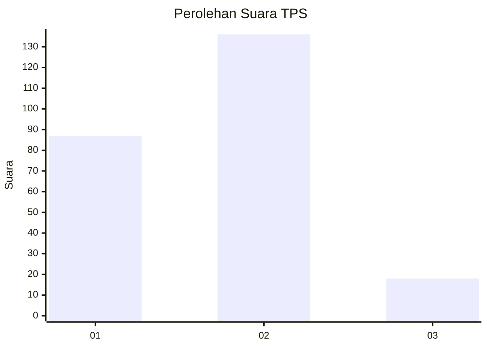

# Hasil

## Grafik

## Tabel

| No. | Nama Paslon    | Suara | Suara (raw) | Persentase |
|:--- |:-------------- | -----:| -----------:| ----------:|
| 1   | ANIES MUHAIMIN | 87    | [87][p-1]   | 36,10      |
| 2   | PRABOWO GIBRAN | 136   | [136][p-2]  | 56,43      |
| 3   | GANJAR MAHFUD  | 18    | [18][p-3]   | 7,47       |

[p-1]: https://github.com/gigit-pemilu/pemilu-2024-11-aceh/blob/main/pilpres/hitung-suara/sub/11-aceh/sub/16-aceh-tamiang/sub/03-karang-baru/sub/2020-alur-selalas/sub/001-tps/sub/paslon-1.txt
[p-2]: https://github.com/gigit-pemilu/pemilu-2024-11-aceh/blob/main/pilpres/hitung-suara/sub/11-aceh/sub/16-aceh-tamiang/sub/03-karang-baru/sub/2020-alur-selalas/sub/001-tps/sub/paslon-2.txt
[p-3]: https://github.com/gigit-pemilu/pemilu-2024-11-aceh/blob/main/pilpres/hitung-suara/sub/11-aceh/sub/16-aceh-tamiang/sub/03-karang-baru/sub/2020-alur-selalas/sub/001-tps/sub/paslon-3.txt

## Foto C Plano

https://sirekap-obj-formc.kpu.go.id/a2ce/pemilu/ppwp/11/16/03/20/20/1116032020001-20240214-222141--e19ad1ee-8953-48ec-84e8-f8c7724b66cf.jpg

https://sirekap-obj-formc.kpu.go.id/a2ce/pemilu/ppwp/11/16/03/20/20/1116032020001-20240214-222144--222d3d57-90e0-4ff9-819c-9a92c2a80504.jpg

https://sirekap-obj-formc.kpu.go.id/a2ce/pemilu/ppwp/11/16/03/20/20/1116032020001-20240214-222154--f9579f41-5e2d-4eb5-a9b3-a3c7cf86ccba.jpg

## Metadata

| Key        | Value               |
| ---------- | ------------------- |
| Time Stamp | 2024-02-24 22:31:28 |

