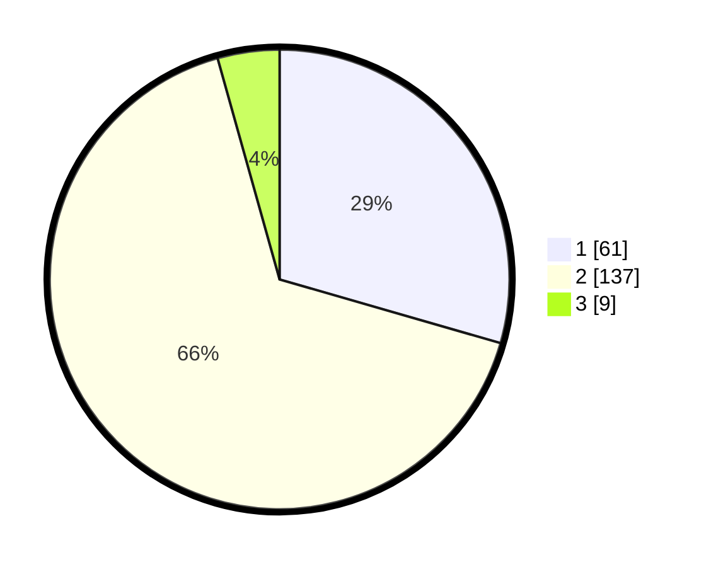

# Hasil

## Grafik

## Tabel

| No. | Nama Paslon    | Suara | Suara (raw) | Persentase |
|:--- |:-------------- | -----:| -----------:| ----------:|
| 1   | ANIES MUHAIMIN | 61    | [61][p-1]   | 29,47      |
| 2   | PRABOWO GIBRAN | 137   | [137][p-2]  | 66,18      |
| 3   | GANJAR MAHFUD  | 9     | [9][p-3]    | 4,35       |

[p-1]: https://github.com/gigit-pemilu/pemilu-2024-11-aceh/blob/main/pilpres/hitung-suara/sub/11-aceh/sub/16-aceh-tamiang/sub/03-karang-baru/sub/2022-alur-baung/sub/002-tps/sub/paslon-1.txt
[p-2]: https://github.com/gigit-pemilu/pemilu-2024-11-aceh/blob/main/pilpres/hitung-suara/sub/11-aceh/sub/16-aceh-tamiang/sub/03-karang-baru/sub/2022-alur-baung/sub/002-tps/sub/paslon-2.txt
[p-3]: https://github.com/gigit-pemilu/pemilu-2024-11-aceh/blob/main/pilpres/hitung-suara/sub/11-aceh/sub/16-aceh-tamiang/sub/03-karang-baru/sub/2022-alur-baung/sub/002-tps/sub/paslon-3.txt

## Foto C Plano

https://sirekap-obj-formc.kpu.go.id/1d6d/pemilu/ppwp/11/16/03/20/22/1116032022002-20240214-202119--1e393b25-cf39-439b-a1e4-2f8fc1f528ba.jpg

https://sirekap-obj-formc.kpu.go.id/1d6d/pemilu/ppwp/11/16/03/20/22/1116032022002-20240214-202324--6ae5262e-93f7-47f8-bc9a-5c4822ce0eda.jpg

https://sirekap-obj-formc.kpu.go.id/1d6d/pemilu/ppwp/11/16/03/20/22/1116032022002-20240214-201912--57446eda-d70c-46b2-9032-429c2b9b3f73.jpg

## Metadata

| Key        | Value               |
| ---------- | ------------------- |
| Time Stamp | 2024-02-15 00:41:44 |

