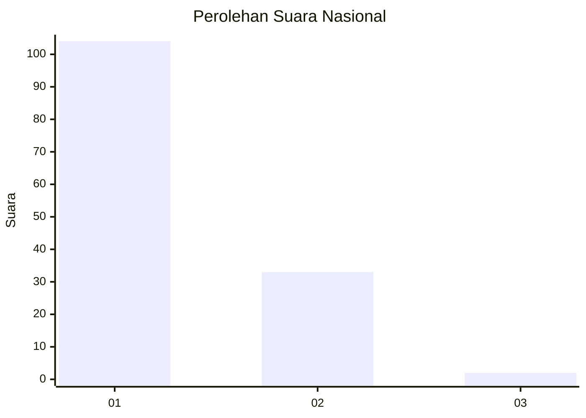
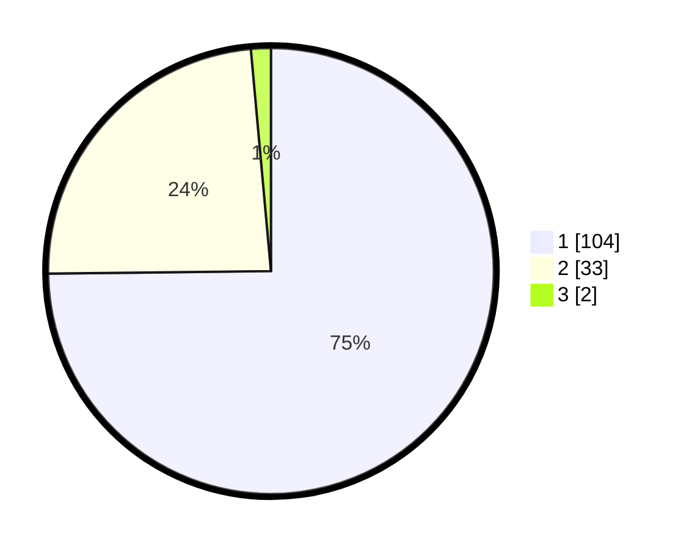

# Hasil

## Grafik

## Tabel

| No. | Nama Paslon    | Suara | Suara (raw) | Persentase |
|:--- |:-------------- | -----:| -----------:| ----------:|
| 1   | ANIES MUHAIMIN | 104   | [104][p-1]  | 74,82      |
| 2   | PRABOWO GIBRAN | 33    | [33][p-2]   | 23,74      |
| 3   | GANJAR MAHFUD  | 2     | [2][p-3]    | 1,44       |

[p-1]: https://github.com/gigit-pemilu/pemilu-2024/blob/main/pilpres/hitung-suara/sub/11-aceh/sub/16-aceh-tamiang/sub/03-karang-baru/sub/2026-paya-awe/sub/002-tps/sub/paslon-1.txt
[p-2]: https://github.com/gigit-pemilu/pemilu-2024/blob/main/pilpres/hitung-suara/sub/11-aceh/sub/16-aceh-tamiang/sub/03-karang-baru/sub/2026-paya-awe/sub/002-tps/sub/paslon-2.txt
[p-3]: https://github.com/gigit-pemilu/pemilu-2024/blob/main/pilpres/hitung-suara/sub/11-aceh/sub/16-aceh-tamiang/sub/03-karang-baru/sub/2026-paya-awe/sub/002-tps/sub/paslon-3.txt

## Foto C Plano

https://sirekap-obj-formc.kpu.go.id/1374/pemilu/ppwp/11/16/03/20/26/1116032026002-20240215-032834--545688b2-7662-449f-b2c5-c6cada7d50ac.jpg

https://sirekap-obj-formc.kpu.go.id/1374/pemilu/ppwp/11/16/03/20/26/1116032026002-20240214-201136--021d166c-4fde-4ccb-830b-3b624eadef01.jpg

https://sirekap-obj-formc.kpu.go.id/1374/pemilu/ppwp/11/16/03/20/26/1116032026002-20240214-201137--ee0ba5c2-c234-4afc-b11d-9a666c32e8a4.jpg

## Metadata

| Key        | Value               |
| ---------- | ------------------- |
| Time Stamp | 2024-02-15 22:00:27 |

