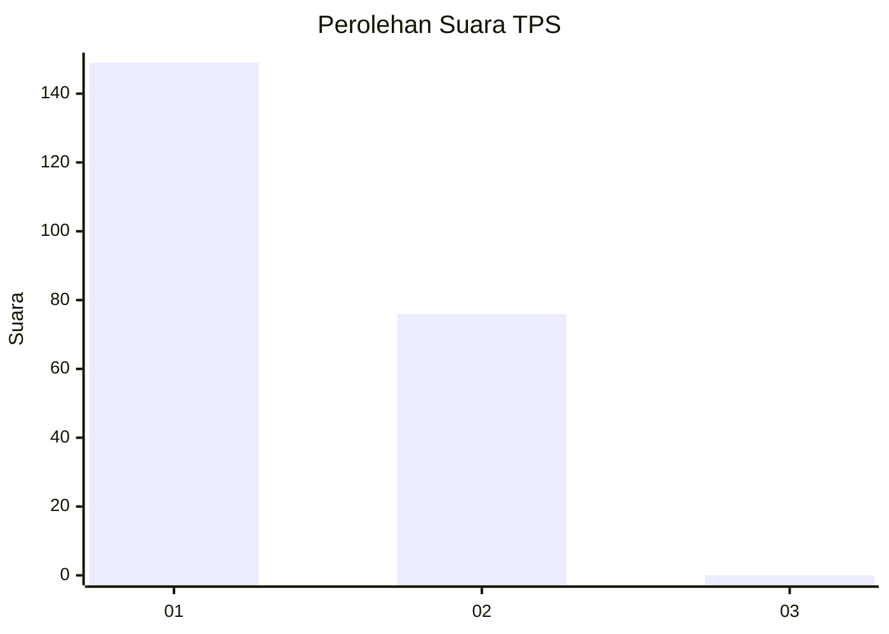
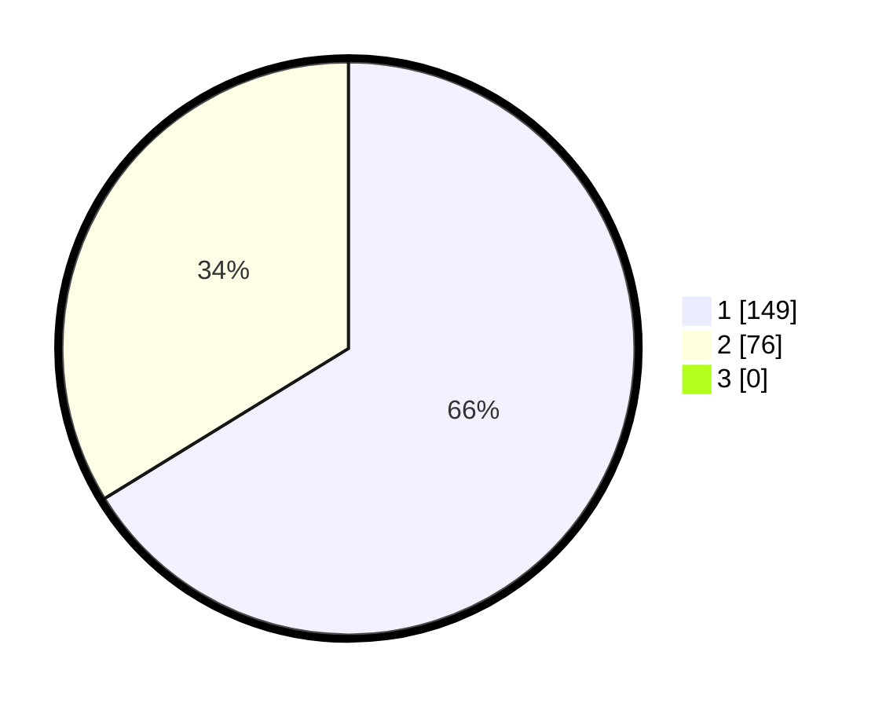

# Hasil

## Grafik

## Tabel

| No. | Nama Paslon    | Suara | Suara (raw) | Persentase |
|:--- |:-------------- | -----:| -----------:| ----------:|
| 1   | ANIES MUHAIMIN | 149   | [149][p-1]  | 66,22      |
| 2   | PRABOWO GIBRAN | 76    | [76][p-2]   | 33,78      |
| 3   | GANJAR MAHFUD  | 0     | [0][p-3]    | 0,00       |

[p-1]: https://github.com/gigit-pemilu/pemilu-2024-11-aceh/blob/main/pilpres/hitung-suara/sub/11-aceh/sub/16-aceh-tamiang/sub/03-karang-baru/sub/2027-simpang-empat/sub/001-tps/sub/paslon-1.txt
[p-2]: https://github.com/gigit-pemilu/pemilu-2024-11-aceh/blob/main/pilpres/hitung-suara/sub/11-aceh/sub/16-aceh-tamiang/sub/03-karang-baru/sub/2027-simpang-empat/sub/001-tps/sub/paslon-2.txt
[p-3]: https://github.com/gigit-pemilu/pemilu-2024-11-aceh/blob/main/pilpres/hitung-suara/sub/11-aceh/sub/16-aceh-tamiang/sub/03-karang-baru/sub/2027-simpang-empat/sub/001-tps/sub/paslon-3.txt

## Foto C Plano

https://sirekap-obj-formc.kpu.go.id/1fdf/pemilu/ppwp/11/16/03/20/27/1116032027001-20240215-060855--b9099620-ccba-47a7-8109-cf4ad2248d39.jpg

https://sirekap-obj-formc.kpu.go.id/1fdf/pemilu/ppwp/11/16/03/20/27/1116032027001-20240215-060959--01e40566-b433-4899-9898-049662083203.jpg

https://sirekap-obj-formc.kpu.go.id/1fdf/pemilu/ppwp/11/16/03/20/27/1116032027001-20240215-061037--f8ff7826-6e6f-4c88-89e6-1b29d3fe3d53.jpg

## Metadata

| Key        | Value               |
| ---------- | ------------------- |
| Time Stamp | 2024-02-16 16:25:10 |

