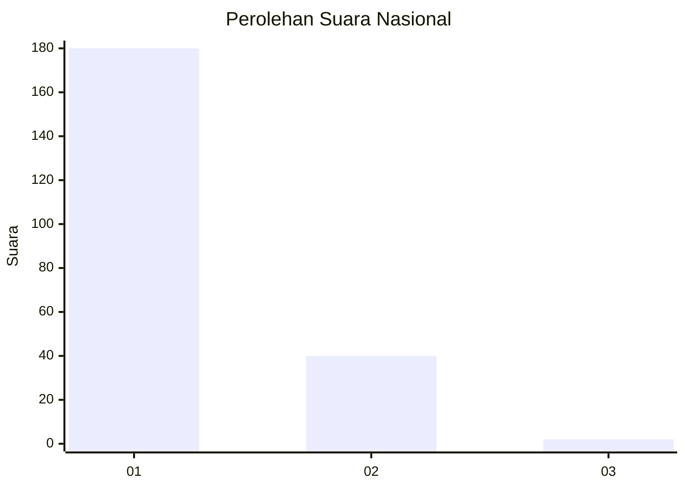
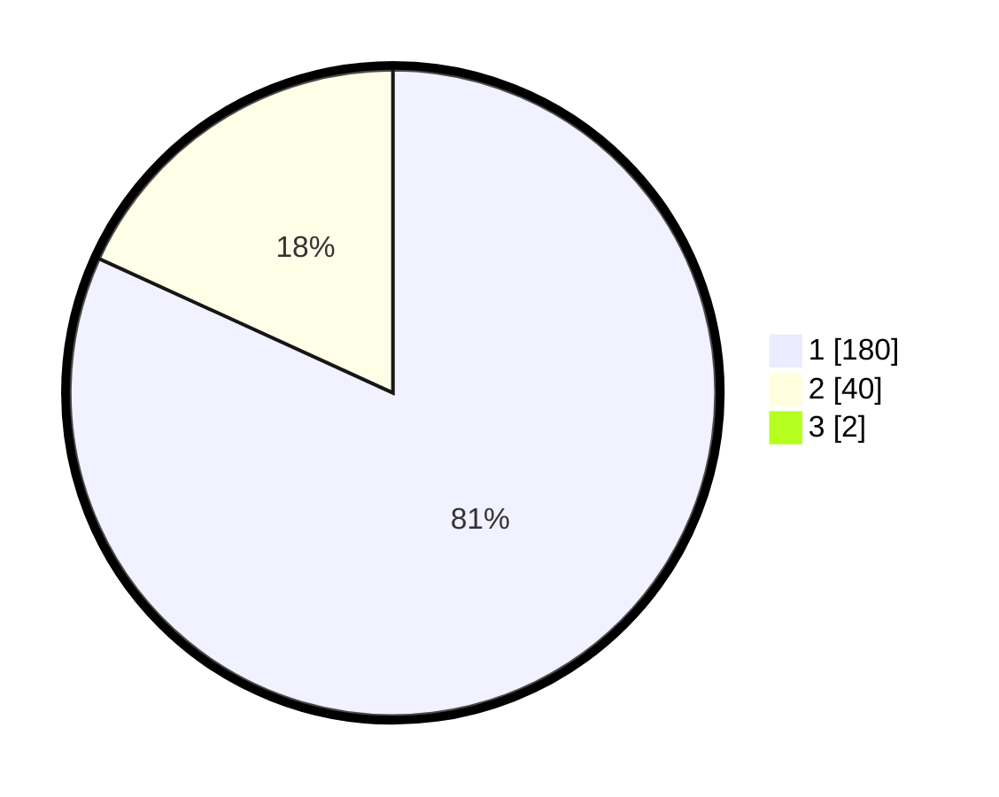

# Hasil

## Grafik

## Tabel

| No. | Nama Paslon    | Suara | Suara (raw) | Persentase |
|:--- |:-------------- | -----:| -----------:| ----------:|
| 1   | ANIES MUHAIMIN | 180   | [180][p-1]  | 81,08      |
| 2   | PRABOWO GIBRAN | 40    | [40][p-2]   | 18,02      |
| 3   | GANJAR MAHFUD  | 2     | [2][p-3]    | 0,90       |

[p-1]: https://github.com/gigit-pemilu/pemilu-2024/blob/main/pilpres/hitung-suara/sub/11-aceh/sub/16-aceh-tamiang/sub/03-karang-baru/sub/2031-tanjung-seumantoh/sub/003-tps/sub/paslon-1.txt
[p-2]: https://github.com/gigit-pemilu/pemilu-2024/blob/main/pilpres/hitung-suara/sub/11-aceh/sub/16-aceh-tamiang/sub/03-karang-baru/sub/2031-tanjung-seumantoh/sub/003-tps/sub/paslon-2.txt
[p-3]: https://github.com/gigit-pemilu/pemilu-2024/blob/main/pilpres/hitung-suara/sub/11-aceh/sub/16-aceh-tamiang/sub/03-karang-baru/sub/2031-tanjung-seumantoh/sub/003-tps/sub/paslon-3.txt

## Foto C Plano

https://sirekap-obj-formc.kpu.go.id/e017/pemilu/ppwp/11/16/03/20/31/1116032031003-20240214-195016--c3b5a353-4662-4bcb-a578-b5d2408f8867.jpg

https://sirekap-obj-formc.kpu.go.id/e017/pemilu/ppwp/11/16/03/20/31/1116032031003-20240214-195119--387060b4-ab16-4eac-a6f1-feaa1473bbf5.jpg

https://sirekap-obj-formc.kpu.go.id/e017/pemilu/ppwp/11/16/03/20/31/1116032031003-20240214-195232--c867ab18-95c2-4608-8994-a68658ff41e0.jpg

## Metadata

| Key        | Value               |
| ---------- | ------------------- |
| Time Stamp | 2024-02-15 20:30:46 |

