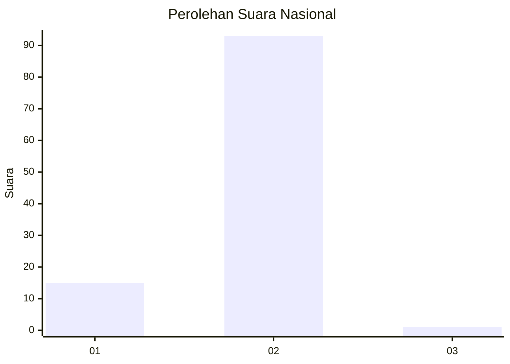
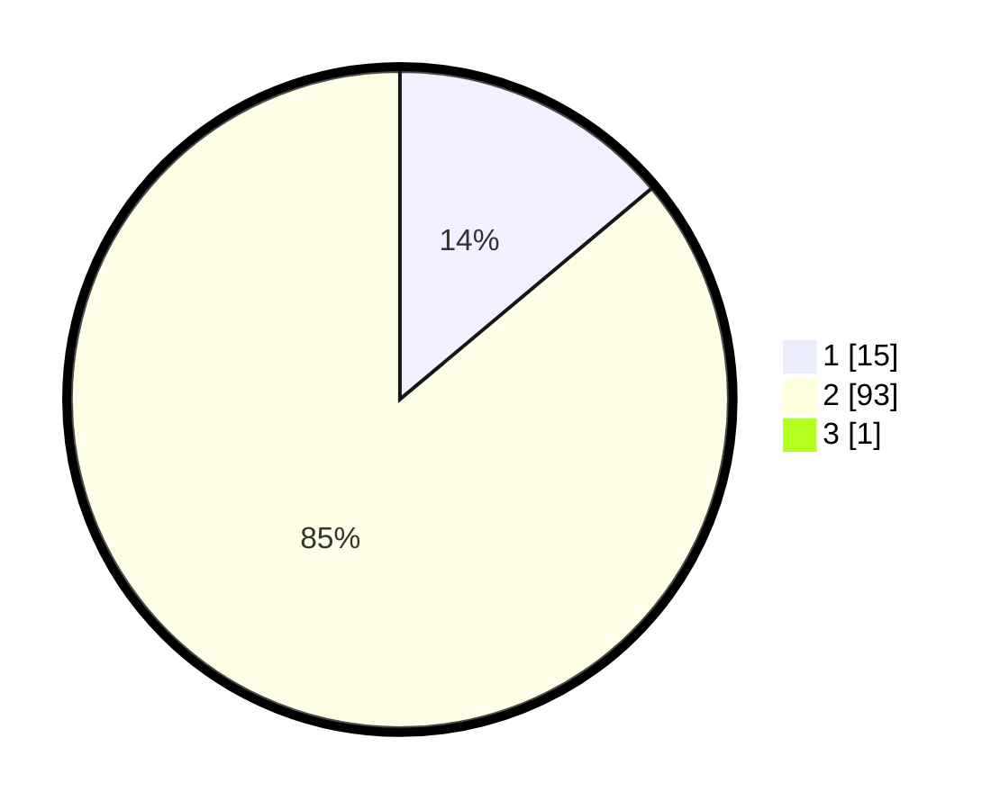

# Hasil

## Grafik

## Tabel

| No. | Nama Paslon    | Suara | Suara (raw) | Persentase |
|:--- |:-------------- | -----:| -----------:| ----------:|
| 1   | ANIES MUHAIMIN | 15    | [15][p-1]   | 13,76      |
| 2   | PRABOWO GIBRAN | 93    | [93][p-2]   | 85,32      |
| 3   | GANJAR MAHFUD  | 1     | [1][p-3]    | 0,92       |

[p-1]: https://github.com/gigit-pemilu/pemilu-2024/blob/main/pilpres/hitung-suara/sub/11-aceh/sub/16-aceh-tamiang/sub/03-karang-baru/sub/2032-bukit-keranji/sub/002-tps/sub/paslon-1.txt
[p-2]: https://github.com/gigit-pemilu/pemilu-2024/blob/main/pilpres/hitung-suara/sub/11-aceh/sub/16-aceh-tamiang/sub/03-karang-baru/sub/2032-bukit-keranji/sub/002-tps/sub/paslon-2.txt
[p-3]: https://github.com/gigit-pemilu/pemilu-2024/blob/main/pilpres/hitung-suara/sub/11-aceh/sub/16-aceh-tamiang/sub/03-karang-baru/sub/2032-bukit-keranji/sub/002-tps/sub/paslon-3.txt

## Foto C Plano

https://sirekap-obj-formc.kpu.go.id/34d1/pemilu/ppwp/11/16/03/20/32/1116032032002-20240214-225357--efc5434c-84de-41eb-92ee-1bcf40673ab7.jpg

https://sirekap-obj-formc.kpu.go.id/34d1/pemilu/ppwp/11/16/03/20/32/1116032032002-20240214-214201--b30f406e-34c2-4e8e-bbfd-ee99cd1a48b8.jpg

https://sirekap-obj-formc.kpu.go.id/34d1/pemilu/ppwp/11/16/03/20/32/1116032032002-20240214-214417--4aa389ea-2c29-45dc-b4fd-e069e98303a8.jpg

## Metadata

| Key        | Value               |
| ---------- | ------------------- |
| Time Stamp | 2024-02-15 22:00:27 |

