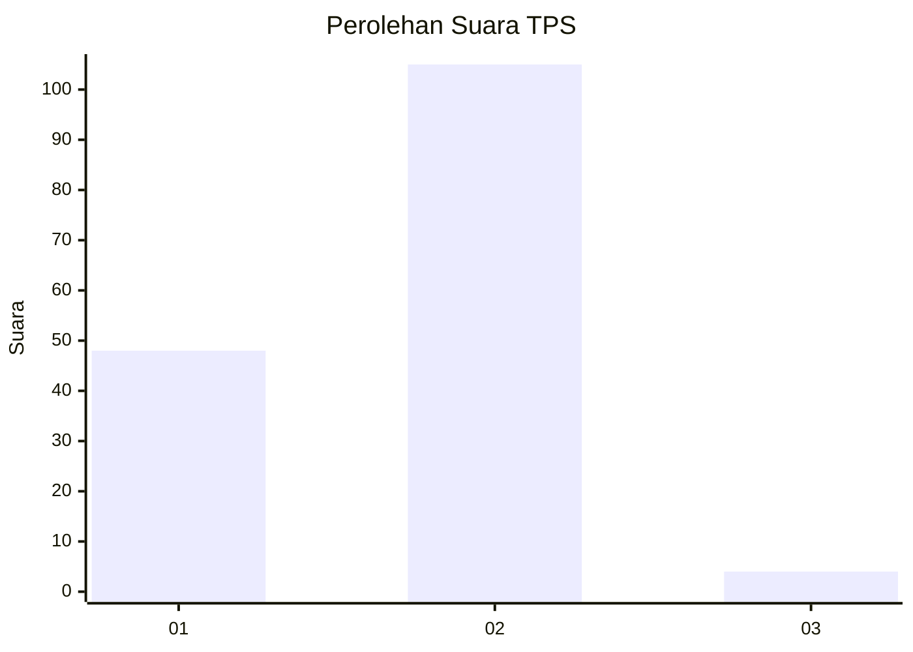
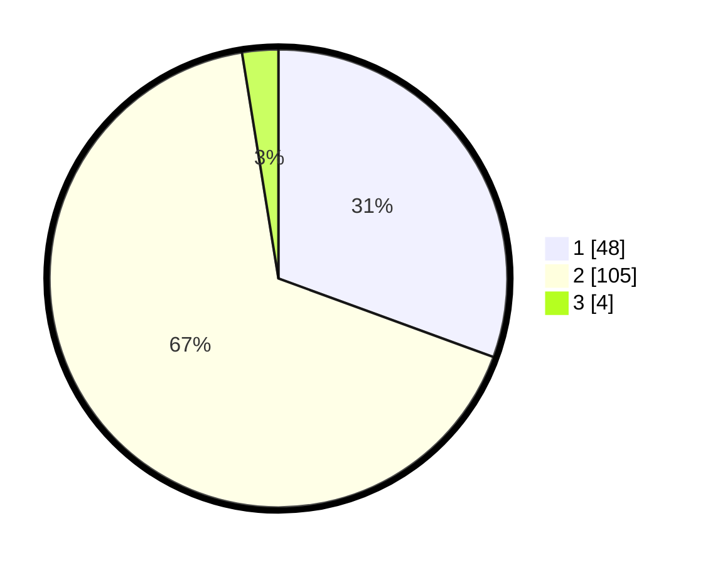

# Hasil

## Grafik

## Tabel

| No. | Nama Paslon    | Suara | Suara (raw) | Persentase |
|:--- |:-------------- | -----:| -----------:| ----------:|
| 1   | ANIES MUHAIMIN | 48    | [48][p-1]   | 30,57      |
| 2   | PRABOWO GIBRAN | 105   | [105][p-2]  | 66,88      |
| 3   | GANJAR MAHFUD  | 4     | [4][p-3]    | 2,55       |

[p-1]: https://github.com/gigit-pemilu/pemilu-2024-11-aceh/blob/main/pilpres/hitung-suara/sub/11-aceh/sub/16-aceh-tamiang/sub/03-karang-baru/sub/2033-kebun-tanjung-seumantoh/sub/001-tps/sub/paslon-1.txt
[p-2]: https://github.com/gigit-pemilu/pemilu-2024-11-aceh/blob/main/pilpres/hitung-suara/sub/11-aceh/sub/16-aceh-tamiang/sub/03-karang-baru/sub/2033-kebun-tanjung-seumantoh/sub/001-tps/sub/paslon-2.txt
[p-3]: https://github.com/gigit-pemilu/pemilu-2024-11-aceh/blob/main/pilpres/hitung-suara/sub/11-aceh/sub/16-aceh-tamiang/sub/03-karang-baru/sub/2033-kebun-tanjung-seumantoh/sub/001-tps/sub/paslon-3.txt

## Foto C Plano

https://sirekap-obj-formc.kpu.go.id/2dd2/pemilu/ppwp/11/16/03/20/33/1116032033001-20240214-223422--c9169214-5d37-45a6-8819-ee3ab4a97abc.jpg

https://sirekap-obj-formc.kpu.go.id/2dd2/pemilu/ppwp/11/16/03/20/33/1116032033001-20240214-223444--8286f7de-15fb-4fc2-98e5-5510eabed3de.jpg

https://sirekap-obj-formc.kpu.go.id/2dd2/pemilu/ppwp/11/16/03/20/33/1116032033001-20240214-223450--4b6fe5fa-4328-4e3b-a04d-3b73eb856ce7.jpg

## Metadata

| Key        | Value               |
| ---------- | ------------------- |
| Time Stamp | 2024-02-15 07:00:44 |

