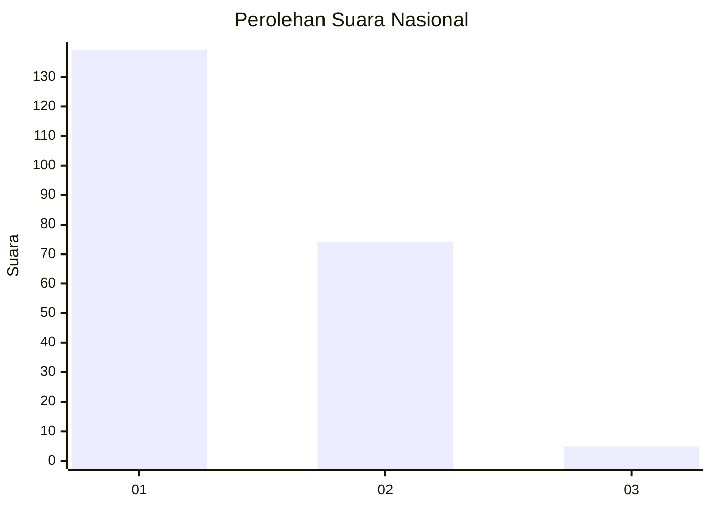
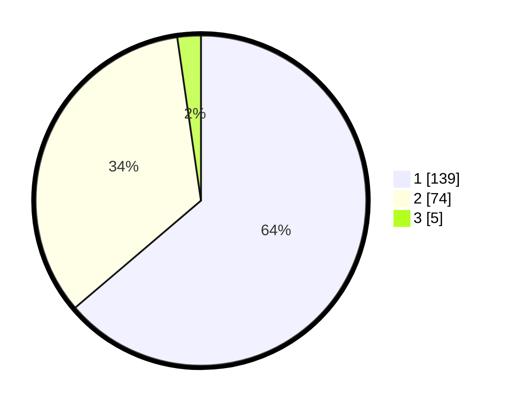

# Hasil

## Grafik

## Tabel

| No. | Nama Paslon    | Suara | Suara (raw) | Persentase |
|:--- |:-------------- | -----:| -----------:| ----------:|
| 1   | ANIES MUHAIMIN | 139   | [139][p-1]  | 63,76      |
| 2   | PRABOWO GIBRAN | 74    | [74][p-2]   | 33,94      |
| 3   | GANJAR MAHFUD  | 5     | [5][p-3]    | 2,29       |

[p-1]: https://github.com/gigit-pemilu/pemilu-2024/blob/main/pilpres/hitung-suara/sub/11-aceh/sub/16-aceh-tamiang/sub/04-seruway/sub/2002-pekan-seruway/sub/003-tps/sub/paslon-1.txt
[p-2]: https://github.com/gigit-pemilu/pemilu-2024/blob/main/pilpres/hitung-suara/sub/11-aceh/sub/16-aceh-tamiang/sub/04-seruway/sub/2002-pekan-seruway/sub/003-tps/sub/paslon-2.txt
[p-3]: https://github.com/gigit-pemilu/pemilu-2024/blob/main/pilpres/hitung-suara/sub/11-aceh/sub/16-aceh-tamiang/sub/04-seruway/sub/2002-pekan-seruway/sub/003-tps/sub/paslon-3.txt

## Foto C Plano

https://sirekap-obj-formc.kpu.go.id/357d/pemilu/ppwp/11/16/04/20/02/1116042002003-20240214-223622--ba79400a-add8-445a-bccf-adf24dc08b69.jpg

https://sirekap-obj-formc.kpu.go.id/357d/pemilu/ppwp/11/16/04/20/02/1116042002003-20240214-223717--c0c34d23-a504-4b45-a4f9-5186f2fd2b4b.jpg

## Metadata

| Key        | Value               |
| ---------- | ------------------- |
| Time Stamp | 2024-02-15 21:30:27 |

