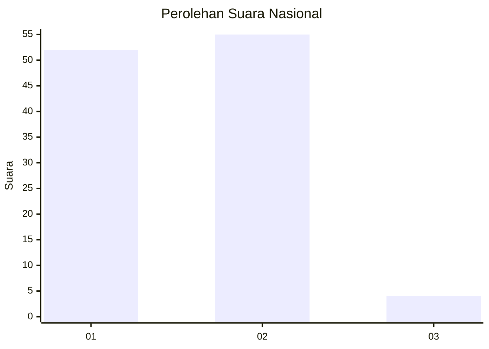
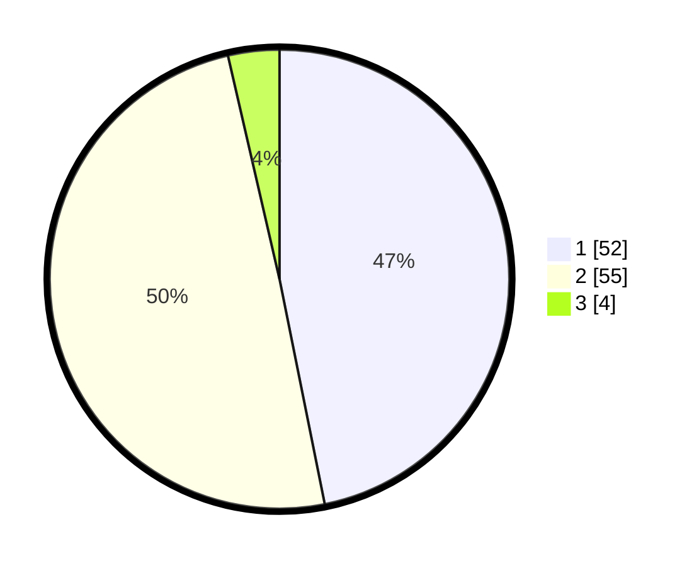

# Hasil

## Grafik

## Tabel

| No. | Nama Paslon    | Suara | Suara (raw) | Persentase |
|:--- |:-------------- | -----:| -----------:| ----------:|
| 1   | ANIES MUHAIMIN | 52    | [52][p-1]   | 46,85      |
| 2   | PRABOWO GIBRAN | 55    | [55][p-2]   | 49,55      |
| 3   | GANJAR MAHFUD  | 4     | [4][p-3]    | 3,60       |

[p-1]: https://github.com/gigit-pemilu/pemilu-2024/blob/main/pilpres/hitung-suara/sub/11-aceh/sub/16-aceh-tamiang/sub/04-seruway/sub/2007-suka-ramai-dua/sub/007-tps/sub/paslon-1.txt
[p-2]: https://github.com/gigit-pemilu/pemilu-2024/blob/main/pilpres/hitung-suara/sub/11-aceh/sub/16-aceh-tamiang/sub/04-seruway/sub/2007-suka-ramai-dua/sub/007-tps/sub/paslon-2.txt
[p-3]: https://github.com/gigit-pemilu/pemilu-2024/blob/main/pilpres/hitung-suara/sub/11-aceh/sub/16-aceh-tamiang/sub/04-seruway/sub/2007-suka-ramai-dua/sub/007-tps/sub/paslon-3.txt

## Foto C Plano

https://sirekap-obj-formc.kpu.go.id/0ec3/pemilu/ppwp/11/16/04/20/07/1116042007007-20240219-211146--bf936119-2332-4464-974c-acbf3db51707.jpg

https://sirekap-obj-formc.kpu.go.id/0ec3/pemilu/ppwp/11/16/04/20/07/1116042007007-20240219-211410--e59f7e4e-b028-446e-b321-579f4500a10d.jpg

https://sirekap-obj-formc.kpu.go.id/0ec3/pemilu/ppwp/11/16/04/20/07/1116042007007-20240219-211517--2ddc73d1-fd48-45ff-a80b-c1d3b7df61e0.jpg

## Metadata

| Key        | Value               |
| ---------- | ------------------- |
| Time Stamp | 2024-02-20 00:00:00 |

## DATA PEMILIH TETAP

Jumlah pemilih dalam DPT: **124**.
 * L: **62**.
 * P: **62**.

## DATA PENGGUNA HAK PILIH

Jumlah pengguna hak pilih dalam DPT: **99**.
 * L: **53**.
 * P: **46**.

Jumlah pengguna hak pilih dalam DPTb: **4**.
 * L: **0**.
 * P: **4**.

Jumlah pengguna hak pilih dalam DPK: **11**.
 * L: **5**.
 * P: **6**.

Jumlah pengguna hak pilih: **114**.
 * L: **58**.
 * P: **56**.

## JUMLAH SUARA SAH DAN TIDAK SAH

JUMLAH SELURUH SUARA SAH: **111**.

JUMLAH SUARA TIDAK SAH: **3**.

JUMLAH SELURUH SUARA SAH DAN SUARA TIDAK SAH: **114**.

