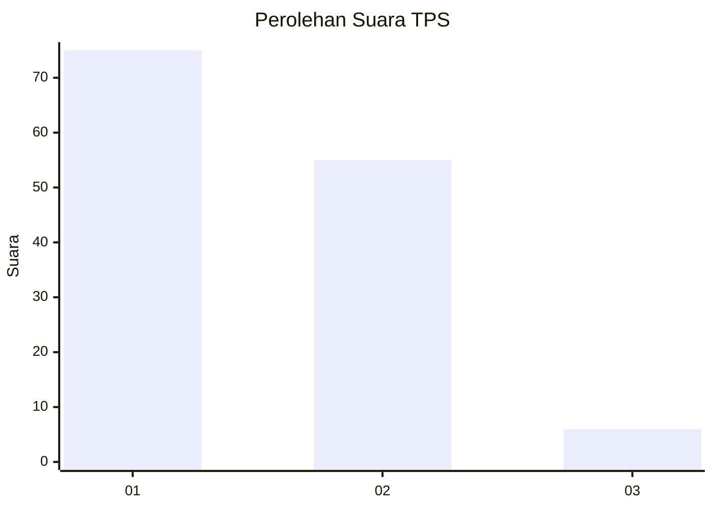
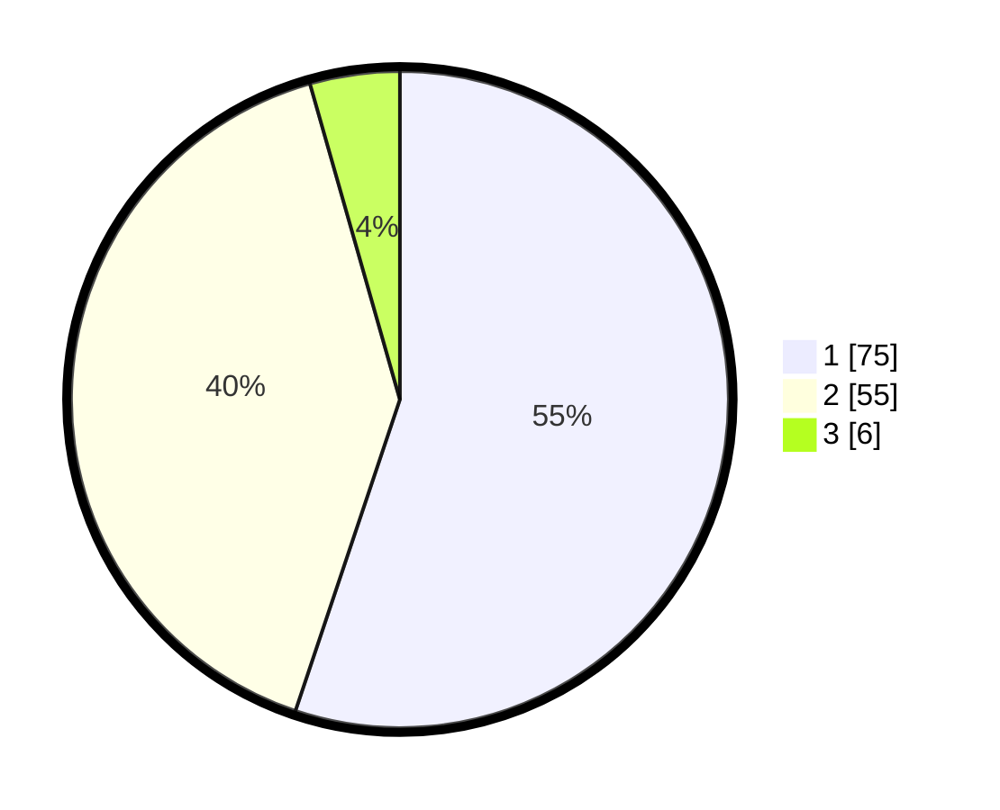

# Hasil

## Grafik

## Tabel

| No. | Nama Paslon    | Suara | Suara (raw) | Persentase |
|:--- |:-------------- | -----:| -----------:| ----------:|
| 1   | ANIES MUHAIMIN | 75    | [75][p-1]   | 55,15      |
| 2   | PRABOWO GIBRAN | 55    | [55][p-2]   | 40,44      |
| 3   | GANJAR MAHFUD  | 6     | [6][p-3]    | 4,41       |

[p-1]: https://github.com/gigit-pemilu/pemilu-2024-11-aceh/blob/main/pilpres/hitung-suara/sub/11-aceh/sub/16-aceh-tamiang/sub/04-seruway/sub/2008-perkebunan-seruway/sub/001-tps/sub/paslon-1.txt
[p-2]: https://github.com/gigit-pemilu/pemilu-2024-11-aceh/blob/main/pilpres/hitung-suara/sub/11-aceh/sub/16-aceh-tamiang/sub/04-seruway/sub/2008-perkebunan-seruway/sub/001-tps/sub/paslon-2.txt
[p-3]: https://github.com/gigit-pemilu/pemilu-2024-11-aceh/blob/main/pilpres/hitung-suara/sub/11-aceh/sub/16-aceh-tamiang/sub/04-seruway/sub/2008-perkebunan-seruway/sub/001-tps/sub/paslon-3.txt

## Foto C Plano

https://sirekap-obj-formc.kpu.go.id/6100/pemilu/ppwp/11/16/04/20/08/1116042008001-20240214-184522--8a6dde54-6fa8-4d71-b475-9371491abe2f.jpg

https://sirekap-obj-formc.kpu.go.id/6100/pemilu/ppwp/11/16/04/20/08/1116042008001-20240214-184828--5d35ed50-cc02-4b53-90f3-36cfebe61b7d.jpg

https://sirekap-obj-formc.kpu.go.id/6100/pemilu/ppwp/11/16/04/20/08/1116042008001-20240214-190519--7850ae94-6ef7-4c65-b0cf-dfdaadc7b645.jpg

## Metadata

| Key        | Value               |
| ---------- | ------------------- |
| Time Stamp | 2024-02-14 21:46:01 |

## DATA PEMILIH TETAP

Jumlah pemilih dalam DPT: **168**.
 * L: **89**.
 * P: **79**.

## DATA PENGGUNA HAK PILIH

Jumlah pengguna hak pilih dalam DPT: **130**.
 * L: **70**.
 * P: **60**.

Jumlah pengguna hak pilih dalam DPTb: **4**.
 * L: **2**.
 * P: **2**.

Jumlah pengguna hak pilih dalam DPK: **2**.
 * L: **2**.
 * P: **0**.

Jumlah pengguna hak pilih: **136**.
 * L: **74**.
 * P: **62**.

## JUMLAH SUARA SAH DAN TIDAK SAH

JUMLAH SELURUH SUARA SAH: **131**.

JUMLAH SUARA TIDAK SAH: **5**.

JUMLAH SELURUH SUARA SAH DAN SUARA TIDAK SAH: **136**.

