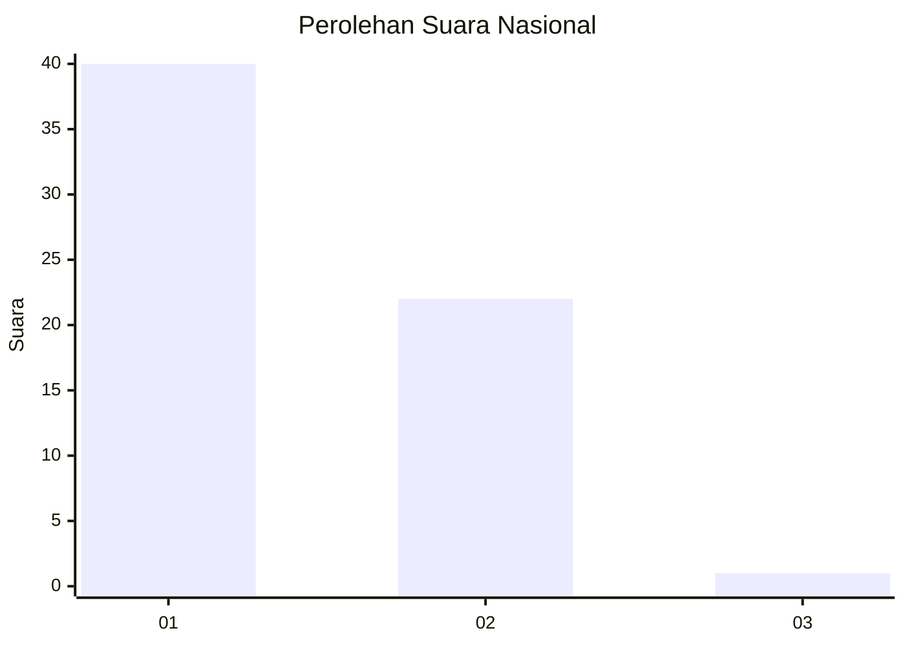
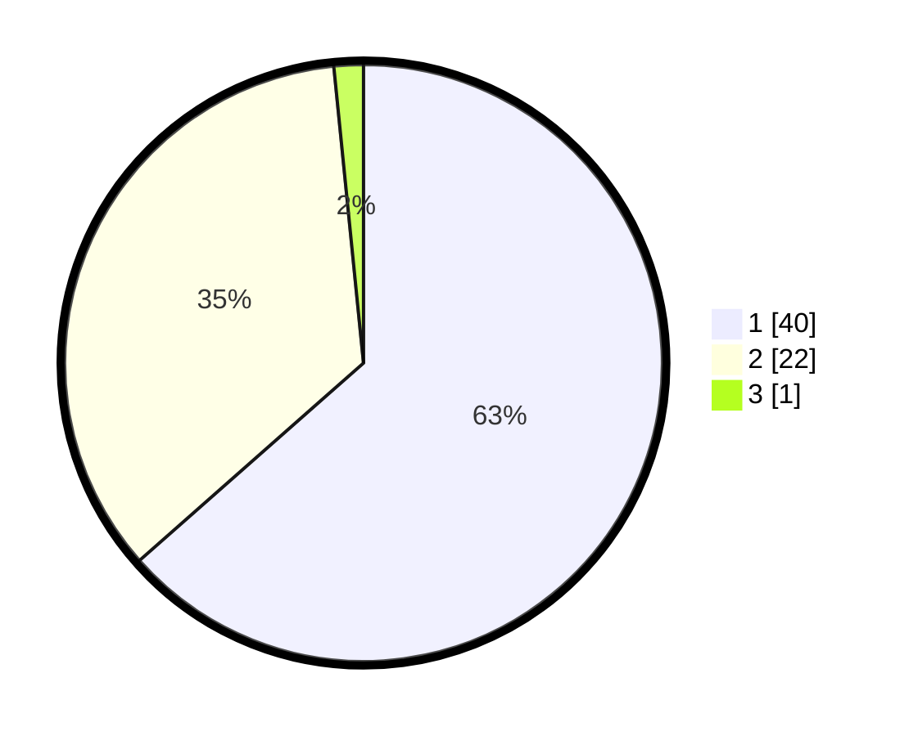

# Hasil

## Grafik

## Tabel

| No. | Nama Paslon    | Suara | Suara (raw) | Persentase |
|:--- |:-------------- | -----:| -----------:| ----------:|
| 1   | ANIES MUHAIMIN | 40    | [40][p-1]   | 63,49      |
| 2   | PRABOWO GIBRAN | 22    | [22][p-2]   | 34,92      |
| 3   | GANJAR MAHFUD  | 1     | [1][p-3]    | 1,59       |

[p-1]: https://github.com/gigit-pemilu/pemilu-2024/blob/main/pilpres/hitung-suara/sub/11-aceh/sub/16-aceh-tamiang/sub/04-seruway/sub/2015-perk-gedung-biara/sub/003-tps/sub/paslon-1.txt
[p-2]: https://github.com/gigit-pemilu/pemilu-2024/blob/main/pilpres/hitung-suara/sub/11-aceh/sub/16-aceh-tamiang/sub/04-seruway/sub/2015-perk-gedung-biara/sub/003-tps/sub/paslon-2.txt
[p-3]: https://github.com/gigit-pemilu/pemilu-2024/blob/main/pilpres/hitung-suara/sub/11-aceh/sub/16-aceh-tamiang/sub/04-seruway/sub/2015-perk-gedung-biara/sub/003-tps/sub/paslon-3.txt

## Foto C Plano

https://sirekap-obj-formc.kpu.go.id/adcb/pemilu/ppwp/11/16/04/20/15/1116042015003-20240214-141000--9916a131-85b0-49e7-a101-2630c5cb8934.jpg

https://sirekap-obj-formc.kpu.go.id/adcb/pemilu/ppwp/11/16/04/20/15/1116042015003-20240223-090559--612e663a-5a0d-47de-8c1f-15eab421b663.jpg

https://sirekap-obj-formc.kpu.go.id/adcb/pemilu/ppwp/11/16/04/20/15/1116042015003-20240214-141306--905417d8-2dbd-45e2-b8e2-df63750908b8.jpg

## Metadata

| Key        | Value               |
| ---------- | ------------------- |
| Time Stamp | 2024-02-24 22:31:28 |

## DATA PEMILIH TETAP

Jumlah pemilih dalam DPT: **86**.
 * L: **43**.
 * P: **43**.

## DATA PENGGUNA HAK PILIH

Jumlah pengguna hak pilih dalam DPT: **64**.
 * L: **32**.
 * P: **32**.

Jumlah pengguna hak pilih dalam DPTb: **0**.
 * L: **0**.
 * P: **0**.

Jumlah pengguna hak pilih dalam DPK: **0**.
 * L: **0**.
 * P: **0**.

Jumlah pengguna hak pilih: **64**.
 * L: **32**.
 * P: **32**.

## JUMLAH SUARA SAH DAN TIDAK SAH

JUMLAH SELURUH SUARA SAH: **63**.

JUMLAH SUARA TIDAK SAH: **1**.

JUMLAH SELURUH SUARA SAH DAN SUARA TIDAK SAH: **64**.

