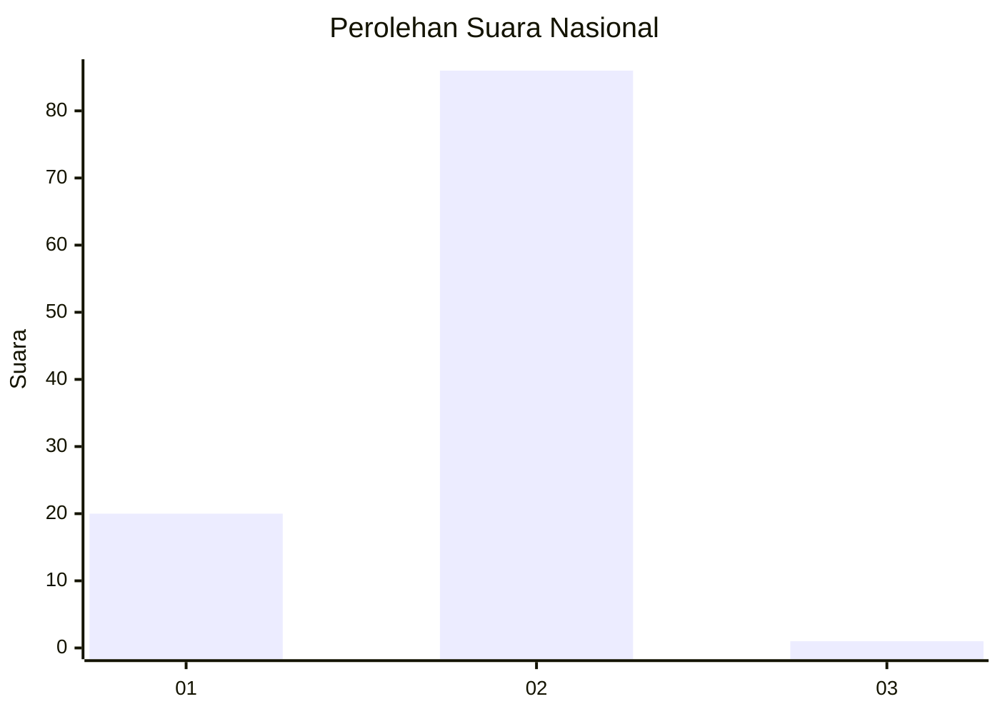
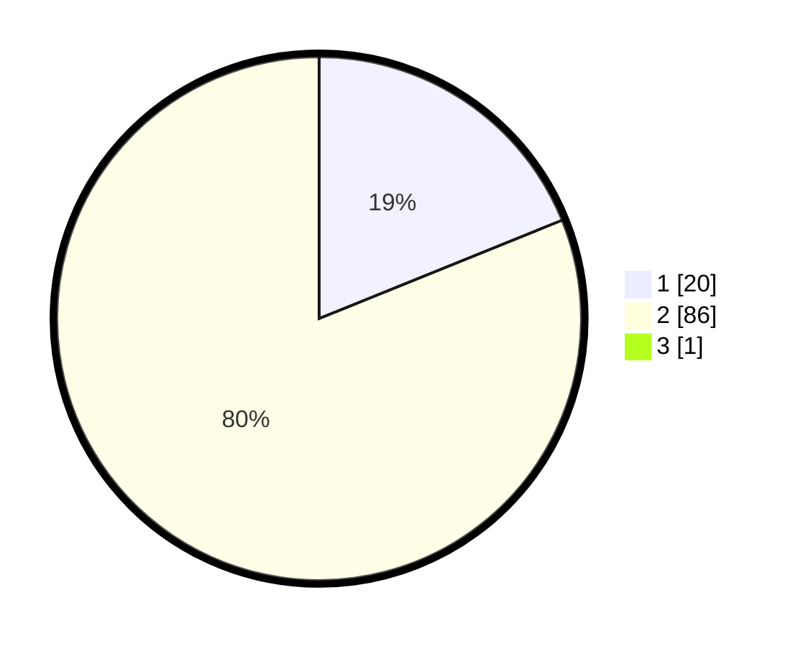

# Hasil

## Grafik

## Tabel

| No. | Nama Paslon    | Suara | Suara (raw) | Persentase |
|:--- |:-------------- | -----:| -----------:| ----------:|
| 1   | ANIES MUHAIMIN | 20    | [20][p-1]   | 18,69      |
| 2   | PRABOWO GIBRAN | 86    | [86][p-2]   | 80,37      |
| 3   | GANJAR MAHFUD  | 1     | [1][p-3]    | 0,93       |

[p-1]: https://github.com/gigit-pemilu/pemilu-2024/blob/main/pilpres/hitung-suara/sub/11-aceh/sub/16-aceh-tamiang/sub/04-seruway/sub/2015-perk-gedung-biara/sub/004-tps/sub/paslon-1.txt
[p-2]: https://github.com/gigit-pemilu/pemilu-2024/blob/main/pilpres/hitung-suara/sub/11-aceh/sub/16-aceh-tamiang/sub/04-seruway/sub/2015-perk-gedung-biara/sub/004-tps/sub/paslon-2.txt
[p-3]: https://github.com/gigit-pemilu/pemilu-2024/blob/main/pilpres/hitung-suara/sub/11-aceh/sub/16-aceh-tamiang/sub/04-seruway/sub/2015-perk-gedung-biara/sub/004-tps/sub/paslon-3.txt

## Foto C Plano

https://sirekap-obj-formc.kpu.go.id/ca9f/pemilu/ppwp/11/16/04/20/15/1116042015004-20240214-210438--7a0a24de-793c-4856-a1ea-b701374080bf.jpg

https://sirekap-obj-formc.kpu.go.id/ca9f/pemilu/ppwp/11/16/04/20/15/1116042015004-20240222-194759--a76bce4b-7881-4753-a561-6f448098f2f8.jpg

## Metadata

| Key        | Value               |
| ---------- | ------------------- |
| Time Stamp | 2024-02-24 22:31:28 |

